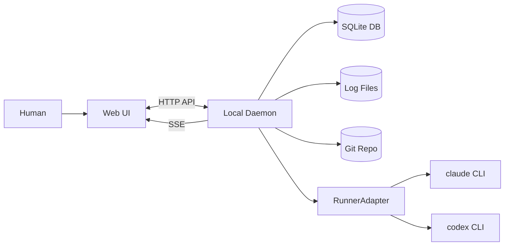

# AgentMine

AgentMineは、ソフトウェア開発のための「プロジェクト管理 + AI実行基盤」である。
MVPはローカル一人運用を前提とし、Web UIで監視・介入し、裏側はLocal Daemonが実行を担う。

状態の正はDBマスターである。
AIの自己申告ではなく、観測可能な事実から状態を導出する。

## 何を作るか（MVP）

- GitリポジトリをProjectとして登録する
- タスクを親子・依存つきで管理する
- タスクに対してRunを開始し、実行の事実（ログ、終了コード、チェック結果等）を記録する
- Agent Profileでrunner/model/prompt等の実行設定を管理する
- DoD（Definition of Done）の必須チェックを定義し、Runに対して検証結果（Check）を残す
- worktreeで作業領域を分離し、スコープ制御で変更可能範囲を制約する
- Web UIで、SSE（Server-Sent Events）により実行状況をリアルタイムに監視し、stop/retry/continue/approve等で介入する
- Task Live Viewで、自律駆動AIの全Role（Orchestrator/Planner/Supervisor/Worker/Reviewer）を一覧監視する

## アーキテクチャ概要

注:
- MVPの認証は行わない。localhost前提である。
- ログの正はDBではなくファイルである。DBは参照（log_ref/output_ref）を保持する。

## 自律駆動モデル

AIが自律的にTaskを処理し、Humanは監視と介入のみ行う。

| Role | 責務 |
|------|------|
| Orchestrator | Taskの全体管理、Role起動 |
| Planner | 計画立案、サブタスク分解 |
| Supervisor | Worker進捗管理、品質監視 |
| Worker | 実作業（コード生成等） |
| Reviewer | 成果物レビュー、DoD確認 |

各Roleは前段Roleが起動する（起動連鎖）。Humanは異常時のみ介入する。

## 技術スタック

| 層 | 技術 |
|----|------|
| フロントエンド | Next.js 15 / React 19, Tailwind CSS 4, TanStack Query + Zustand |
| バックエンド | Hono, Drizzle ORM, SSE |
| データ | SQLite |
| 開発ツール | pnpm, Turborepo, tsup, Vitest |

## モノレポ構成

| パッケージ | 責務 |
|-----------|------|
| `packages/daemon` | Local Daemon（Hono API + RunnerManager） |
| `packages/web` | Web UI（Next.js） |
| `packages/shared` | 共通型定義（API schema等） |
| `packages/db` | Drizzle schema + migrations |

## 想定ワークフロー（MVP）

1. Projectを登録する（repo_pathとbase_branchを指定する）
2. Settingsで `scope.defaultExclude` と `dod.requiredChecks` を設定する
3. Agent Profileを作成する（runner/model/prompt_template等）
4. タスクを作成する（title/description/write_scope必須）
5. Runを開始する（worktreeを作り、RunnerAdapterでrunnerを起動する）
6. Task Live Viewで全Roleの進行を監視する
7. scope violationが発生した場合、Web UIでapprove/rejectする
8. DoD必須チェックを実行し、Check結果を確認する
9. base branchへマージされたことを根拠にdoneを確定する

## 設計の特徴（MVP）

- DBをSSoT（Single Source of Truth）とする
- continue/retryは「同一runへの追加入力」ではなく、新しいrunを追加する
- doneは「観測可能な事実」から導出する（例: マージ + DoD passed + worktree_dirty=false）
- runner差はRunnerAdapterのcapabilitiesで吸収する（UI出し分け + 実行前バリデーション）
- AIは自律駆動し、Humanは監視・介入に専念する

## ドキュメント

| カテゴリ | パス |
|---------|------|
| 設計の入口 | `docs/00-index.md` |
| 全体像 | `docs/01-overview/summary.md` |
| 構成 | `docs/02-architecture/structure.md` |
| 役割モデル | `docs/02-architecture/role-model.md` |
| 技術スタック | `docs/02-architecture/tech-stack.md` |
| UI仕様（MVP） | `docs/03-details/ui-mvp.md` |
| Task Live View | `docs/03-details/ui-task-live-view.md` |
| 用語 | `docs/99-appendix/glossary.md` |

## コントリビューション / Contributing

コントリビューションを歓迎します。詳細は [CONTRIBUTING.md](CONTRIBUTING.md) を参照してください。

Contributions are welcome. See [CONTRIBUTING.md](CONTRIBUTING.md) for details.

## ステータス

このリポジトリは設計ドキュメントの整備が完了した。
実装フェーズに移行する。
