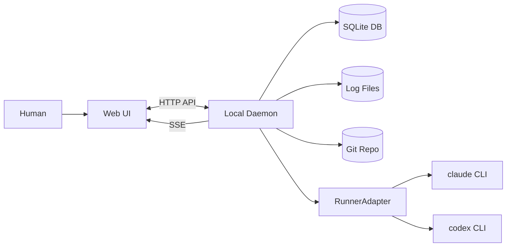

# AgentMine

AgentMineは、ソフトウェア開発のための「プロジェクト管理 + AI実行基盤」である。
MVPはローカル一人運用を前提とし、Web UIで監視・介入し、裏側はLocal Daemonが実行を担う。

状態の正はDBマスターである。
AIの自己申告ではなく、観測可能な事実から状態を導出する。

## 何を作るか（MVP）

- GitリポジトリをProjectとして登録する
- タスクを親子・依存つきで管理する
- タスクに対してRunを開始し、実行の事実（ログ、終了コード、チェック結果等）を記録する
- Agent Profileでrunner/model/prompt等の実行設定を管理する
- DoD（Definition of Done）の必須チェックを定義し、Runに対して検証結果（Check）を残す
- worktreeで作業領域を分離し、スコープ制御で変更可能範囲を制約する
- Web UIで、SSE（Server-Sent Events）により実行状況をリアルタイムに監視し、stop/retry/continue/approve等で介入する

## アーキテクチャ概要

注:
- MVPの認証は行わない。localhost前提である。
- ログの正はDBではなくファイルである。DBは参照（log_ref/output_ref）を保持する。

## 想定ワークフロー（MVP）

1. Projectを登録する（repo_pathとbase_branchを指定する）
2. Settingsで `scope.defaultExclude` と `dod.requiredChecks` を設定する
3. Agent Profileを作成する（runner/model/prompt_template等）
4. タスクを作成する（title/description/write_scope必須）
5. Runを開始する（worktreeを作り、RunnerAdapterでrunnerを起動する）
6. scope violationが発生した場合、Web UIでapprove/rejectする
7. DoD必須チェックを実行し、Check結果を確認する
8. base branchへマージされたことを根拠にdoneを確定する

## 設計の特徴（MVP）

- DBをSSoT（Single Source of Truth）とする
- continue/retryは「同一runへの追加入力」ではなく、新しいrunを追加する
- doneは「観測可能な事実」から導出する（例: マージ + DoD passed + worktree_dirty=false）
- runner差はRunnerAdapterのcapabilitiesで吸収する（UI出し分け + 実行前バリデーション）

## ドキュメント

- 設計の入口: `docs/00-index.md`
- 全体像: `docs/01-overview/summary.md`
- 構成: `docs/02-architecture/structure.md`
- 実装参照（MVP UI）: `docs/03-details/ui-mvp.md`
- 用語: `docs/99-appendix/glossary.md`

## ステータス

このリポジトリは設計ドキュメントの整備が中心である。
実装は今後追加する。
