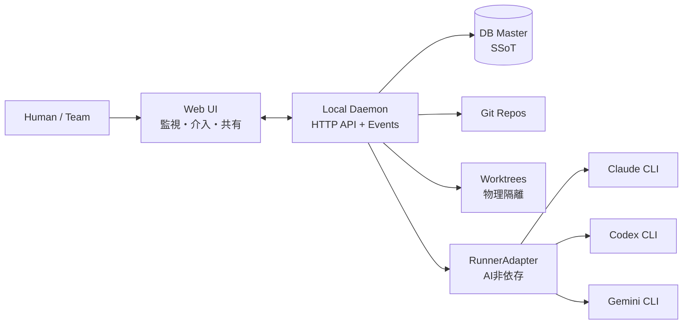

# AgentMine

**[English](README_en.md)**

**AI非依存**の開発タスクオーケストレーション基盤。複数のAI Runner（Claude, Codex, Gemini等）を統合管理し、スコープ制御・完了定義・監査証跡で**安全性と観測可能性**を提供する。

## ポジショニング

AgentMineは「AIプログラマーを管理するプロジェクトマネージャー」として機能する。

| 観点     | Claude Code等のAI開発ツール | AgentMine                                |
| -------- | --------------------------- | ---------------------------------------- |
| AI対応   | 特定AI専用                  | AI非依存（RunnerAdapter）                |
| 安全制御 | ツール単位の権限            | ファイル単位のスコープ+違反検出+承認     |
| 実行隔離 | 同一ディレクトリ            | worktreeで物理隔離                       |
| 完了判定 | AI自己報告                  | Observable Facts + DoD                   |
| 監査     | なし                        | Proof-Carrying Run（証跡パック自動生成） |
| 利用形態 | 個人ターミナル              | Web UIで可視化・共有                     |

## 主要機能

| 機能                         | 説明                                                                             |
| ---------------------------- | -------------------------------------------------------------------------------- |
| AI非依存オーケストレーション | RunnerAdapterで複数AI Runnerを統合管理する                                       |
| スコープ制御                 | タスクごとにwrite/excludeを適用し、事前制約+事後検出で担保する                   |
| Conflict-Aware Scheduler     | 並列起動前にwrite_scopeの重なりを検出し、衝突を回避する                          |
| Proof-Carrying Run           | Run完了時に証跡パック（prompt hash、scope、変更ファイル、DoD結果）を自動生成する |
| Memory Governance            | 記憶の信頼度・有効期限・承認で長期運用の品質を維持する                           |
| 観測可能な事実               | exit code、差分、検証結果等で状態を自動判定する（AIの自己申告に依存しない）      |
| worktree隔離                 | タスクごとにブランチ+worktreeを作り、並列実行の衝突を物理的に防ぐ                |
| 監視と介入（Web UI）         | ブラウザで実行ログを監視し、stop/retry/continue/approve等で介入する              |

## アーキテクチャ概要

注:

- Phase 1-2はlocalhost一人運用。Phase 3でチーム対応を予定。
- ログの正はDBではなくファイルである。DBは参照（log_ref/output_ref）を保持する。
- DBをSSoT（Single Source of Truth）とし、状態はObservable Factsから導出する。

## 技術スタック

| 層             | 技術                                                            |
| -------------- | --------------------------------------------------------------- |
| フロントエンド | Next.js 15 / React 19, Tailwind CSS 4, TanStack Query + Zustand |
| バックエンド   | Hono, Drizzle ORM, SSE                                          |
| データ         | SQLite                                                          |
| 開発ツール     | pnpm, Turborepo, tsup, Vitest                                   |

## モノレポ構成

| パッケージ        | 責務                                     |
| ----------------- | ---------------------------------------- |
| `packages/daemon` | Local Daemon（Hono API + RunnerManager） |
| `packages/web`    | Web UI（Next.js）                        |
| `packages/shared` | 共通型定義（API schema等）               |
| `packages/db`     | Drizzle schema + migrations              |

## 想定ワークフロー

1. Projectを登録する（repo_pathとbase_branchを指定する）
2. Settingsで `scope.defaultExclude` と `dod.requiredChecks` を設定する
3. Agent Profileを作成する（runner/model/prompt_template等。Runnerを選択可能）
4. タスクを作成する（title/description/write_scope必須）
5. Runを開始する → **Conflict-Aware Scheduler**がwrite_scope衝突を事前チェック
6. worktreeで物理隔離された環境で、選択されたRunnerがタスクを実行する
7. scope violationが発生した場合、Web UIでapprove/rejectする
8. Run完了時にDoDチェック実行 → **Proof Bundle（証跡パック）**を自動生成
9. base branchへマージされたことを根拠にdoneを確定する

## 設計の特徴

- **AI非依存**: RunnerAdapterで差異を吸収。特定AI Runnerにロックインしない
- **安全性**: write_scope + 違反検出 + 承認ワークフロー + worktree物理隔離
- **監査性**: Proof-Carrying Runで変更の証跡を自動集約。レビュー・監査コストを削減
- **衝突回避**: Conflict-Aware Schedulerが並列実行前にwrite_scope重複を検出
- **記憶の品質管理**: Memory Governanceで信頼度・有効期限・承認を管理
- **観測可能性**: 状態はObservable Facts（exit code, diff, check結果等）から導出。AIの自己申告に依存しない

## フェーズ計画

| Phase | テーマ               | 主な内容                                                                                             |
| ----- | -------------------- | ---------------------------------------------------------------------------------------------------- |
| 1     | MVP完成 + 差別化確立 | スコープ制御完成、Proof-Carrying Run、Conflict-Aware Scheduler、Memory Governance、RunnerAdapter追加 |
| 2     | 運用知能化           | Cost/SLA Router、Compliance Templates、監査ログエクスポート                                          |
| 3     | チーム対応           | 認証・認可、リモートアクセス、チームダッシュボード                                                   |

## ドキュメント

| カテゴリ                  | パス                                          |
| ------------------------- | --------------------------------------------- |
| 設計の入口                | `docs/00-index.md`                            |
| 全体像                    | `docs/01-overview/summary.md`                 |
| スコープ・フェーズ        | `docs/01-overview/scope.md`                   |
| 構成                      | `docs/02-architecture/structure.md`           |
| 役割モデル                | `docs/02-architecture/role-model.md`          |
| Proof-Carrying Run        | `docs/03-details/proof-carrying-run.md`       |
| Conflict-Aware Scheduler  | `docs/03-details/conflict-aware-scheduler.md` |
| Memory Layer + Governance | `docs/03-details/memory-layer.md`             |
| UI仕様（MVP）             | `docs/03-details/ui-mvp.md`                   |
| リポジショニング決定      | `docs/04-decisions/0013-repositioning.md`     |
| 用語                      | `docs/99-appendix/glossary.md`                |
| English docs              | `docs_en/`                                    |

## コントリビューション / Contributing

コントリビューションを歓迎します。詳細は [CONTRIBUTING.md](CONTRIBUTING.md) を参照してください。

Contributions are welcome. See [CONTRIBUTING.md](CONTRIBUTING.md) for details.

## ステータス

Phase 1（MVP完成 + 差別化確立）の実装を進行中。
