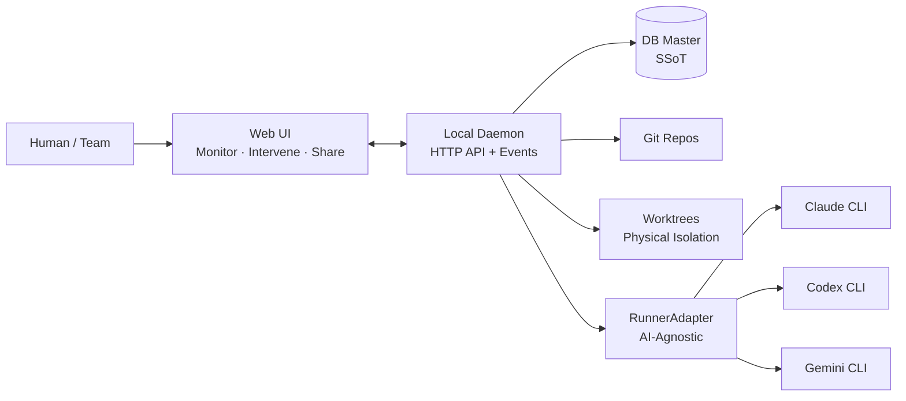

# AgentMine

> This is an English translation of the [Japanese README](README.md), which is the canonical version.

An **AI-agnostic** development task orchestration platform. It manages multiple AI Runners (Claude, Codex, Gemini, etc.) through a unified interface and provides **safety and observability** via scope control, definition of done, and audit trails.

## Positioning

AgentMine acts as a "project manager that manages AI programmers."

| Aspect | AI Dev Tools (e.g. Claude Code) | AgentMine |
|--------|--------------------------------|-----------|
| AI support | Single AI only | AI-agnostic (RunnerAdapter) |
| Safety control | Tool-level permissions | File-level scope + violation detection + approval |
| Execution isolation | Shared directory | Physical isolation via worktree |
| Completion criteria | AI self-report | Observable Facts + DoD |
| Audit | None | Proof-Carrying Run (auto-generated proof bundles) |
| Usage model | Individual terminal | Web UI for visualization and sharing |

## Key Features

| Feature | Description |
|---------|-------------|
| AI-Agnostic Orchestration | Manage multiple AI Runners through RunnerAdapter |
| Scope Control | Apply write/exclude per task, enforced by pre-constraints + post-detection |
| Conflict-Aware Scheduler | Detect write_scope overlaps before parallel execution to prevent conflicts |
| Proof-Carrying Run | Auto-generate proof bundles (prompt hash, scope, changed files, DoD results) on run completion |
| Memory Governance | Maintain long-term quality with confidence scores, expiration, and approval for memories |
| Observable Facts | Derive state automatically from exit codes, diffs, check results — never relying on AI self-reports |
| Worktree Isolation | Create branch + worktree per task to physically prevent parallel execution conflicts |
| Monitoring & Intervention (Web UI) | Monitor execution logs in the browser and intervene with stop/retry/continue/approve |

## Architecture Overview

Notes:
- Phase 1-2 run on localhost (single user). Team support is planned for Phase 3.
- Log files are the source of truth for logs. The DB holds references (log_ref/output_ref).
- The DB is the SSoT (Single Source of Truth); state is derived from Observable Facts.

## Tech Stack

| Layer | Technology |
|-------|-----------|
| Frontend | Next.js 15 / React 19, Tailwind CSS 4, TanStack Query + Zustand |
| Backend | Hono, Drizzle ORM, SSE |
| Data | SQLite |
| Dev Tools | pnpm, Turborepo, tsup, Vitest |

## Monorepo Structure

| Package | Responsibility |
|---------|---------------|
| `packages/daemon` | Local Daemon (Hono API + RunnerManager) |
| `packages/web` | Web UI (Next.js) |
| `packages/shared` | Shared type definitions (API schema, etc.) |
| `packages/db` | Drizzle schema + migrations |

## Workflow

1. Register a Project (specify repo_path and base_branch)
2. Configure Settings: `scope.defaultExclude` and `dod.requiredChecks`
3. Create an Agent Profile (runner/model/prompt_template — choose your Runner)
4. Create a Task (title/description/write_scope required)
5. Start a Run — **Conflict-Aware Scheduler** checks for write_scope conflicts beforehand
6. The selected Runner executes the task in a physically isolated worktree
7. If a scope violation occurs, approve/reject via the Web UI
8. On run completion, DoD checks execute — a **Proof Bundle** is auto-generated
9. Confirm done based on the merge to the base branch

## Design Principles

- **AI-Agnostic**: RunnerAdapter absorbs runner differences. No lock-in to any specific AI Runner
- **Safety**: write_scope + violation detection + approval workflow + worktree physical isolation
- **Auditability**: Proof-Carrying Run auto-aggregates change evidence, reducing review and audit costs
- **Conflict Avoidance**: Conflict-Aware Scheduler detects write_scope overlaps before parallel execution
- **Memory Quality**: Memory Governance manages confidence, expiration, and approval
- **Observability**: State is derived from Observable Facts (exit code, diff, check results) — never from AI self-reports

## Roadmap

| Phase | Theme | Key Items |
|-------|-------|-----------|
| 1 | MVP + Differentiation | Scope control completion, Proof-Carrying Run, Conflict-Aware Scheduler, Memory Governance, additional RunnerAdapters |
| 2 | Operational Intelligence | Cost/SLA Router, Compliance Templates, audit log export |
| 3 | Team Support | Auth & authorization, remote access, team dashboard |

## Documentation

| Category | Path |
|----------|------|
| Design entry point | `docs/00-index.md` |
| Overview | `docs/01-overview/summary.md` |
| Scope & Phases | `docs/01-overview/scope.md` |
| Structure | `docs/02-architecture/structure.md` |
| Role Model | `docs/02-architecture/role-model.md` |
| Proof-Carrying Run | `docs/03-details/proof-carrying-run.md` |
| Conflict-Aware Scheduler | `docs/03-details/conflict-aware-scheduler.md` |
| Memory Layer + Governance | `docs/03-details/memory-layer.md` |
| UI Spec (MVP) | `docs/03-details/ui-mvp.md` |
| Repositioning Decision | `docs/04-decisions/0013-repositioning.md` |
| Glossary | `docs/99-appendix/glossary.md` |
| English docs | `docs_en/` |

## Contributing

Contributions are welcome. See [CONTRIBUTING.md](CONTRIBUTING.md) for details.

## Status

Phase 1 (MVP + Differentiation) is currently in progress.
