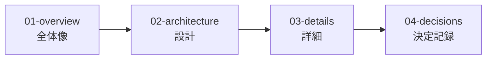

# ドキュメントインデックス

> Status: Active
> 最終更新: 2026-02-01

本ドキュメントは、設計ドキュメント全体のナビゲーションを提供する。

---

## ドキュメント構造

| レベル | 目的 | 対象読者 |
|--------|------|----------|
| **01-overview** | 何を作るか、なぜ作るか | 初見・思い出し用 |
| **02-architecture** | どう構成するか | 設計理解 |
| **03-details** | 具体的な仕様 | 実装時参照 |
| **04-decisions** | なぜその選択をしたか | 判断根拠 |

---

## ドキュメント一覧

### 00 - メタドキュメント

| ドキュメント | 説明 |
|--------------|------|
| [00-index.md](./00-index.md) | 本ドキュメント。全体ナビゲーション |
| [00-writing-guide.md](./00-writing-guide.md) | 記載規範（文章の書き方） |
| [00-format-guide.md](./00-format-guide.md) | フォーマット規範（構造・メタ情報・図・命名） |
| [00-git-guide.md](./00-git-guide.md) | Git規範（コミット・ブランチ・変更履歴） |

### 01 - Overview（全体像）

| ドキュメント | 説明 |
|--------------|------|
| [summary.md](./01-overview/summary.md) | プロジェクト概要（1枚で全体把握） |
| [goals.md](./01-overview/goals.md) | 目的・解決する課題 |
| [scope.md](./01-overview/scope.md) | スコープ・対象外 |
| [requirements.md](./01-overview/requirements.md) | 機能要件（MVP） |

### 02 - Architecture（設計）

| ドキュメント | 説明 |
|--------------|------|
| [principles.md](./02-architecture/principles.md) | 設計原則（思想SSoT） |
| [context.md](./02-architecture/context.md) | システム境界・外部連携 |
| [structure.md](./02-architecture/structure.md) | 主要コンポーネント構成 |
| [role-model.md](./02-architecture/role-model.md) | 役割モデル（5層） |
| [tech-stack.md](./02-architecture/tech-stack.md) | 技術スタック |
| [non-functional.md](./02-architecture/non-functional.md) | 非機能要件（MVP） |

### 03 - Details（詳細）

| ドキュメント | 説明 |
|--------------|------|
| [data-model.md](./03-details/data-model.md) | データモデル・ER図 |
| [observable-facts.md](./03-details/observable-facts.md) | 観測可能な事実（状態の自動判定ルール） |
| [business-rules.md](./03-details/business-rules.md) | 業務ルール（不変条件/同時実行制約） |
| [task-decomposition.md](./03-details/task-decomposition.md) | タスク分解（判定基準/パターン） |
| [scope-control.md](./03-details/scope-control.md) | スコープ制御（worktree隔離と物理制約） |
| [daemon.md](./03-details/daemon.md) | Local Daemon（起動・停止） |
| [event-stream.md](./03-details/event-stream.md) | イベント配信（SSE） |
| [runner-adapter.md](./03-details/runner-adapter.md) | RunnerAdapter（claude/codex差の吸収） |
| [agent-profiles.md](./03-details/agent-profiles.md) | Agent Profiles（runner/model/prompt） |
| [prompt-composition.md](./03-details/prompt-composition.md) | プロンプト組み立て（runner非依存） |
| [definition-of-done.md](./03-details/definition-of-done.md) | DoD定義（必須チェックと集計） |
| [log-storage.md](./03-details/log-storage.md) | ログ保存（参照と保持） |
| [api.md](./03-details/api.md) | API設計（Web UI/Daemon） |
| [ui.md](./03-details/ui.md) | UI設計（監視・介入） |
| [flows.md](./03-details/flows.md) | 主要フロー・シーケンス |
| [authorization.md](./03-details/authorization.md) | 認証・認可（MVP） |

### 04 - Decisions（決定記録）

| ドキュメント | 説明 |
|--------------|------|
| [0001-template.md](./04-decisions/0001-template.md) | ADRテンプレート |
| [0002-definition-of-done.md](./04-decisions/0002-definition-of-done.md) | done判定（マージ+DoD） |
| [0003-local-daemon-and-web-ui.md](./04-decisions/0003-local-daemon-and-web-ui.md) | Web UI + Local Daemon |
| [0004-agentmine-home-dir.md](./04-decisions/0004-agentmine-home-dir.md) | AgentMine Home（`~/.agentmine`） |
| [0005-continue-adds-new-run.md](./04-decisions/0005-continue-adds-new-run.md) | continue/retryは新run |
| [0006-task-write-scope-required.md](./04-decisions/0006-task-write-scope-required.md) | write_scope必須 + scope snapshot |
| [0007-event-stream-uses-sse.md](./04-decisions/0007-event-stream-uses-sse.md) | イベント配信はSSE |
| [0008-log-storage-as-files.md](./04-decisions/0008-log-storage-as-files.md) | ログはファイル保存 |
| [0009-runner-adapter-interface.md](./04-decisions/0009-runner-adapter-interface.md) | RunnerAdapter導入 |
| [0010-daemon-single-instance-and-localhost.md](./04-decisions/0010-daemon-single-instance-and-localhost.md) | localhost単一インスタンス |

### 99 - Appendix（付録）

| ドキュメント | 説明 |
|--------------|------|
| [glossary.md](./99-appendix/glossary.md) | 用語集 |

---

## 読み方ガイド

### 初めて読む場合

1. [summary.md](./01-overview/summary.md) - プロジェクト概要を把握
2. [goals.md](./01-overview/goals.md) - 目的を理解
3. [principles.md](./02-architecture/principles.md) - 設計思想を理解

### 設計を理解したい場合

1. [structure.md](./02-architecture/structure.md) - コンポーネント構成
2. [role-model.md](./02-architecture/role-model.md) - 役割と責務分離
3. [tech-stack.md](./02-architecture/tech-stack.md) - 技術選定理由
4. [04-decisions/](./04-decisions/) - 設計判断の根拠

### 実装時に参照する場合

1. [data-model.md](./03-details/data-model.md) - データ構造
2. [flows.md](./03-details/flows.md) - 処理フロー
3. [glossary.md](./99-appendix/glossary.md) - 用語確認

---

## 関連ドキュメント

- [記載規範](./00-writing-guide.md) - 文章の書き方ルール
- [フォーマット規範](./00-format-guide.md) - 構造・メタ情報・図・命名規則
- [Git規範](./00-git-guide.md) - コミット・ブランチ・変更履歴
