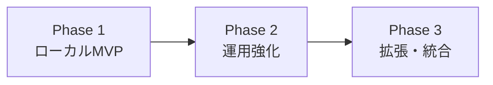

---
depends_on:
  - ./goals.md
tags: [overview, scope, phases]
ai_summary: "対象範囲・対象外・フェーズ分割・前提条件・制約を定義"
---

# スコープ・対象外

> Status: Draft
> 最終更新: 2026-02-01

本ドキュメントは、プロジェクトのスコープ（範囲）を明確にする。

---

## スコープ定義

### 対象範囲

| カテゴリ | 対象 | 説明 |
|----------|------|------|
| 機能 | マルチプロジェクト管理 | 複数GitリポジトリをProjectとして登録・切替する |
| 機能 | タスク管理 | タスク/依存/履歴（run）をDBで一元管理する |
| 機能 | 実行基盤 | タスクごとのworktree作成とプロセス実行を行う |
| 機能 | スコープ制御 | タスクごとにwrite/excludeを適用し、違反を検出・承認管理する |
| 機能 | 判断材料 | 観測可能な事実（exit code、差分、検証結果等）を保存する |
| インターフェース | Web UI | ブラウザで監視・介入・承認・再実行を行う |

### 対象外

| カテゴリ | 対象外 | 理由 |
|----------|--------|------|
| 機能 | AIの最終判断ロジック | 判断はOrchestrator/Plannerに委ねる |
| 機能 | 単一AIの全自動開発 | 役割分離とレビュー前提を維持する |
| プラットフォーム | Gitの置き換え | Git前提で共存する |
| 機能 | tmuxベースの多重セッション | Web UIでの可視化・介入に置換する |
| 機能 | マルチユーザー認証/認可 | ローカル一人運用MVPの外とする |

---

## フェーズ分け

### Phase 1: ローカルMVP

| 機能 | 説明 |
|------|------|
| マルチプロジェクト | repo登録と切替 |
| DBマスター | 状態・履歴・事実の一元管理 |
| Web UI | 監視・介入・承認 |
| 実行基盤 | worktree隔離、プロセス起動 |
| スコープ制御 | 事前制約+事後検出 |

### Phase 2: 運用強化

| 機能 | 説明 |
|------|------|
| 実行安定性 | 再実行・タイムアウト・中断の標準化 |
| 監査性 | 監査ログと判断材料の拡充 |
| テンプレート化 | 代表的なタスク種別のスコープ/DoDテンプレート整備 |

### Phase 3: 拡張・統合

| 機能 | 説明 |
|------|------|
| 外部連携 | 既存開発ツールとの接続 |
| 運用自動化 | 標準運用のテンプレート化 |

---

## 前提条件

| 前提 | 説明 |
|------|------|
| Git利用 | 既存Git運用を前提とする |
| worktree利用 | タスクごとの隔離作業領域を作る |
| ローカル一人運用 | MVPはローカル環境で完結する |

---

## 制約事項

| 制約 | 種別 | 説明 |
|------|------|------|
| 判断しない | 設計 | AgentMineは判断せず、判断材料を提供する |
| AI非依存 | 技術 | 特定AIに依存しない構成とする |
| 物理制約 | 安全 | スコープ制御は物理的に適用する |

---

## 関連ドキュメント

- [summary.md](./summary.md) - プロジェクト概要
- [goals.md](./goals.md) - 目的・解決する課題
- [principles.md](../02-architecture/principles.md) - 設計原則
