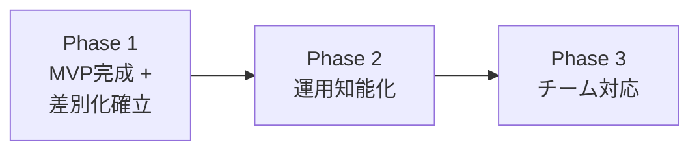

---
depends_on:
  - ./goals.md
tags: [overview, scope, phases, roadmap]
ai_summary: "対象範囲・対象外・フェーズ分割（A:AI非依存/B:安全性/D:チーム向け）・前提条件・制約を定義"
---

# スコープ・対象外

> Status: Active
> 最終更新: 2026-02-06

本ドキュメントは、プロジェクトのスコープ（範囲）を明確にする。

---

## スコープ定義

### 対象範囲

| カテゴリ    | 対象                           | 説明                                            |
| ----------- | ------------------------------ | ----------------------------------------------- |
| A: AI非依存 | RunnerAdapter + 複数Runner対応 | Claude/Codex/Gemini等を統合管理する             |
| B: 安全性   | スコープ制御                   | write/exclude + 違反検出 + 承認ワークフロー     |
| B: 安全性   | Proof-Carrying Run             | Run完了時の証跡パック自動生成                   |
| B: 安全性   | Conflict-Aware Scheduler       | write_scope重なり検出と衝突回避                 |
| B: 安全性   | Memory Governance              | 記憶の信頼度・有効期限・承認管理                |
| 基盤        | マルチプロジェクト管理         | 複数GitリポジトリをProjectとして登録・切替する  |
| 基盤        | タスク管理                     | タスク/依存/履歴（run）をDBで一元管理する       |
| 基盤        | worktree隔離                   | タスクごとに物理的に隔離する                    |
| 基盤        | 観測可能な事実                 | exit code、差分、検証結果等で状態を自動判定する |
| UI          | Web UI                         | ブラウザで監視・介入・承認・再実行を行う        |

### 対象外

| カテゴリ         | 対象外                  | 理由                                                |
| ---------------- | ----------------------- | --------------------------------------------------- |
| 機能             | AIの最終判断ロジック    | 判断はOrchestrator/Plannerに委ねる                  |
| 機能             | 単一AIの全自動開発      | 役割分離とレビュー前提を維持する                    |
| 機能             | 特定AI Runnerへの最適化 | AI非依存が原則。Runner固有の最適化はAdapterに閉じる |
| プラットフォーム | Gitの置き換え           | Git前提で共存する                                   |

---

## フェーズ分け

### Phase 1: MVP完成 + 差別化確立

既存設計の未実装部分を完成し、差別化機能を追加する。

| 機能                     | 方向性 | 説明                             | 状態                             |
| ------------------------ | ------ | -------------------------------- | -------------------------------- |
| スコープ制御の完成       | B      | 違反検出、承認ワークフローの実装 | 設計済み・未実装                 |
| DoD check実行            | B      | 検証チェック定義と自動実行       | 設計済み・未実装                 |
| Worktree管理の完成       | 基盤   | cleanup、reuse、dirty検出        | 設計済み・未実装                 |
| Proof-Carrying Run       | B      | 証跡パック自動生成               | **新規**                         |
| Conflict-Aware Scheduler | B      | write_scope重なり検出と衝突回避  | **新規**                         |
| Memory Governance        | B      | 信頼度・有効期限・承認           | **新規**（既存memory-layer拡張） |
| RunnerAdapter追加        | A      | Codex完成 + Gemini CLI等         | Codex stub済み                   |
| Task状態導出の完成       | 基盤   | DoD統合、merge判定、完全なルール | 部分実装済み                     |

### Phase 2: 運用知能化

AI実行の運用効率を向上する。

| 機能                 | 方向性 | 説明                                       |
| -------------------- | ------ | ------------------------------------------ |
| Cost/SLA Router      | A      | 予算・締切・失敗率でRunner選択を最適化する |
| Compliance Templates | B+D    | SOC2/ISO向けポリシープリセットを提供する   |
| 監査ログエクスポート | B      | 監査証跡のレポート出力                     |
| Runner実績メトリクス | A      | Runner別の成功率・コスト・所要時間の収集   |
| テンプレート化       | 基盤   | タスク種別ごとのスコープ/DoDテンプレート   |

### Phase 3: チーム対応

マルチユーザー・組織利用に対応する。

| 機能                 | 方向性 | 説明                                              |
| -------------------- | ------ | ------------------------------------------------- |
| 認証・認可           | D      | JWT/OAuth + ロール管理（Owner/Operator/Reviewer） |
| リモートアクセス     | D      | localhost制約の解除、TLS対応                      |
| チームダッシュボード | D      | メンバー別の実行状況・成果物一覧                  |
| 組織ポリシー管理     | B+D    | 組織レベルのスコープ/DoD/記憶ポリシー             |

### 保留機能

以下は検討の結果、現時点では保留とする。

| 機能               | 保留理由                                                    | 再検討条件                         |
| ------------------ | ----------------------------------------------------------- | ---------------------------------- |
| Just-in-Time Scope | 非対話Runner(ADR-0005)と矛盾。既存retryフローで擬似実現可能 | Runner通信モデルの拡張時           |
| Forensic Replay    | 優先度低。再現性原則の運用で部分対応可能                    | ユーザーからの需要が明確になった時 |
| Spec Contract Mode | コード意味解析が必要。現アーキテクチャのスコープ外          | AST解析基盤の導入時                |

---

## 前提条件

| 前提             | 説明                                        |
| ---------------- | ------------------------------------------- |
| Git利用          | 既存Git運用を前提とする                     |
| worktree利用     | タスクごとの隔離作業領域を作る              |
| ローカル一人運用 | Phase 1-2はローカル環境で完結する           |
| 複数Runner利用   | 最低1つのAI CLIがインストール済みであること |

---

## 制約事項

| 制約       | 種別 | 説明                                    |
| ---------- | ---- | --------------------------------------- |
| 判断しない | 設計 | AgentMineは判断せず、判断材料を提供する |
| AI非依存   | 技術 | 特定AIに依存しない構成とする            |
| 物理制約   | 安全 | スコープ制御は物理的に適用する          |

---

## 関連ドキュメント

- [summary.md](./summary.md) - プロジェクト概要
- [goals.md](./goals.md) - 目的・解決する課題
- [principles.md](../02-architecture/principles.md) - 設計原則
- [ADR-0013](../04-decisions/0013-repositioning.md) - リポジショニング決定記録
