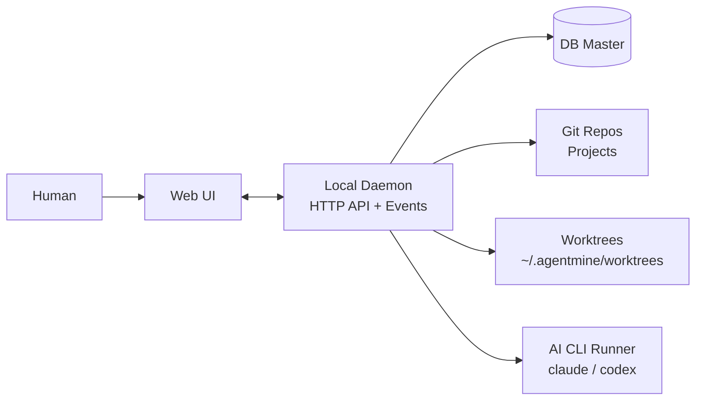

# プロジェクト概要

> Status: Draft
> 最終更新: 2026-02-01

本ドキュメントは、プロジェクト全体を1枚で把握するための概要を記載する。

---

## 一言で言うと

AgentMineは、ローカル環境でAI作業を安全に実行し、
結果をDBに集約して可視化・追跡できるプロジェクト管理基盤である。
基本構成はHuman→Orchestrator→Planner→Supervisor→Worker→Reviewerとする。

---

## 背景

| 項目 | 内容 |
|------|------|
| 現状の課題 | AI並列開発は安全性と再現性が低い。状態把握も難しい |
| 解決アプローチ | 実行（worktree+スコープ）と記録（DB）を分離する。状態は観測可能な事実で統一する |

---

## 主要機能

| 機能 | 説明 |
|------|------|
| マルチプロジェクト管理 | 複数のGitリポジトリをProjectとして登録し、同一UIで扱う |
| タスク・依存・履歴管理 | タスク分解、依存関係、実行履歴（run）をDBで一元管理する |
| worktree隔離 | タスクごとにブランチ+worktreeを作り、並列実行の衝突を避ける |
| スコープ制御 | タスクごとに編集可能範囲（write）を明示し、事前制約+事後検出で担保する |
| 監視と介入（Web UI） | ブラウザで実行ログを監視し、stop/retry/continue等で介入する |
| 観測可能な事実 | exit code、差分、検証結果等で状態を自動判定する |

---

## 対象ユーザー

| ユーザー種別 | 説明 | 主な利用シーン |
|--------------|------|----------------|
| 個人開発者 | ローカルで安全にAI並列開発したい | 複数タスクを並列に進める |
| Orchestrator | 人間の要件を整理し判断する窓口 | 要件整理・優先度決定・介入判断 |
| Planner | タスク分解と依存設計を担う | 分解・依存設計 |
| Supervisor | 実行管理（起動/停止/並列度）を担う | 起動可否判断・run開始/停止 |

---

## システム概観

---

## 関連ドキュメント

- [目的・解決する課題](./goals.md) - 課題一覧と成功基準の定義
- [スコープ・対象外](./scope.md) - 対象範囲とフェーズ分割
- [設計原則](../02-architecture/principles.md) - 判断と実行基盤の分離方針
- [システム境界・外部連携](../02-architecture/context.md) - C4 Context図と外部システム定義
- [役割モデル（5層）](../02-architecture/role-model.md) - 役割と責務分離
