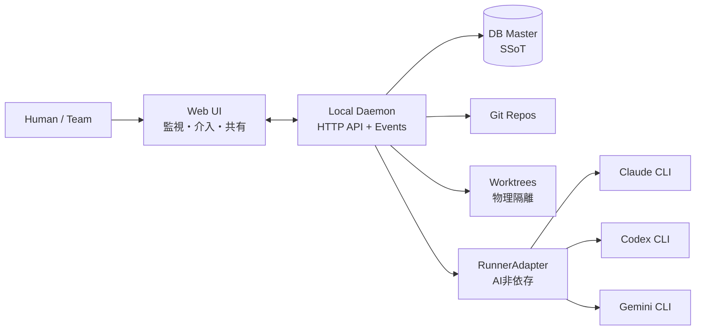

# プロジェクト概要

> Status: Active
> 最終更新: 2026-02-06

本ドキュメントは、プロジェクト全体を1枚で把握するための概要を記載する。

---

## 一言で言うと

AgentMineは、**AI非依存**の開発タスクオーケストレーション基盤である。複数のAI Runner（Claude, Codex, Gemini等）を統合管理し、スコープ制御・完了定義・監査証跡で**安全性と観測可能性**を提供する。

---

## ポジショニング

AgentMineは「AIプログラマーを管理するプロジェクトマネージャー」として機能する。

| 観点 | Claude Code等のAI開発ツール | AgentMine |
|------|---------------------------|-----------|
| AI対応 | 特定AI専用 | AI非依存（RunnerAdapter） |
| 安全制御 | ツール単位の権限 | ファイル単位のスコープ+違反検出+承認 |
| 実行隔離 | 同一ディレクトリ | worktreeで物理隔離 |
| 完了判定 | AI自己報告 | Observable Facts + DoD |
| 利用形態 | 個人ターミナル | Web UIで可視化・共有 |

---

## 背景

| 項目 | 内容 |
|------|------|
| 市場の変化 | AI開発ツールがオーケストレーション機能を内蔵し始めた（Claude Code Agent Teams等） |
| AgentMineの強み | AI非依存設計、物理的スコープ制御、事実ベースの状態管理は他ツールにない |
| 解決アプローチ | 実行（worktree+スコープ）と記録（DB）を分離する。状態は観測可能な事実で統一する |

---

## 主要機能

| 機能 | 説明 |
|------|------|
| AI非依存オーケストレーション | RunnerAdapterで複数AI Runner（Claude, Codex, Gemini等）を統合管理する |
| スコープ制御 | タスクごとにwrite/excludeを適用し、事前制約+事後検出で担保する |
| Conflict-Aware Scheduler | 並列起動前にwrite_scopeの重なりを検出し、衝突を回避する |
| Proof-Carrying Run | Run完了時に証跡パック（prompt hash、scope、変更ファイル、DoD結果）を自動生成する |
| Memory Governance | 記憶の信頼度・有効期限・承認で長期運用の品質を維持する |
| 観測可能な事実 | exit code、差分、検証結果等で状態を自動判定する |
| worktree隔離 | タスクごとにブランチ+worktreeを作り、並列実行の衝突を物理的に防ぐ |
| 監視と介入（Web UI） | ブラウザで実行ログを監視し、stop/retry/continue等で介入する |

---

## 対象ユーザー

| ユーザー種別 | 説明 | 主な利用シーン |
|--------------|------|----------------|
| 個人開発者 | 複数のAI Runnerを安全に並列管理したい | タスクごとに最適なRunnerを選択して実行 |
| チームリード | AI開発の進捗と品質を把握したい | Web UIで全タスクの状態・監査証跡を確認 |
| Orchestrator | 人間の要件を整理し判断する窓口 | 要件整理・優先度決定・介入判断 |
| Supervisor | 実行管理（起動/停止/並列度）を担う | 起動可否判断・衝突検出・run開始/停止 |

---

## システム概観

---

## 関連ドキュメント

- [目的・解決する課題](./goals.md) - 課題一覧と成功基準の定義
- [スコープ・対象外](./scope.md) - 対象範囲とフェーズ分割
- [設計原則](../02-architecture/principles.md) - 判断と実行基盤の分離方針
- [システム境界・外部連携](../02-architecture/context.md) - C4 Context図と外部システム定義
- [役割モデル（5層）](../02-architecture/role-model.md) - 役割と責務分離
- [ADR-0013](../04-decisions/0013-repositioning.md) - リポジショニング決定記録
