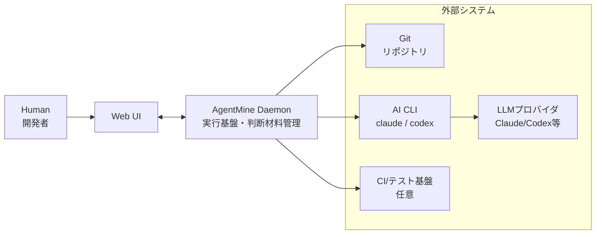

---
depends_on:
  - ../01-overview/summary.md
  - ../02-architecture/principles.md
tags: [architecture, c4, context, boundary]
ai_summary: "システム境界と外部システム連携をC4 Context図で定義"
---

# システム境界・外部連携

> Status: Draft
> 最終更新: 2026-02-01

本ドキュメントは、システムの境界と外部システムとの連携を定義する（C4 Context相当）。

---

## システムコンテキスト図

---

## アクター定義

| アクター | 種別 | 説明 | 主な操作 |
|----------|------|------|----------|
| Human | 人間 | 目的の提示と最終判断を行う | 依頼、承認、介入 |
| Orchestrator | 役割 | 人間の要件を整理し判断する窓口 | 依頼受付、移譲、判断 |
| Planner | 役割 | タスク分解と依存設計 | 分解、依存設計 |
| Supervisor | 役割 | runの起動/停止と並列度管理 | 起動可否判断、run開始/停止 |
| Worker | 役割 | 隔離worktreeで実装を担当 | コード作成、テスト |
| Reviewer | 役割 | DoD検証を担当 | 検証、結果記録 |

---

## 外部システム連携

### Git

| 項目 | 内容 |
|------|------|
| 概要 | ソース管理・履歴・マージ判定に利用 |
| 連携方式 | CLI操作・worktree運用 |
| 連携データ | ブランチ、コミット、差分 |
| 連携頻度 | 実行中は随時 |
| 依存度 | 必須 |

### AI CLI

| 項目 | 内容 |
|------|------|
| 概要 | Workerを実行するローカルCLI |
| 例 | `claude`, `codex` |
| 連携方式 | プロセス起動、stdin/stdoutのログ収集 |
| 依存度 | 必須（MVP） |

### LLMプロバイダ

| 項目 | 内容 |
|------|------|
| 概要 | Worker/Orchestrator等のAI実行基盤 |
| 連携方式 | AI CLI/SDK（AgentMine外部） |
| 連携データ | プロンプト、コンテキスト |
| 連携頻度 | 実行中は随時 |
| 依存度 | 必須 |

### CI/テスト基盤

| 項目 | 内容 |
|------|------|
| 概要 | DoD検証の一部を担う可能性 |
| 連携方式 | CLI/HTTP/API（運用により変動） |
| 連携データ | テスト結果、ビルド結果 |
| 連携頻度 | 必要時 |
| 依存度 | オプション |

---

## システム境界

### 内部（AgentMineの責務）

| 責務 | 説明 |
|------|------|
| 実行基盤 | worktree隔離、プロセス管理、スコープ制御 |
| 状態管理 | DBマスターによるProject/Task/Run等の管理 |
| 判断材料 | 観測可能な事実とログの提供 |
| 共有基盤 | Web UIとAPIの統合アクセス |

### 外部（AgentMineの責務外）

| 項目 | 担当 | 説明 |
|------|------|------|
| 最終判断 | Human/Orchestrator | 仕様の正しさや優先度の決定 |
| タスク分解のルール | Planner | 分解粒度や依存設計の判断 |
| 実行順序/並列度の判断 | Supervisor | 起動可否、停止、並列度の判断 |
| LLMの品質 | LLMプロバイダ | モデル性能や学習は外部要素 |

---

## 関連ドキュメント

- [summary.md](../01-overview/summary.md) - プロジェクト概要
- [principles.md](./principles.md) - 設計原則
- [structure.md](./structure.md) - 主要コンポーネント構成
- [role-model.md](./role-model.md) - 役割と責務分離
