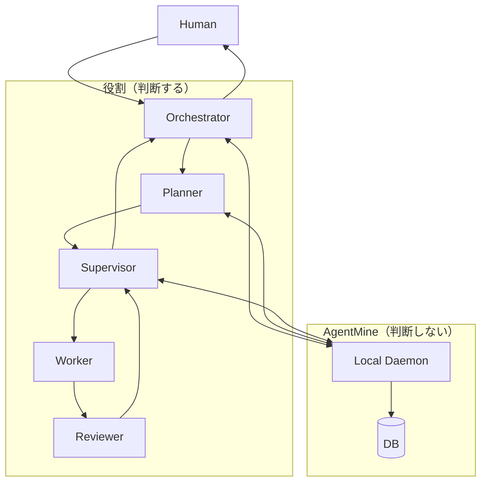

---
depends_on:
  - ./principles.md
  - ./structure.md
  - ../03-details/flows.md
  - ../03-details/scope-control.md
  - ../03-details/runner-adapter.md
  - ../03-details/event-stream.md
tags: [architecture, roles, multi-agent, orchestration]
ai_summary: "Human/Orchestrator/Planner/Supervisor/Worker/Reviewerの役割モデルと、AgentMine（判断しない）との関係を定義"
---

# 役割モデル（5層）

> Status: Draft
> 最終更新: 2026-02-01

本ドキュメントは、AgentMine上で並列開発を行うための役割モデルを定義する。
ここでの「層」は実装モジュールではなく、責務分離のための役割分類である。

---

## 目的

- 「判断」と「実行」を分離し、AI並列開発の失敗を局所化する。
- 役割名を一般的な用語に統一し、固有語（例: Shogun）を持ち込まない。
- AgentMineの責務（判断しない）を明確化する。

---

## 概要図

注:

- Orchestrator/Planner/Supervisorは「人間が担ってもよい」役割である。

---

## 役割定義

| 役割         | 定義       | 主な責務                               | やらないこと         |
| ------------ | ---------- | -------------------------------------- | -------------------- |
| Human        | 最終責任者 | 目的提示、方針決定、承認               | 実装、分解の詳細設計 |
| Orchestrator | 人間IF     | 依頼受付、状況説明、介入判断           | 実装、検証           |
| Planner      | 計画       | タスク分解、依存設計、粒度調整         | Worker起動、進捗監視 |
| Supervisor   | 実行管理   | 起動可否判定、run開始/停止、並列度制御 | タスク分解、実装     |
| Worker       | 実装       | worktree内で実装し成果物を作る         | 判断、他Worker調整   |
| Reviewer     | 検証       | DoD実行、品質観点の確認、結果報告      | 修正、分解           |
| AgentMine    | 実行基盤   | DB集約、ログ/事実提供、制約適用        | 次に何をするかの判断 |

---

## 起動モデル（Supervisor中心）

Supervisorが「起動できるタスク」と「並列度」を管理する。
Planner/Worker/Reviewerは必要時に都度起動される。

| 役割         | 起動トリガー           | 終了条件               |
| ------------ | ---------------------- | ---------------------- |
| Orchestrator | Humanが対話/操作を開始 | Humanが終了            |
| Supervisor   | 実行を開始したい       | 監視対象がなくなる     |
| Planner      | 分解/再計画が必要      | 分解結果を確定         |
| Worker       | 依存解消し、run開始    | 指示完了または異常終了 |
| Reviewer     | Worker完了             | 検証完了               |

注:

- MVPでは、Supervisor相当の操作（run開始/stop等）をHumanがWeb UIで行ってもよい。

---

## 共有と通信（MVP）

役割間の共有はDBの事実を中心に行い、通知はイベント配信で行う。
プロセスの起動/停止はDaemonが一元化する。

| 用途     | 手段                 | 備考                                     |
| -------- | -------------------- | ---------------------------------------- |
| 状態共有 | DB                   | 状態のSSoTである                         |
| 操作     | HTTP API             | Web UIおよび外部クライアントから呼び出す |
| 通知     | SSE（Event Stream）  | UIは`/api/events`を購読する              |
| 実行     | OSプロセス（Runner） | runner差はRunnerAdapterで吸収する        |

---

## NG時の責任分界

NGの多くは「指示/計画/環境」の問題である。
Workerは意図を挟めない前提とし、NG時は指示側へ戻す。

| NG原因           | 主担当               | 次のアクション                        |
| ---------------- | -------------------- | ------------------------------------- |
| タスク説明が曖昧 | Orchestrator/Planner | タスク説明を修正し、新runで再実行する |
| 粒度が大きすぎ   | Planner              | タスクを追加分解する                  |
| 依存が誤っている | Planner              | 依存を修正する                        |
| 実行環境の問題   | Supervisor           | runner/DoD/環境を調整し再実行する     |
| 検証（DoD）失敗  | Planner              | 失敗理由を踏まえタスク定義を見直す    |

---

## Workerの隔離と入力

WorkerはAgentMineのDB/APIに直接アクセスしない。
入力は「プロンプト」と「worktree内の読み取り資料」に限定する。

| 入力       | 内容                                             |
| ---------- | ------------------------------------------------ |
| タスク     | id/title/description、依存関係                   |
| スコープ   | write_scopeとexcludeの合成結果（scope snapshot） |
| ルール資料 | Memory Bank等のスナップショット（任意）          |
| 検証       | DoD定義と実行方法（任意）                        |

注:

- スコープの物理制約と違反検出は[スコープ制御](../03-details/scope-control.md)に従う。

---

## 関連ドキュメント

- [設計原則](./principles.md) - AgentMineは判断しない
- [主要コンポーネント構成](./structure.md) - Daemon/UI/Runnerの分離
- [主要フロー](../03-details/flows.md) - 分解とrun開始/介入
- [イベント配信](../03-details/event-stream.md) - SSEによる通知
- [RunnerAdapter](../03-details/runner-adapter.md) - runner差の吸収
- [スコープ制御](../03-details/scope-control.md) - Worker隔離
