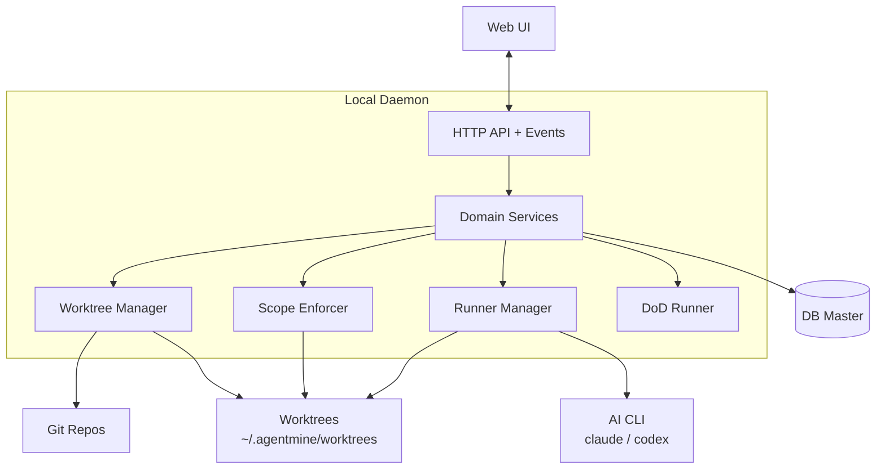

---
depends_on:
  - ./context.md
  - ./principles.md
tags: [architecture, c4, container, components]
ai_summary: "主要コンポーネントの構成・責務・通信方式をC4 Container図で定義"
---

# 主要コンポーネント構成

> Status: Draft
> 最終更新: 2026-02-01

本ドキュメントは、システムの主要コンポーネントとその関係を定義する（C4 Container相当）。

---

## コンポーネント構成図



---

## コンポーネント一覧

| コンポーネント | 種別 | 責務 | 技術 |
|----------------|------|------|------|
| Web UI | Interface | 人間向け監視・介入 | ブラウザ |
| Local Daemon | Core | API/イベント配信、実行基盤の統括 | Node.js/TypeScript |
| Domain Services | Core | Project/Task/Run管理 | TypeScript |
| Worktree Manager | Core | worktree作成/削除、Git事実取得 | Git/Filesystem |
| Scope Enforcer | Core | exclude/read/writeの適用と違反検出 | Git/Filesystem |
| Runner Manager | Core | AIプロセス起動/停止、ログ収集 | OSプロセス |
| DoD Runner | Core | 検証実行と結果記録 | CLI/CI連携 |
| DB Master | Data | 状態のSSoT | SQLite（MVP） |

---

## コンポーネント詳細

### Domain Services

| 項目 | 内容 |
|------|------|
| 責務 | すべての状態をDBに集約し操作する |
| 入力 | Web UI/APIからの操作 |
| 出力 | DB更新、イベント、ログ |
| 依存 | DB Master, Runner Manager, Worktree Manager, Scope Enforcer |

### Runner Manager

| 項目 | 内容 |
|------|------|
| 責務 | AIプロセスの起動/監視/終了 |
| 入力 | Worker起動要求 |
| 出力 | 実行状態・終了コード |
| 依存 | OSプロセス, worktree |

### Worktree Manager / Scope Enforcer

| 項目 | 内容 |
|------|------|
| 責務 | 物理的な隔離と書き込み制約 |
| 入力 | タスクとスコープ定義 |
| 出力 | worktree構築と制約適用 |
| 依存 | Git, Filesystem |

---

## コンポーネント間通信

| 送信元 | 送信先 | プロトコル | 内容 |
|--------|--------|------------|------|
| Web UI | Local Daemon | HTTP + Events | タスク管理・実行制御・監視 |
| Local Daemon | DB Master | SQL | 状態の保存と取得 |
| Local Daemon | Git/Filesystem | CLI/FS | worktree操作、差分取得 |
| Local Daemon | AI CLI | OSプロセス | AI実行 |

---

## ディレクトリ構成

実装上のディレクトリ構成は実装に委ねる。以下は例である。

```
project/
├── apps/
│   ├── daemon/      # Local Daemon（API + Runner）
│   └── web/         # Web UI
├── packages/        # 共有ロジック（任意）
├── docs/            # 設計ドキュメント
└── scripts/
```

---

## 関連ドキュメント

- [システム境界・外部連携](./context.md) - C4 Context図と外部システム定義
- [技術スタック](./tech-stack.md) - 技術選定と選定理由
- [データモデル](../03-details/data-model.md) - エンティティ定義とER図
- [主要フロー](../03-details/flows.md) - 業務フローのシーケンス図
