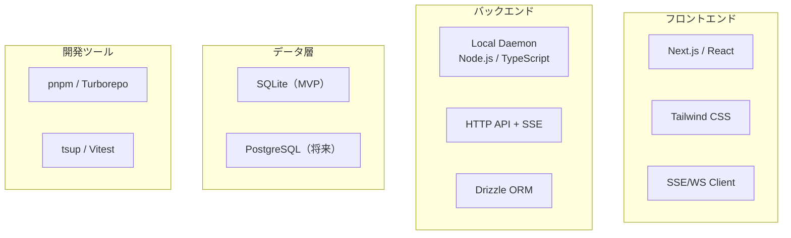

---
depends_on:
  - ./structure.md
tags: [architecture, technology, stack]
ai_summary: "技術選定の一覧と選定理由・代替案・バージョン管理方針を定義"
---

# 技術スタック

> Status: Draft
> 最終更新: 2026-02-01

本ドキュメントは、プロジェクトで使用する技術スタックとその選定理由を記載する。

---

## 技術スタック概要

---

## 技術スタック一覧

### 言語・フレームワーク

| カテゴリ | 技術 | バージョン | 用途 |
|----------|------|------------|------|
| 言語 | TypeScript | 5.x | 全パッケージ共通 |
| ランタイム | Node.js | >=20 | Daemon実行 |
| フロントエンド | Next.js | 未確定 | Web UI |
| UI基盤 | React | 未確定 | Web UI |
| 通信 | SSE（Server-Sent Events） | - | runログ/状態のストリーミング |

### データベース・ストレージ

| 技術 | バージョン | 用途 |
|------|------------|------|
| SQLite | - | ローカル/軽量運用（MVP） |
| PostgreSQL | - | チーム共有運用（将来） |

### インフラ・ホスティング

| 技術 | 用途 |
|------|------|
| ローカル/セルフホスト | まずはローカル運用を想定 |

### 開発ツール

| カテゴリ | 技術 | 用途 |
|----------|------|------|
| パッケージ管理 | pnpm 9.15.0 | モノレポ管理 |
| モノレポ | Turborepo 2.7.x | パッケージ横断ビルド |
| ビルド | tsup 8.x | CLI/Coreビルド |
| テスト | Vitest 2.x | CLI/Coreテスト |
| CSS | Tailwind CSS 4.x | Web UI |

---

## 技術選定理由

### TypeScript + Node.js

| 項目 | 内容 |
|------|------|
| 選定理由 | DaemonとWebで共通言語を使える |
| 代替候補 | Go, Rust |
| 不採用理由 | 既存資産と運用速度を優先 |

### Next.js

| 項目 | 内容 |
|------|------|
| 選定理由 | Web UIの開発速度と拡張性 |
| 代替候補 | Vite + React |
| 不採用理由 | 統合的なルーティング/SSR要件を見込む |

### Drizzle ORM

| 項目 | 内容 |
|------|------|
| 選定理由 | 型安全性とSQLite/PostgreSQL両対応 |
| 代替候補 | Prisma, Kysely |
| 不採用理由 | 軽量性と現行採用実績を優先 |

### SSE（Server-Sent Events）

| 項目 | 内容 |
|------|------|
| 選定理由 | ローカル運用で単方向ストリーミングが簡潔である |
| 代替候補 | WebSocket |
| 不採用理由 | 双方向性がMVPでは必須でない |

---

## バージョン管理方針

| 項目 | 方針 |
|------|------|
| メジャーバージョン | LTS/安定版を優先 |
| マイナーバージョン | 破壊的変更を避けつつ定期更新 |
| 依存関係更新 | 月次で確認し、CIで検証 |

---

## 関連ドキュメント

- [structure.md](./structure.md) - 主要コンポーネント構成
- [04-decisions/](../04-decisions/) - 技術選定のADR
