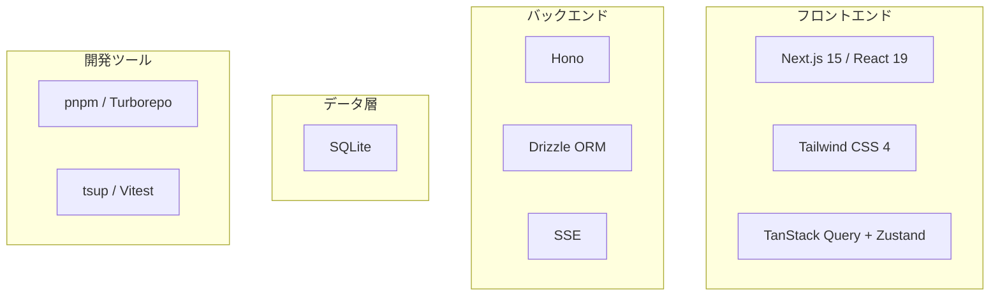

---
depends_on:
  - ./structure.md
tags: [architecture, technology, stack]
ai_summary: "技術選定の一覧と選定理由・代替案・モノレポ構成を定義"
---

# 技術スタック

> Status: Draft
> 最終更新: 2026-02-02

プロジェクトで使用する技術スタックを定義する。

---

## 技術スタック概要

---

## モノレポ構成

| パッケージ | 責務 |
|-----------|------|
| `packages/daemon` | Local Daemon（Hono API + RunnerManager） |
| `packages/web` | Web UI（Next.js） |
| `packages/shared` | 共通型定義（API schema等） |
| `packages/db` | Drizzle schema + migrations |

---

## 技術スタック一覧

### 言語・ランタイム

| 技術 | バージョン | 用途 |
|------|------------|------|
| TypeScript | 5.x | 全パッケージ共通 |
| Node.js | >=20 | Daemon実行 |

### フロントエンド

| 技術 | バージョン | 用途 |
|------|------------|------|
| Next.js | 15.x | Web UI |
| React | 19.x | UI基盤 |
| Tailwind CSS | 4.x | スタイリング |
| TanStack Query | 5.x | サーバー状態管理 |
| Zustand | 5.x | UI状態管理 |

### バックエンド

| 技術 | バージョン | 用途 |
|------|------------|------|
| Hono | 4.x | HTTPサーバー |
| Drizzle ORM | 0.3x | DB操作 |
| better-sqlite3 | - | SQLiteドライバ |

### 開発ツール

| 技術 | バージョン | 用途 |
|------|------------|------|
| pnpm | 9.x | パッケージ管理 |
| Turborepo | 2.x | モノレポビルド |
| tsup | 8.x | バンドル |
| Vitest | 2.x | テスト |

---

## 技術選定理由

### Hono

| 項目 | 内容 |
|------|------|
| 選定理由 | 軽量（14KB）、TypeScriptネイティブ、シンプル |
| 代替候補 | Fastify, Express |
| 不採用理由 | Fastifyはオーバースペック、Expressは性能と型が弱い |

### TanStack Query + Zustand

| 項目 | 内容 |
|------|------|
| 選定理由 | 2025年の定番構成。役割分担が明確 |
| TanStack Query | APIデータの取得・キャッシュ・再取得 |
| Zustand | UIローカル状態（選択、フィルタ等） |
| 代替候補 | Redux Toolkit, Jotai |
| 不採用理由 | Reduxはボイラープレート過多、Jotaiは用途が限定的 |

### Next.js 15

| 項目 | 内容 |
|------|------|
| 選定理由 | 安定版、React 19対応、Turbopack安定 |
| 代替候補 | Vite + React |
| 不採用理由 | ルーティング・SSR統合の利便性を優先 |

### Drizzle ORM

| 項目 | 内容 |
|------|------|
| 選定理由 | 型安全、SQLite/PostgreSQL両対応、軽量 |
| 代替候補 | Prisma, Kysely |
| 不採用理由 | Prismaは重い、Kyselyはマイグレーション弱い |

---

## 関連ドキュメント

- [主要コンポーネント構成](./structure.md) - アーキテクチャ構成
- [Local Daemon](../03-details/daemon.md) - Daemon仕様
- [UI仕様](../03-details/ui-mvp.md) - Web UI仕様
