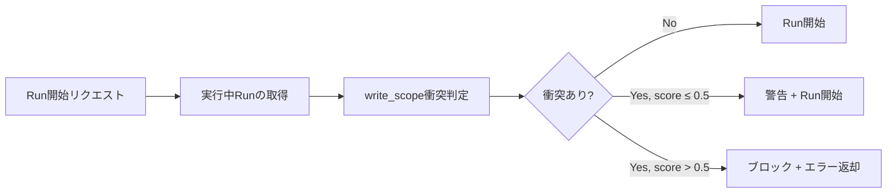

---
depends_on:
  - ./scope-control.md
  - ./business-rules.md
  - ../04-decisions/0006-task-write-scope-required.md
  - ../04-decisions/0013-repositioning.md
tags: [details, scheduler, conflict, safety, parallel]
ai_summary: "並列起動前にwrite_scopeの重なりを検出し、衝突を回避する実行順を決定するスケジューラを定義"
---

# Conflict-Aware Scheduler

> Status: Draft
> 最終更新: 2026-02-06

並列起動前にwrite_scopeの重なりを検出し、衝突を回避する実行順を決定する仕組みを定義する。

---

## 目的

- 並列実行時のwrite_scope競合をゼロにする
- Supervisorの手動判断負荷を下げる
- worktree隔離の恩恵を最大化する

---

## 前提

| 項目 | 内容 |
|------|------|
| write_scope必須 | タスクには必ずwrite_scope（glob配列）が設定されている（ADR-0006） |
| 同一タスク並列禁止 | 同一タスクの複数run同時実行は禁止（→[ビジネスルール](./business-rules.md)） |
| 異なるタスク並列可 | 異なるタスクは同時実行可能（worktreeが異なる） |

---

## 衝突の定義

2つのタスクのwrite_scopeが「同一ファイルに展開される可能性がある」場合、衝突とする。

### 衝突判定ロジック

2つのタスク A, B の write_scope を比較する。

| 判定 | 条件 | 例 |
|------|------|-----|
| 衝突なし | glob同士の交差が空集合 | A: `src/api/**`, B: `src/ui/**` |
| 衝突あり | glob同士が交差する | A: `src/**/*.ts`, B: `src/api/**` |
| 衝突あり | 一方が他方を包含する | A: `src/**`, B: `src/api/auth.ts` |

注: glob交差判定は保守的に行う。判定が困難な場合は「衝突あり」とみなす。

---

## 衝突スコア

衝突の度合いを数値化し、スケジューリング判断に利用する。

| スコア | 意味 | 算出方法 |
|--------|------|---------|
| 0.0 | 衝突なし | glob交差が空 |
| 0.0〜1.0 | 部分衝突 | 交差するglobの具体性で推定 |
| 1.0 | 完全衝突 | 一方が他方を完全に包含 |

### 算出ルール

1. 両タスクのwrite_scopeをglob配列として取得する
2. 各globペアの交差を判定する
3. 交差ペア数 / 全ペア数 を基本スコアとする
4. 包含関係がある場合はスコアを1.0に引き上げる

---

## スケジューリング判断

### 判断テーブル

| 衝突スコア | 判断 | 理由 |
|-----------|------|------|
| 0.0 | 並列実行を許可 | 衝突リスクなし |
| 0.0〜0.5 | 警告付きで並列実行を許可 | 低リスクだが注意が必要 |
| 0.5〜1.0 | 並列実行をブロック。順次実行を推奨 | 衝突リスクが高い |

注: 閾値はProject設定で調整可能とする（`scheduler.conflictThreshold`）。

### 判断ログ

スケジューリング判断は `scheduler_decision_log` として記録する。

| フィールド | 型 | 説明 |
|-----------|-----|------|
| id | integer | 判断ID |
| task_a_id | integer FK | 比較タスクA |
| task_b_id | integer FK | 比較タスクB |
| conflict_score | number | 衝突スコア |
| decision | string | allowed / warned / blocked |
| reason | string | 判断理由 |
| created_at | datetime | 判断日時 |

---

## 適用タイミング

### 判定の入力

| 入力 | 取得元 |
|------|--------|
| 新規Runのwrite_scope | タスクのwrite_scope |
| 実行中Runのwrite_scope | 実行中Run → タスク → write_scope |

注: scope_snapshotではなくタスクのwrite_scopeを比較する。scope_snapshotはRun開始後に確定するためである。

---

## API変更

### POST /api/tasks/:taskId/runs

既存のRun開始エンドポイントに衝突判定を追加する。

| レスポンス | 条件 |
|-----------|------|
| 201 Created | 衝突なし、またはスコア ≤ 閾値 |
| 409 Conflict | 衝突スコアが閾値を超過 |

409レスポンスに含める情報:

| フィールド | 説明 |
|-----------|------|
| conflicting_tasks | 衝突するタスクの一覧 |
| conflict_score | 各タスクとの衝突スコア |
| suggestion | 推奨アクション（順次実行、scope絞り込み等） |

### GET /api/tasks/:taskId/conflicts

指定タスクと実行中タスク間の衝突情報を取得する。Run開始前の事前確認に使用する。

---

## UI統合

### Run開始時の衝突警告

Run開始ボタン押下時に衝突判定を実行し、結果に応じて表示を変える。

| 衝突スコア | UI表示 |
|-----------|--------|
| 0.0 | 通常の開始確認 |
| 0.0〜0.5 | 黄色警告バナー + 衝突タスク名 + 「続行」ボタン |
| 0.5〜1.0 | 赤色エラーバナー + 衝突タスク名 + 「強制実行」ボタン（確認付き） |

### Monitor画面

タスクツリーに衝突アイコンを表示する。実行中タスクと衝突するタスクを視覚的に識別できるようにする。

---

## 関連ドキュメント

- [スコープ制御](./scope-control.md) - write_scopeの定義と違反検出
- [ビジネスルール](./business-rules.md) - 並列実行の既存制約
- [ADR-0006](../04-decisions/0006-task-write-scope-required.md) - write_scope必須の決定
- [ADR-0013](../04-decisions/0013-repositioning.md) - リポジショニング決定記録
