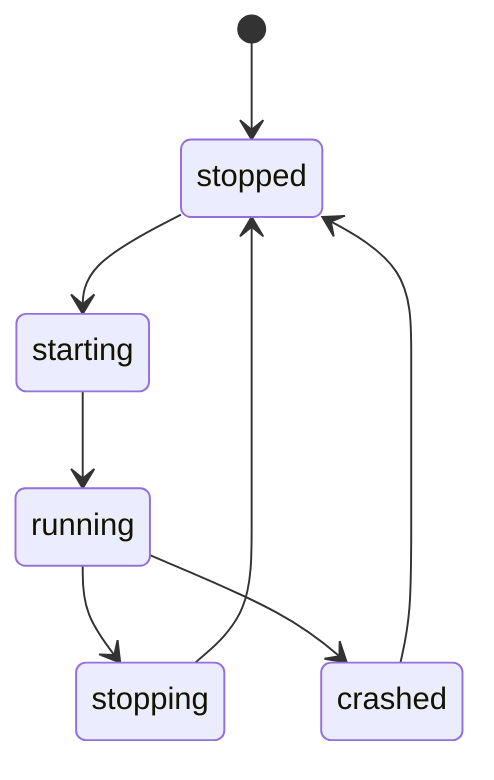

---
depends_on:
  - ../02-architecture/structure.md
  - ../04-decisions/0003-local-daemon-and-web-ui.md
  - ../04-decisions/0004-agentmine-home-dir.md
  - ../04-decisions/0010-daemon-single-instance-and-localhost.md
tags: [details, daemon, lifecycle, local]
ai_summary: "Local Daemonの起動/停止、単一インスタンス、AgentMine Home配下の配置を定義"
---

# Local Daemon（起動・停止）

> Status: Draft
> 最終更新: 2026-02-01

本ドキュメントは、Local Daemonの起動と停止を定義する。
運用はローカル一人運用を前提とする。

---

## 目的

- Web UIからの操作を1つの制御点に集約する
- runの実行と監視をローカルで完結させる
- DB正（SSoT）を担保する

---

## 起動状態



---

## 単一インスタンス

Daemonは同一ユーザー環境で単一である。
複数起動は行わない。

| 項目 | 方針 |
|------|------|
| 重複起動 | 既存Daemonが存在する場合は、既存のURLを返す |
| 判定 | AgentMine Homeにロックファイルを置く |
| 解除 | 正常停止で解除する。異常終了時は再起動で回収する |

---

## ポートとURL

Daemonは `127.0.0.1` にバインドする。
デフォルトポートは `6419` とする。

| 項目 | 方針 |
|------|------|
| デフォルト | `http://127.0.0.1:6419` |
| 競合時 | 次の候補ポートへ切り替える |
| 参照 | 実際のURLはstateファイルに保存する |

---

## UI配信（MVP）

MVPの運用モードでは、DaemonがWeb UIを配信する。
Web UIとAPI/SSEは同一originで提供される。

| 項目 | 方針 |
|------|------|
| 配信形態 | UIビルド成果物の静的配信である |
| ルート | `/` でUIを返す |
| API | `/api/*` を提供する |
| Events | `/api/events`（SSE）を提供する |

注:
- UIはAPI/SSEを相対パス（`/api/...`）で参照する。UI側にDaemonのポート設定を持ち込まない。

### 開発時の扱い（ハイブリッド）

開発時はWeb UIを別ポートのdev serverで起動してよい。
この場合、Web UIは `/api/*` と `/api/events` をDaemonへプロキシする。

| 観点 | 方針 |
|------|------|
| 目的 | HMR等でUI開発速度を確保する |
| CORS | ブラウザからは同一originに見えるようプロキシする |
| 契約 | UIのAPI呼び出しパスは本番/開発で同一である |

---

## AgentMine Homeの配置

AgentMine Homeは `~/.agentmine` とする（→用語集）。
Daemonは必要なファイルをAgentMine Home配下に作成する。

```
~/.agentmine/
  db/
  daemon/
  logs/
  worktrees/
```

| ディレクトリ | 目的 |
|-------------|------|
| `db/` | DBファイルを置く |
| `daemon/` | ロックと状態ファイルを置く |
| `logs/` | run/checkのログを置く |
| `worktrees/` | worktreeを置く |

---

## 停止時の扱い

Daemon停止はrunの停止を含む。
停止処理は正常停止と異常終了で挙動が異なる。

| 事象 | runプロセス | run状態 |
|------|------------|--------|
| 正常停止（stop） | 停止する | cancelledにする |
| 異常終了（crash） | 停止を試みる | 次回起動で整合処理する |

---

## 再起動時の整合処理

起動時に、DB上で `running` のrunが存在する場合は整合処理を行う。
MVPでは `running` のrunを `cancelled` に変更する。

注:
- runnerの子プロセスはDaemonが管理する。
- Daemonが停止している間にrunを継続させない。

---

## 関連ドキュメント

- [主要コンポーネント構成](../02-architecture/structure.md) - Local Daemonの責務
- [ADR-0003](../04-decisions/0003-local-daemon-and-web-ui.md) - Web UI + Local Daemon
- [ADR-0004](../04-decisions/0004-agentmine-home-dir.md) - `~/.agentmine`
- [ADR-0010](../04-decisions/0010-daemon-single-instance-and-localhost.md) - localhost単一インスタンス
- [ログ保存](./log-storage.md) - ログの保存場所
