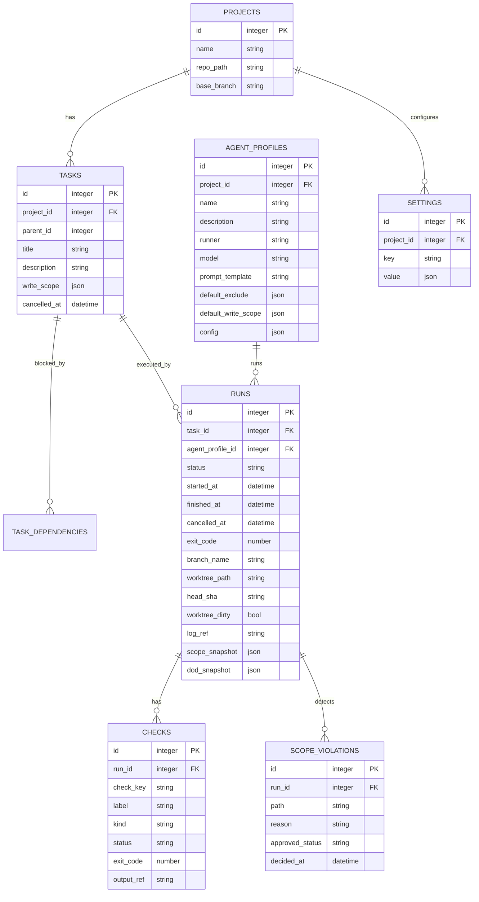

---
depends_on:
  - ../02-architecture/structure.md
  - ../02-architecture/principles.md
  - ./observable-facts.md
tags: [details, data, er-diagram, schema]
ai_summary: "MVPのエンティティ定義とER図（projects/tasks/runs/checks/scope_violations等）を定義"
---

# データモデル

> Status: Draft
> 最終更新: 2026-02-01

本ドキュメントは、MVPのデータモデルを定義する。
物理スキーマ（型・インデックス等）は実装に委ねる。

---

## ER図

---

## エンティティ一覧

| エンティティ      | 説明                                             | 主キー |
| ----------------- | ------------------------------------------------ | ------ |
| projects          | Gitリポジトリ単位の管理                          | id     |
| tasks             | タスク（親子/スコープ含む）                      | id     |
| task_dependencies | 依存関係                                         | id     |
| agent_profiles    | 実行プロファイル（runner/model等）               | id     |
| runs              | 実行履歴（1タスク複数run）                       | id     |
| checks            | DoD等の検証結果（run配下）                       | id     |
| scope_violations  | スコープ違反（run配下）                          | id     |
| settings          | プロジェクト設定                                 | id     |
| project_memories  | プロジェクト記憶（→[記憶層](./memory-layer.md)） | id     |

---

## エンティティ詳細（MVP）

### projects

| カラム      | 必須 | 説明                               |
| ----------- | :--: | ---------------------------------- |
| id          |  ○   | Project識別子                      |
| name        |  ○   | 表示名                             |
| repo_path   |  ○   | ローカルのGitリポジトリパス        |
| base_branch |  ○   | 完了判定の基準ブランチ（例: main） |

### tasks

| カラム       | 必須 | 説明                                                          |
| ------------ | :--: | ------------------------------------------------------------- |
| id           |  ○   | タスク識別子                                                  |
| project_id   |  ○   | 所属Project                                                   |
| parent_id    |  -   | 親タスク                                                      |
| title        |  ○   | タスク名                                                      |
| description  |  -   | 詳細                                                          |
| write_scope  |  ○   | 編集可能範囲（glob配列）。MVPでは未設定のタスクは実行できない |
| cancelled_at |  -   | 明示キャンセル（例外的に手動決定）                            |

注:

- `task.status` は表示用の派生状態である。保存せず、事実から都度導出する。
- 派生状態と理由は[観測可能な事実](./observable-facts.md)（状態導出ルール）に従う。

### task_dependencies

| カラム             | 必須 | 説明         |
| ------------------ | :--: | ------------ |
| task_id            |  ○   | 子タスク     |
| depends_on_task_id |  ○   | 依存先タスク |

### agent_profiles

| カラム              | 必須 | 説明                                  |
| ------------------- | :--: | ------------------------------------- |
| id                  |  ○   | プロファイル識別子                    |
| project_id          |  ○   | 所属Project                           |
| name                |  ○   | 表示名                                |
| description         |  -   | 説明                                  |
| runner              |  ○   | `claude-cli` / `codex-cli` 等         |
| model               |  -   | runnerに渡すモデル名（任意）          |
| prompt_template     |  -   | 役割としての固定指示（任意）          |
| default_exclude     |  ○   | デフォルト除外（glob配列）            |
| default_write_scope |  -   | write_scopeの提案値（glob配列、任意） |
| config              |  -   | runner向け追加設定（JSON、任意）      |

### runs

runは「タスクに対する1回の実行」である。continue/retryはrunを追加する。

| カラム           | 必須 | 説明                                            |
| ---------------- | :--: | ----------------------------------------------- |
| id               |  ○   | run識別子                                       |
| task_id          |  ○   | 対象タスク                                      |
| agent_profile_id |  ○   | 実行プロファイル                                |
| status           |  ○   | running / completed / failed / cancelled        |
| started_at       |  ○   | 開始時刻                                        |
| finished_at      |  -   | 終了時刻                                        |
| cancelled_at     |  -   | 明示キャンセル                                  |
| exit_code        |  -   | 終了コード                                      |
| branch_name      |  ○   | タスク作業ブランチ                              |
| worktree_path    |  ○   | 実行worktree                                    |
| head_sha         |  -   | run終了時点のHEADコミット（監査とdone判定補助） |
| worktree_dirty   |  -   | run終了時点で未コミット変更があるか             |
| log_ref          |  -   | runログ参照（→ログ保存）                        |
| scope_snapshot   |  ○   | 実行時の有効スコープ（再現性のため）            |
| dod_snapshot     |  ○   | 実行時のDoD定義スナップショット（再現性のため） |

### checks

DoD等の「検証」をrun配下のチェックとして記録する。

| カラム     | 必須 | 説明                              |
| ---------- | :--: | --------------------------------- |
| run_id     |  ○   | 対象run                           |
| check_key  |  ○   | チェック識別子（Project内で一意） |
| label      |  ○   | UI表示名                          |
| kind       |  ○   | dod / lint / test / build 等      |
| status     |  ○   | pending / passed / failed         |
| exit_code  |  -   | 終了コード                        |
| output_ref |  -   | ログ参照                          |

### scope_violations

スコープ違反（write範囲外の変更等）を検出結果として記録する。

| カラム          | 必須 | 説明                          |
| --------------- | :--: | ----------------------------- |
| run_id          |  ○   | 検出元run                     |
| path            |  ○   | 対象パス                      |
| reason          |  ○   | 違反理由（例: outside_write） |
| approved_status |  ○   | pending / approved / rejected |
| decided_at      |  -   | 決定日時                      |

### settings

| カラム     | 必須 | 説明                                 |
| ---------- | :--: | ------------------------------------ |
| project_id |  ○   | 所属Project                          |
| key        |  ○   | 設定キー（例: `dod.requiredChecks`） |
| value      |  ○   | 設定値（JSON）                       |

---

## 関連ドキュメント

- [主要コンポーネント構成](../02-architecture/structure.md) - コンポーネントと責務
- [観測可能な事実](./observable-facts.md) - 状態導出ルール
- [スコープ制御](./scope-control.md) - 物理制約と違反検出
- [主要フロー](./flows.md) - 業務フロー
