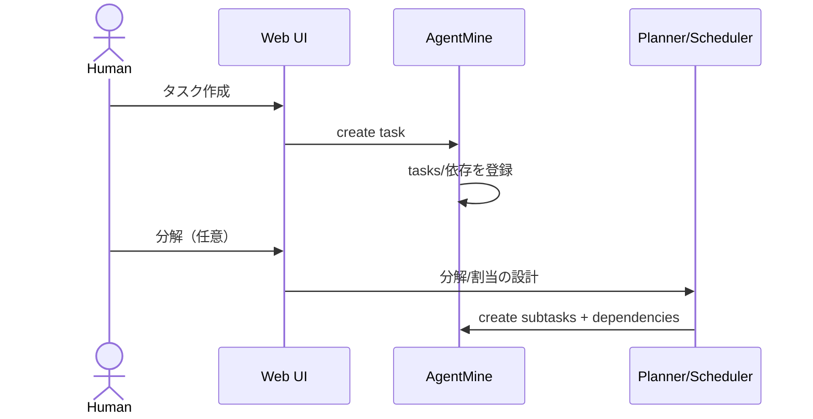
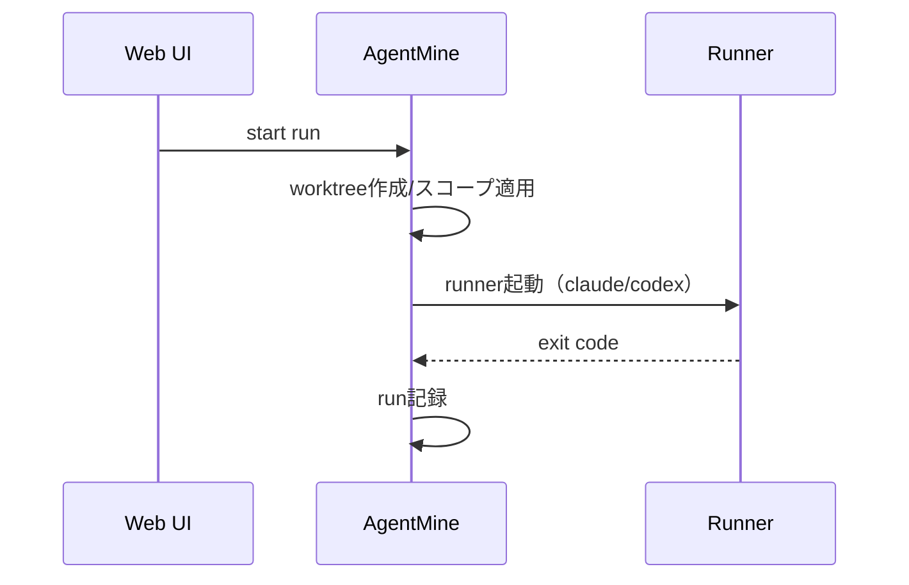
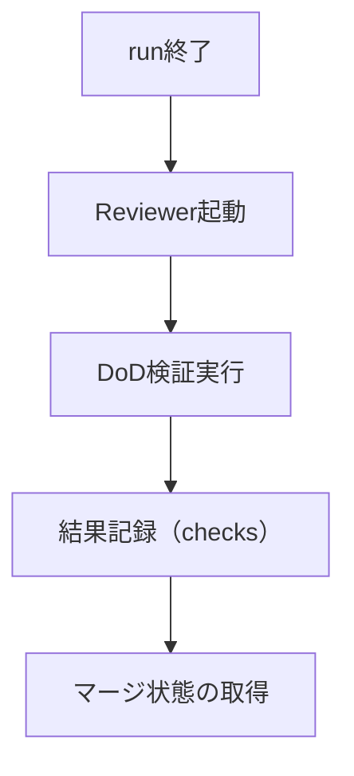

---
depends_on:
  - ../02-architecture/structure.md
  - ../02-architecture/principles.md
tags: [details, flows, sequence, process]
ai_summary: "主要業務フローのシーケンス図・処理ステップ・エラーケースを定義"
---

# 主要フロー

> Status: Draft
> 最終更新: 2026-02-01

本ドキュメントは、システムの主要な処理フローを定義する。

---

## フロー一覧

| フローID | フロー名 | 説明 |
|----------|----------|------|
| F000 | Project登録 | GitリポジトリをProjectとして登録する |
| F001 | タスク作成と分解 | 依頼をタスク化し、必要ならサブタスクに分解する |
| F002 | run開始 | worktree作成とスコープ適用の後、runnerを起動する |
| F003 | 検証と完了判定 | DoD検証とマージ判定の事実を記録する |
| F004 | 介入（stop） | 実行中runを停止する |
| F005 | 介入（retry/continue） | 同一タスクに新しいrunを追加する |

---

## フロー詳細

### F000: Project登録

| 項目 | 内容 |
|------|------|
| 概要 | GitリポジトリをProjectとして登録する |
| トリガー | HumanがProject登録を実行 |
| アクター | Human, Web UI, AgentMine |
| 事後条件 | projectsがDBに登録される |

### F001: タスク作成と分解

| 項目 | 内容 |
|------|------|
| 概要 | 依頼をタスク化し分解案を作成する |
| トリガー | Humanが要件を提示 |
| アクター | Human, Orchestrator, Planner/Scheduler, AgentMine |
| 前提条件 | Projectが登録済みである |
| 事後条件 | 親子タスクと依存がDBに登録される |

#### シーケンス図

### F002: run開始

| 項目 | 内容 |
|------|------|
| 概要 | 依存条件を満たしたタスクのrunを開始する |
| トリガー | Web UIからrun開始 |
| アクター | Human, AgentMine, Runner |
| 前提条件 | task.write_scope が設定済みである |
| 事後条件 | runsが記録される |

#### シーケンス図

### F003: 検証と完了判定

| 項目 | 内容 |
|------|------|
| 概要 | ReviewerがDoD検証を実行し、結果を判断材料として記録する |
| トリガー | Worker終了 |
| アクター | Reviewer, AgentMine |
| 前提条件 | run記録が存在 |
| 事後条件 | 検証結果がDBに記録される |

#### フローチャート

### F004: 介入（stop）

| 項目 | 内容 |
|------|------|
| 概要 | 人間が実行を止めたり修正を指示する |
| トリガー | Web UIからの介入操作 |
| アクター | Human, Orchestrator, AgentMine |

#### 処理ステップ

| # | 処理 | 担当 | 説明 |
|---|------|------|------|
| 1 | 実行中タスク選択 | Human | 状態を確認する |
| 2 | 中断/停止 | AgentMine | プロセス停止と状態更新 |
| 3 | 判断 | Orchestrator | 次の指示を決定 |

### F005: 介入（retry/continue）

| 項目 | 内容 |
|------|------|
| 概要 | 同一タスクに新しいrunを追加する |
| トリガー | Web UIで retry/continue |
| アクター | Human, AgentMine |
| 前提条件 | 対象タスクのworktreeが存在する |
| 事後条件 | 新しいrunが記録される |

注:
- continueは「同じrunに追加入力」ではなく、新しいrunを作る。
- 新runの入力には、前runの事実（差分/失敗理由/未解決点）を要約して付与する。

---

## 関連ドキュメント

- [data-model.md](./data-model.md) - データモデル
- [principles.md](../02-architecture/principles.md) - 設計原則
- [structure.md](../02-architecture/structure.md) - コンポーネント構成
