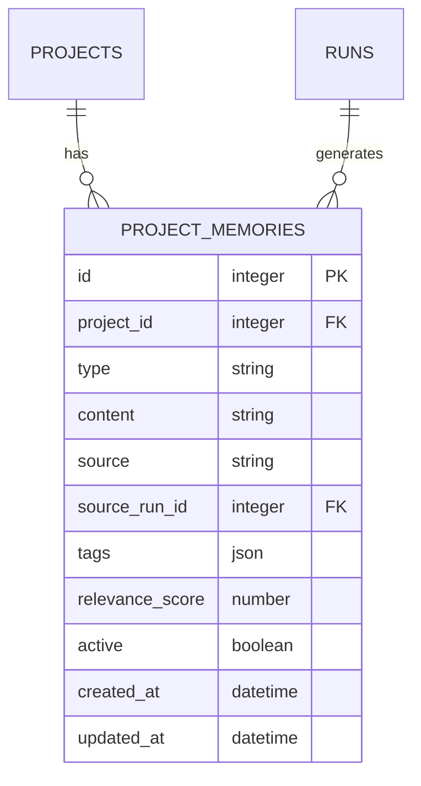

---
depends_on:
  - ../02-architecture/principles.md
  - ./data-model.md
  - ./prompt-composition.md
  - ./observable-facts.md
tags: [details, memory, context, learning]
ai_summary: "記憶層（Memory Layer）の設計。project_memoriesのデータモデル、API、prompt-compositionへの統合を定義"
---

# 記憶層（Memory Layer）

> Status: Draft
> 最終更新: 2026-02-05

本ドキュメントは、プロジェクト単位の記憶を管理し、Workerへ過去の学びを注入する仕組みを定義する。

---

## 目的

- プロジェクト固有の知識（パターン、警告、学習）を永続化する
- Run開始時に関連する記憶をプロンプトに注入し、同じ失敗を繰り返さない
- 将来的にAgent Lightning等の強化学習と連携し、自動で記憶を生成する

---

## 設計原則との整合

| 原則 | 記憶層の対応 |
|------|-------------|
| DBマスター | 記憶はDBに永続化し、SSoTを維持 |
| 観測可能な事実 | 記憶は「事実」ではなく「補助情報」として扱う |
| 判断しない | 記憶の適用判断はSupervisor/Plannerに委ねる |
| 再現性優先 | 同じ記憶セットなら同じプロンプトが生成される |

---

## データモデル

### project_memories

| カラム | 必須 | 型 | 説明 |
|--------|:---:|-----|------|
| id | ○ | integer | 記憶識別子 |
| project_id | ○ | integer FK | 所属Project |
| type | ○ | string | 記憶の種類 |
| content | ○ | string | 記憶の内容（自然言語） |
| source | - | string | 記憶の出所（human/run/learning） |
| source_run_id | - | integer FK | 関連Run（あれば） |
| tags | - | json | 検索用タグ（glob/キーワード） |
| relevance_score | - | number | 関連度スコア（0.0-1.0） |
| active | ○ | boolean | 有効フラグ |
| created_at | ○ | datetime | 作成日時 |
| updated_at | ○ | datetime | 更新日時 |

### type の種類

| type | 説明 | 例 |
|------|------|-----|
| pattern | プロジェクトの慣習・パターン | 「pnpm + Turborepo使用」 |
| warning | 注意が必要な箇所 | 「src/core/は変更時に全テスト必須」 |
| learning | 過去の成功/失敗から学んだこと | 「ESLint設定変更時は.eslintrc.jsも確認」 |
| context | プロジェクト固有の文脈 | 「v2移行中のため旧APIも維持」 |

### source の種類

| source | 説明 |
|--------|------|
| human | Human/Orchestratorが手動登録 |
| run | Run完了時に自動抽出（将来） |
| learning | Agent Lightning等の学習結果（将来） |

---

## ER図（追加分）



---

## API仕様

### エンドポイント一覧

| メソッド | パス | 説明 |
|---------|------|------|
| GET | /api/projects/:id/memories | 記憶一覧取得 |
| POST | /api/projects/:id/memories | 記憶作成 |
| GET | /api/projects/:id/memories/:memoryId | 記憶詳細取得 |
| PATCH | /api/projects/:id/memories/:memoryId | 記憶更新 |
| DELETE | /api/projects/:id/memories/:memoryId | 記憶削除 |

### GET /api/projects/:id/memories

クエリパラメータ:

| パラメータ | 型 | デフォルト | 説明 |
|-----------|-----|-----------|------|
| type | string | - | type でフィルタ |
| active | boolean | true | 有効な記憶のみ |
| tags | string | - | タグでフィルタ（カンマ区切り） |
| limit | number | 50 | 取得件数上限 |

レスポンス例:
```json
{
  "memories": [
    {
      "id": 1,
      "projectId": 1,
      "type": "pattern",
      "content": "このプロジェクトではpnpm + Turborepoを使用",
      "source": "human",
      "tags": ["build", "package-manager"],
      "relevanceScore": 1.0,
      "active": true,
      "createdAt": "2026-02-05T10:00:00Z"
    }
  ]
}
```

### POST /api/projects/:id/memories

リクエストボディ:
```json
{
  "type": "warning",
  "content": "src/core/配下の変更は全テスト実行が必須",
  "tags": ["src/core/**", "testing"],
  "relevanceScore": 0.9
}
```

---

## prompt-compositionへの統合

### 追加セクション: Memories

プロンプトの `Read First` と `Constraints` の間に `Memories` セクションを追加する。

```
## Role
{Agent Profileのprompt_template}

## Task
{task id/title/description}

## Workspace
{worktreeの説明}

## Read First
{参照すべきパス一覧}

## Memories
- [pattern] このプロジェクトではpnpm + Turborepoを使用
- [warning] src/core/配下の変更は全テスト実行が必須
- [learning] 前回Task#12でESLint設定変更時、.eslintrc.jsの確認漏れで失敗

## Constraints
{write/exclude、禁止事項}

## Retry/Continue Digest
{該当時のみ}

## Output Format
{期待する出力}
```

### 記憶の選択ロジック

Run開始時に以下の条件で記憶を選択する:

1. `active = true` の記憶のみ
2. タスクの `write_scope` とタグがマッチするものを優先
3. `relevance_score` 降順でソート
4. 上限N件（設定可能、デフォルト10件）

---

## 将来拡張

### Phase 2: Agent Lightning連携

| 機能 | 説明 |
|------|------|
| training-dataエクスポート | Runs履歴を学習データとして出力 |
| 自動記憶生成 | 学習結果からlearning記憶を自動作成 |
| relevance_score自動調整 | 記憶の有効性を実行結果から学習 |

### その他の拡張候補

| 機能 | 説明 |
|------|------|
| 記憶の有効期限 | expires_atで自動無効化 |
| 記憶のバージョニング | 変更履歴の追跡 |
| クロスプロジェクト記憶 | 共通パターンの共有 |

---

## 関連ドキュメント

- [設計原則](../02-architecture/principles.md) - DBマスター/再現性優先
- [データモデル](./data-model.md) - 既存エンティティ定義
- [プロンプト組み立て](./prompt-composition.md) - 最終プロンプト生成
- [観測可能な事実](./observable-facts.md) - 事実と補助情報の違い
- [ADR-0012](../04-decisions/0012-memory-layer.md) - 記憶層導入の決定
