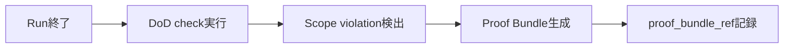

---
depends_on:
  - ./observable-facts.md
  - ./scope-control.md
  - ./definition-of-done.md
  - ./log-storage.md
  - ../04-decisions/0013-repositioning.md
tags: [details, audit, proof, safety, run]
ai_summary: "Run完了時に変更の証跡パック（Proof Bundle）を自動生成し、監査・レビューコストを下げる仕組みを定義"
---

# Proof-Carrying Run

> Status: Draft
> 最終更新: 2026-02-06

Run完了時に、変更の証跡パック（Proof Bundle）を自動生成する仕組みを定義する。

---

## 目的

- Run単位で「何が・なぜ・どう変わったか」を自己完結的に説明する
- レビュー・監査時に複数画面を横断する手間を排除する
- Compliance Templates（Phase 2）の基盤とする

---

## 設計原則との整合

| 原則 | 対応 |
|------|------|
| 観測可能な事実 | Proof Bundleの構成要素は全てDBまたはファイルに既存の事実である |
| DBマスター | Bundleはメタ情報のみDB保持。実体は既存データへの参照集約 |
| 再現性優先 | Bundle内のスナップショット（scope, DoD）は固定済み |
| 判断しない | Bundleは事実の集約であり、合否判断を含まない |

---

## Proof Bundleの構成

Run完了時に以下の情報を集約する。新規データの作成は行わず、既存データの**参照を束ねる**。

| 要素 | 取得元 | 説明 |
|------|--------|------|
| prompt_hash | runs.log_ref → ログファイル | 実行プロンプトのSHA-256ハッシュ |
| scope_snapshot | runs.scope_snapshot | 有効スコープのJSON |
| dod_snapshot | runs.dod_snapshot | DoD定義のJSON |
| changed_files | git diff --name-only（worktree） | 変更ファイル一覧 |
| diff_stat | git diff --stat（worktree） | 変更の規模（行数） |
| head_sha | runs.head_sha | Run終了時のコミットSHA |
| exit_code | runs.exit_code | プロセス終了コード |
| dod_results | checks（run_id） | 各チェックの結果一覧 |
| scope_violations | scope_violations（run_id） | 違反一覧と承認状態 |
| approval_history | scope_violations.approved_status + decided_at | 違反の承認/却下履歴 |

---

## データモデル

### run_proof_bundles

既存runsテーブルに `proof_bundle_ref` カラムを追加する方式とする。BundleはJSONファイルとして保存する。

| カラム | 必須 | 型 | 説明 |
|--------|:---:|-----|------|
| proof_bundle_ref | - | string | Bundleファイルへの参照パス |

注: Bundleの実体はログと同様にファイルベースで保存する（→[ログ保存](./log-storage.md)に準拠）。

### Bundle JSONの構造

| フィールド | 型 | 説明 |
|-----------|-----|------|
| version | string | Bundle形式のバージョン（"1.0"） |
| run_id | integer | 対象Run |
| generated_at | datetime | 生成日時 |
| prompt_hash | string | SHA-256 |
| scope_snapshot | object | 有効スコープ |
| dod_snapshot | object | DoD定義 |
| changed_files | string[] | 変更ファイル一覧 |
| diff_stat | object | 追加行/削除行/ファイル数 |
| head_sha | string | コミットSHA |
| exit_code | integer | 終了コード |
| dod_results | object[] | チェック結果一覧 |
| scope_violations | object[] | 違反一覧（承認状態含む） |

---

## 生成タイミング

Run終了後、以下の順序で生成する。

注: DoDチェックとScope violation検出が完了してからBundleを生成する。生成は非同期で実行する。

---

## API

### GET /api/runs/:id/proof

Run単位のProof Bundleを取得する。

レスポンス: Bundle JSONそのもの。Bundleが未生成の場合は404を返す。

---

## UI統合

Run詳細パネルのタブに「Proof」を追加する。

| 表示項目 | 説明 |
|---------|------|
| 変更ファイル一覧 | changed_filesをリスト表示 |
| diff統計 | +行/-行/ファイル数 |
| DoDチェック結果 | passed/failed/pendingのバッジ表示 |
| Scope違反 | 違反パス+承認状態 |
| スコープ定義 | scope_snapshotの内容 |
| ダウンロード | Bundle JSONの保存 |

---

## 関連ドキュメント

- [観測可能な事実](./observable-facts.md) - Bundleの構成要素の定義
- [スコープ制御](./scope-control.md) - 違反検出と承認ワークフロー
- [完了定義](./definition-of-done.md) - DoDチェック結果
- [ログ保存](./log-storage.md) - ファイルベース保存方式
- [ADR-0013](../04-decisions/0013-repositioning.md) - リポジショニング決定記録
