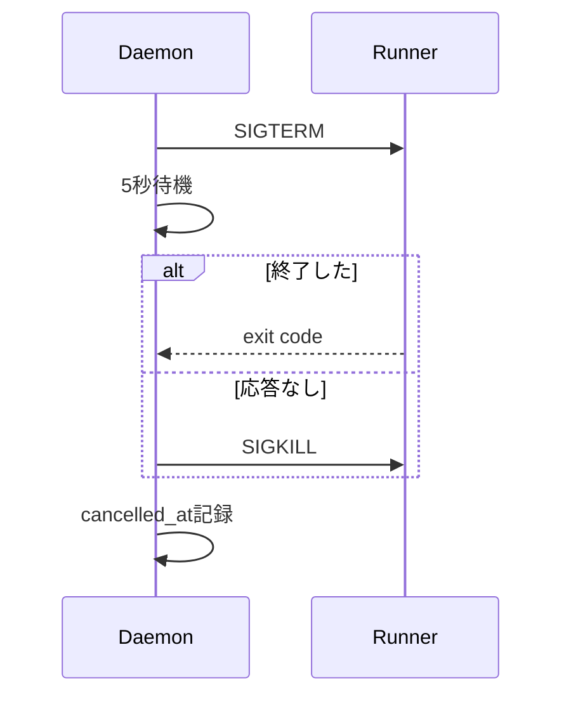

---
depends_on:
  - ../02-architecture/structure.md
  - ./flows.md
  - ./log-storage.md
  - ./prompt-composition.md
  - ../04-decisions/0005-continue-adds-new-run.md
  - ../04-decisions/0009-runner-adapter-interface.md
tags: [details, runner, adapter, execution]
ai_summary: "RunnerAdapterの責務、I/F、capabilities、claude/codex CLIの実行仕様を定義"
---

# RunnerAdapter

> Status: Draft
> 最終更新: 2026-02-02

runner差を吸収するRunnerAdapterを定義する。MVPでは `claude` と `codex` のCLIを対象とする。

---

## 目的

- runnerの差（引数、モデル指定可否等）を吸収する
- runの実行を一貫した事実として記録する
- stop/retry/continueをrunnerに依存させない

---

## 前提

| 項目             | 方針                               |
| ---------------- | ---------------------------------- |
| 実行形態         | 非対話である                       |
| 追加入力         | 同一プロセスへの追加入力を行わない |
| 作業ディレクトリ | worktreeである                     |

注: continue/retryは新しいrunを作成する（→ADR-0005）。

---

## I/F（インターフェース）

| 操作             | 入力             | 出力           | 説明                   |
| ---------------- | ---------------- | -------------- | ---------------------- |
| start            | run, prompt, env | process_handle | runnerを起動する       |
| stop             | process_handle   | -              | runnerを停止する       |
| get_capabilities | -                | capabilities   | モデル指定可否等を返す |

---

## capabilities

capabilitiesは「このrunnerで何ができるか」を機械可読に返すための情報である。

| 用途                 | 目的                                 |
| -------------------- | ------------------------------------ |
| UI出し分け           | 未対応の入力項目を選べないようにする |
| 実行前バリデーション | 未対応の要求をrun開始前に拒否する    |

### フィールド（MVP）

| フィールド                     | 型       | 意味                 |
| ------------------------------ | -------- | -------------------- |
| supports_model                 | boolean  | モデル指定可否       |
| supports_non_interactive       | boolean  | 非対話実行可否       |
| supports_prompt_file_inclusion | boolean  | ファイル埋め込み可否 |
| available_models               | string[] | 指定可能モデル一覧   |

---

## startの入力

| 項目          | 必須 | 説明                         |
| ------------- | :--: | ---------------------------- |
| run_id        |  ○   | 対象run                      |
| worktree_path |  ○   | 実行ディレクトリ             |
| prompt        |  ○   | 実行指示                     |
| env           |  -   | 環境変数                     |
| model         |  -   | モデル名（runner対応時のみ） |

注: Daemonはstart直前にpromptをrunログのmetaとして記録する。

---

## 出力と観測可能な事実

| 事実 | 例            | 用途           |
| ---- | ------------- | -------------- |
| 出力 | stdout/stderr | ログ表示、監査 |
| 終了 | exit code     | run状態判定    |

出力はログ保存に書き込み、同時にイベント配信する。

---

## Runner実装仕様

### claude-cli

| 項目                     | 値                  |
| ------------------------ | ------------------- |
| コマンド                 | `claude`            |
| supports_model           | true                |
| supports_non_interactive | true                |
| available_models         | sonnet, opus, haiku |

#### 非対話実行

`--print` と `--dangerously-skip-permissions` の組み合わせで非対話実行する。
`--output-format stream-json` でJSON形式のストリーム出力を得る。

#### 主要フラグ

| フラグ                         | 必須 | 説明               |
| ------------------------------ | :--: | ------------------ |
| --print                        |  ○   | 非対話モード       |
| --dangerously-skip-permissions |  ○   | 全操作を自動承認   |
| --output-format stream-json    |  ○   | JSON出力           |
| --model                        |  -   | モデル指定         |
| --system-prompt                |  -   | システムプロンプト |

### codex-cli

| 項目                     | 値      |
| ------------------------ | ------- |
| コマンド                 | `codex` |
| supports_model           | false   |
| supports_non_interactive | true    |

#### 非対話実行

`--approval-policy never` と `--sandbox danger-full-access` の組み合わせで非対話実行する。

#### 主要フラグ

| フラグ                       | 必須 | 説明             |
| ---------------------------- | :--: | ---------------- |
| --approval-policy never      |  ○   | 全操作を自動承認 |
| --sandbox danger-full-access |  ○   | フルアクセス許可 |
| --developer-instructions     |  -   | 開発者指示       |
| --cwd                        |  -   | 作業ディレクトリ |

---

## 停止処理

---

## エラーハンドリング

### 起動失敗

| 原因                   | 対応                                  |
| ---------------------- | ------------------------------------- |
| コマンドが見つからない | run.status = failed                   |
| 引数エラー             | run.status = failed、stderrをログ記録 |
| API認証エラー          | run.status = failed、stderrをログ記録 |

### 実行中エラー

| 原因         | 対応                                   |
| ------------ | -------------------------------------- |
| APIエラー    | run.status = failed                    |
| タイムアウト | SIGTERM → SIGKILL、run.status = failed |

---

## Runner追加ガイドライン

1. RunnerAdapterインターフェースを実装する
2. capabilitiesを正確に定義する
3. 非対話実行が可能であることを確認する
4. 停止処理（SIGTERM/SIGKILL）が機能することを確認する

---

## 関連ドキュメント

- [主要フロー](./flows.md) - run開始とstop/retry/continue
- [主要コンポーネント構成](../02-architecture/structure.md) - Runner Manager
- [ログ保存](./log-storage.md) - promptと出力の追跡
- [プロンプト組み立て](./prompt-composition.md) - runner非依存のprompt生成
- [ADR-0005](../04-decisions/0005-continue-adds-new-run.md) - continue/retryは新run
- [ADR-0009](../04-decisions/0009-runner-adapter-interface.md) - RunnerAdapter I/F
