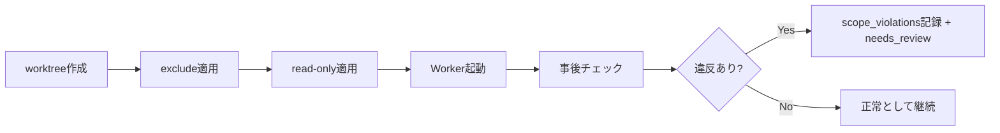

---
depends_on:
  - ../02-architecture/principles.md
  - ./observable-facts.md
tags: [details, scope, safety, worktree]
ai_summary: "Workerのアクセス範囲を物理制約で限定し、違反は検出してレビュー可能にするスコープ制御を定義"
---

# スコープ制御

> Status: Draft
> 最終更新: 2026-02-01

本ドキュメントは、Workerがアクセスできるファイル範囲を制限する「スコープ制御」を定義する。

---

## 目的

- 意図しない変更（特に秘匿情報や設定）の混入を減らす
- 自動承認に寄せても「被害範囲が限定される」状態を作る
- 違反は“なかったこと”にせず、検出してレビュー可能にする

---

## スコープフィールド（論理モデル）

| フィールド | 意味 | デフォルト | 主な物理実装 |
|---|---|---|---|
| exclude | アクセス不可（存在しない） | 空 | sparse-checkout 等 |
| read | 参照可能 | **/*（全て） | worktreeに存在 |
| write | 編集可能 | **必須（未設定なら実行不可）** | 書き込み権限付与 |
| implicit_ro | read - write - exclude | - | read-only化 |

優先順位: **exclude > write > read(implicit_ro)**

---

## 物理的な適用方針（最低限）

| 要件 | 方針 |
|---|---|
| exclude | worktree上から除外（見えない） |
| write 以外 | read-only化（誤変更を物理的に失敗させる） |
| Windows互換 | chmod相当はOS差異を許容し、検出で補う |

注: 物理制約は100%ではない前提で、必ず事後チェックを併用する。

---

## スコープの決定（MVP）

スコープは「テンプレ」と「タスク固有」の合成で決める。
タスクの `write` は明示必須とする。

| 入力元 | 反映先 | 目的 |
|---|---|---|
| Project設定（例: default_exclude） | exclude | プロジェクト共通の秘匿情報を除外する |
| agent profile（default_exclude） | exclude | runner/用途ごとの除外を足す |
| task（write_scope） | write | このタスクで編集してよい範囲を明示する |

注:
- 合成結果（有効スコープ）はrunに `scope_snapshot` として保存する。
- 以降の違反判定は `scope_snapshot` を基準に行う（再現性のため）。

---

## スコープ適用フロー

---

## 事後チェック（違反検出）

検出の単位は「run」で行い、結果を `scope_violations` として永続化する。

| チェック | 入力 | 判定 |
|---|---|---|
| 変更ファイル | `git diff --name-only` 相当 | 全てが write にマッチし、excludeに非マッチである |
| 変更内容 | `git diff` 相当 | 危険パターンは追加ルールで検出可能（任意） |
| 権限改変 | ファイルモード差分 | read-only解除の兆候を記録（任意） |

注: 実装上のコマンドは環境依存があるため、ここでは「観測すべき事実」を定義する。

---

## 違反時の扱い（レビュー優先モード）

現時点の方針は「違反は即失敗ではなく、レビュー待ち（needs_review）に寄せる」。

| 事項 | 挙動 |
|---|---|
| task.status | needs_review に遷移（自動） |
| 自動マージ | ブロック（手動/上位AIの判断が必要） |
| 承認/却下 | **Humanのみ**がdecisionとして記録し、追跡可能にする |

未確定:
- 承認後に `done` 判定へ進めるか（推奨: 承認=「違反は受容」扱い）
- 違反の重大度（warning/error）を導入するか

決定:
- 承認（approved）は「違反を受容した」扱いとし、以降の done 判定（merge+DoD）を妨げない。

---

## Agent定義との関係

agent profileはデフォルト除外（exclude）を持つ。
タスクは編集範囲（write）を持つ。
MVPでは両者を合成してrunの有効スコープを決める。

| 例 | task.write_scope（例） | agent_profile.default_exclude（例） |
|---|---|---|
| backend変更タスク | `packages/core/**` | `**/*.env`, `**/*secret*` |
| docs変更タスク | `docs/**` | `**/*.env` |

---

## 関連ドキュメント

- [設計原則](../02-architecture/principles.md) - 安全性は制約で担保する
- [観測可能な事実](./observable-facts.md) - 違反の記録とtask状態への反映
- [データモデル](./data-model.md) - scope_violationsの保持
