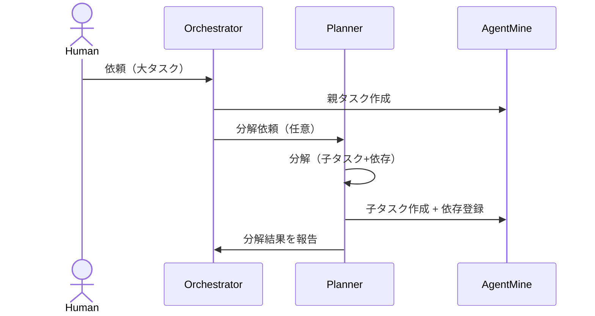

---
depends_on:
  - ../02-architecture/role-model.md
  - ./data-model.md
  - ./flows.md
  - ./business-rules.md
tags: [details, planning, decomposition, tasks, dependencies]
ai_summary: "Plannerによるタスク分解の目的・判定基準・分解パターン・DBへの反映（親子/依存）を定義"
---

# タスク分解（Task Decomposition）

> Status: Draft
> 最終更新: 2026-02-01

本ドキュメントは、大きな依頼を並列実行可能な粒度のタスクへ分解するためのルールを定義する。
タスク分解は役割モデル上のPlannerの責務である。

---

## 目的

- 並列化可能な単位へ分割し、進捗と責任範囲を明確化する。
- 失敗時に差し戻し先（指示/計画側）を明確にする。
- 「1タスク=1run/1成果物」へ近づけ、観測可能な事実で状態を追跡しやすくする。

---

## 分解の判定基準（シンプルルール）

Plannerは複雑なスコア計算ではなく、以下の自問で分解を判断する。

| 自問 | 回答 | 判定 |
|------|------|------|
| 1つのコミット（または差分）として説明できるか | No | 分解する |
| 複数の独立した変更が含まれるか | Yes | 分解する |
| 1人が短時間でレビューできるか | No | 分解する |

注:
- 「短時間」は時間数の固定値ではなく、レビュー容易性で判断する。

---

## 追加判定基準（MVPの実行モデル）

MVPでは **1 Task = 1 worktree** である（→worktree管理）。
そのため、タスク分解は「別worktree/別ブランチで進めても成立するか」を基準に追加で判断する。

| 観点 | 判断 | 目安 |
|------|------|------|
| write_scope | 広すぎるなら分解する | `apps/web/**` と `apps/daemon/**` を同時に含む等 |
| マージ可能性 | 個別にbaseへ統合できるなら分解する | 子タスク単体でDoDが通り、説明可能である |
| 強い結合 | 片方なしではビルド/テストが通らないなら分解しない | 分割すると常に未完成状態になる |

注:
- 分解できない場合は「同一タスクに複数runを追加する」ことで段階的に進める。

---

## 分解パターン

| パターン | 分解方法 | 例 |
|---------|---------|-----|
| レイヤー跨ぎ | DB → API → UI に分ける | 認証 → スキーマ、API、画面 |
| 機能複合 | 機能A/機能Bへ分ける | ユーザー管理 → 登録、編集、削除 |
| CRUD | Create/Read/Update/Deleteで分ける | 記事API → 各操作 |

---

## 親子と依存の使い分け

タスク分解は「親子」と「依存」を併用して表現する。
両者は目的が異なる。

| 仕組み | 目的 | 例 |
|--------|------|----|
| 親子（parent_id） | 分解の由来とまとまりを表現する | 親: 「UI実装」 子: 「Monitor」/「Settings」 |
| 依存（task_dependencies） | 実行順序の制約を表現する | 「API追加」→「UIで表示」 |

注:
- 親子は「順序」を意味しない。順序が必要な場合は依存で表現する。

---

## 分解の成果（DBへの反映）

分解の成果は「子タスク」と「依存関係」で表現する。

| 成果物 | 反映先 | 説明 |
|--------|--------|------|
| 親子関係 | tasks.parent_id | 分解元を追跡する |
| 依存関係 | task_dependencies | 実行順序の制約を表現する |
| 実行範囲 | tasks.write_scope | 子タスクごとに必須で定義する |

注:
- 追加メタ情報（複雑度、タスク種別等）はMVPでは必須にしない。
- 追加メタ情報が必要になった場合は、DBの拡張（settingsや専用テーブル）で扱う。

---

## 分割しない方がよいケース

分解は万能ではない。以下の場合は単一タスクで進める方が安全である。

| ケース | 理由 | 代替 |
|--------|------|------|
| 変更が強く結合している | 分割すると常に未完成/不整合になる | 同一タスクにrunを追加する |
| 同一ファイルを頻繁に競合する | worktree分離のメリットが薄い | 1タスクでまとめる |
| write_scopeを分けられない | 安全な制約が引けない | 範囲を絞るまで計画を更新する |

---

## 分解フロー（概念）

注:
- MVPでは、HumanがPlanner相当の作業（子タスクと依存の登録）をUIで行ってもよい。

---

## NG時の再計画

NGはWorkerへ差し戻さず、Plannerが計画を更新する。
再計画は「タスク定義を修正し、新runで再実行する」ことを基本とする。

| NG原因 | Plannerの対応 |
|--------|----------------|
| 指示が曖昧 | descriptionを具体化し、必要なら再分解する |
| 粒度が大きい | 子タスクを追加し、依存を再設計する |
| 依存が誤り | task_dependenciesを修正する |
| 検証失敗 | 失敗理由をタスクへ反映し、再実行する |

---

## 関連ドキュメント

- [役割モデル（5層）](../02-architecture/role-model.md) - Planner/Supervisorの責務
- [データモデル](./data-model.md) - 親子/依存の表現
- [業務ルール](./business-rules.md) - 不変条件と同時実行制約
- [主要フロー](./flows.md) - タスク作成とrun開始
