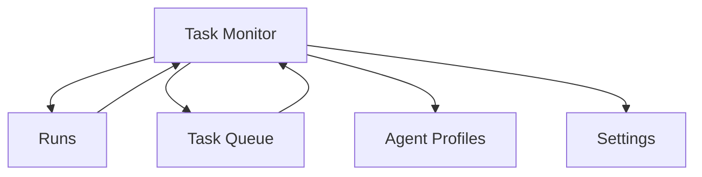

---
depends_on:
  - ../02-architecture/structure.md
  - ./flows.md
tags: [details, ui, screens, interactions]
ai_summary: "Task Monitor中心の監視・介入UI（ツリー+タイムライン）を定義"
---

# UI設計

> Status: Draft
> 最終更新: 2026-02-01

本ドキュメントは、UI設計の方向性を定義する。
最終目標は、AIの実行を可視化し、必要時に介入できるWeb UIである。

---

## 本ドキュメントの位置づけ

UIに関しては、以下を役割分担とする。

| ドキュメント | 位置づけ                          |
| ------------ | --------------------------------- |
| `ui.md`      | 方向性と全体像（将来像を含む）    |
| `ui-mvp.md`  | MVPで実装する具体仕様（実装の正） |

注:

- MVP実装は `ui-mvp.md` を正とする。

---

## 目的

- 人間がAIの実行状況を監視できること
- 介入が必要な場面を明確に示せること
- DBマスターの状態が一貫して見えること
- 「taskの状態は観測可能な事実から導出される」前提で、主観表示を避けること

---

## 画面一覧

| 画面ID | 画面名           | 説明                               | 状態                       |
| ------ | ---------------- | ---------------------------------- | -------------------------- |
| S000   | Project Switcher | Project切替（グローバル）          | MVP定義済み（`ui-mvp.md`） |
| S001   | Task Monitor     | 実行状況の監視（メイン）           | MVP定義済み（`ui-mvp.md`） |
| S002   | Task Queue       | 待機中/依存関係/割り当て           | MVP対象外（将来）          |
| S003   | Runs             | 実行履歴・ログ・検証結果           | MVP定義済み（`ui-mvp.md`） |
| S004   | Agent Profiles   | runner/model/prompt/デフォルト制約 | MVP定義済み（`ui-mvp.md`） |
| S005   | Settings         | プロジェクト設定                   | MVP定義済み（`ui-mvp.md`） |

---

## 画面遷移

---

## UI原則

| 原則                | 説明                               |
| ------------------- | ---------------------------------- |
| 監視優先            | 実行状態の把握を最優先にする       |
| 介入可能            | 停止/再実行/指示変更を明示する     |
| 事実ベース          | AIの自己申告ではなく事実を表示する |
| ツリー+タイムライン | 親子関係と時間軸を同時に把握できる |

---

## Task Monitor（S001）

中心画面。MVPではChrome DevToolsのNetwork風に **Overview** + **Run一覧テーブル** + **ウォーターフォール** を並べる（→UI仕様）。
既定表示は「Group by task」である（親子階層でtask単位にrunを束ねて表示する）。

| 要素         | 内容                                                                                         |
| ------------ | -------------------------------------------------------------------------------------------- |
| Overview     | 実行の時間分布を一目で把握する（NetworkのOverview風）。現在の選択/フィルタ後の一覧に追従する |
| テーブル     | runsの一覧を表示し、status/reasonでトリアージできる                                          |
| タイムライン | runsの開始/終了から実行時間を可視化                                                          |
| ステータス   | task.status（観測事実から導出）を色で表現                                                    |
| 詳細パネル   | 選択task/runのfacts（diff/DoD/violations/log参照）。未選択時は閉じる                         |
| Actions      | stop/retry/continue/approve/reject 等（MVPは最小）                                           |

注: 表示の事実ソースは `runs/checks/scope_violations` 等であり、自由記述の「完了」ボタンは置かない。
注: `needs_review` は「理由」を分けて表示する。理由は保存せず、事実から導出する（例: `scope_violation_pending`, `scope_violation_rejected`, `dod_pending` 等）。

---

## 関連ドキュメント

- [ui-mvp.md](./ui-mvp.md) - MVP実装仕様（画面/操作/空状態）
- [flows.md](./flows.md) - 主要フロー
- [structure.md](../02-architecture/structure.md) - コンポーネント構成
- [principles.md](../02-architecture/principles.md) - 設計原則
- [observable-facts.md](./observable-facts.md) - task/run状態の導出ルール
- [data-model.md](./data-model.md) - UIが参照するエンティティ
- [agent-profiles.md](./agent-profiles.md) - 実行プロファイルの定義
