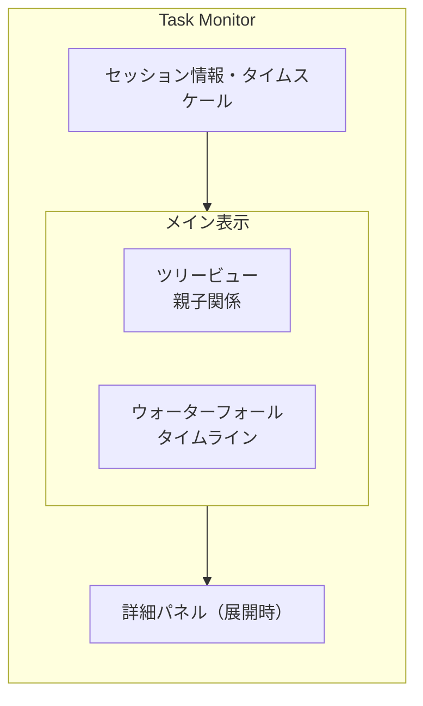
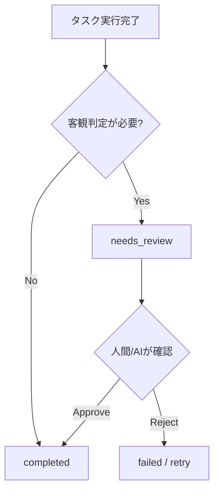

# Web UI

## 目的

Web UIの設計を定義する。本ドキュメントはWeb UI設計のSSoT（Single Source of Truth）である。

## 背景

AgentMineはOrchestrator/Workerモデルを採用しており、AIがタスクを分解・実行する。人間はその実行状況を**監視**し、必要に応じて**介入**する。

従来のSHOGUN（tmuxベース）では状態管理がテキストベースでガバガバだった。AgentMineではDBファーストで状態を管理し、UIはDBを参照・更新する。

**なぜ監視・介入中心か:**
- AIがワークフローを組むため、人間が編集する必要がない
- 人間の役割は「見守り」と「必要時の介入」
- 客観的な完了判定により、タスク記録漏れを防ぐ

## 設計原則

| 原則 | 説明 | 理由 |
|------|------|------|
| 監視ファースト | 実行状況の可視化が最優先 | AIの動きを把握するため |
| 介入可能 | いつでも一時停止・修正・承認できる | 人間が制御を維持 |
| DBファースト | UI/CLIは同じDBを参照 | 一貫した状態管理 |
| キーボードファースト | マウス不要で操作可能 | 開発者の効率性 |

## 参考UI

主に**Jaeger UI**（分散トレーシング）のコンセプトを採用。DevToolsのネットワークパネルに近いイメージ。

| 参考ツール | 良い点 |
|-----------|--------|
| Jaeger UI | ツリー＋ウォーターフォール、親子関係、詳細展開 |
| AgentOps | タイムライン、セッションリプレイ、コスト追跡 |
| Langfuse | LLM Observability、トレースツリー |

詳細は @06-interfaces/web/ui-reference.md を参照。

## 画面構成

| 画面 | 役割 | 優先度 |
|------|------|:------:|
| Task Monitor | タスク実行監視（メイン画面） | P0 |
| Dashboard | 統計・概要 | P1 |
| Task Queue | 待機中タスク、アサイン | P1 |
| History | 過去のセッション履歴 | P2 |
| Agents | エージェント管理 | P2 |
| Settings | 設定 | P3 |

## Task Monitor

メイン画面。Jaeger UI風の**ツリー＋ウォーターフォール**表示。

### 構成要素

| 要素 | 説明 |
|------|------|
| ツリービュー | タスクの親子関係を折りたたみ可能なツリーで表示 |
| ウォーターフォール | 各タスクの実行時間を横棒で可視化 |
| ステータス | 成功/実行中/待機/失敗/要介入を色分け |
| Actions | 介入ボタン（Pause, Edit, Retry, Cancel, Approve, Reject） |
| 詳細パネル | タスククリックで入力/出力/ログを表示 |

### レイアウト

左側にツリービュー、右側にウォーターフォール（タイムライン）を配置。タスクをクリックすると下部に詳細パネルが展開する。

```mermaid
flowchart TB
    subgraph TaskMonitor["Task Monitor"]
        direction TB
        Header["セッション情報・タイムスケール"]
        subgraph Main["メイン表示"]
            direction LR
            Tree["ツリービュー<br/>親子関係"]
            Waterfall["ウォーターフォール<br/>タイムライン"]
        end
        Detail["詳細パネル（展開時）"]
    end
    Header --> Main
    Main --> Detail
```

### ステータス定義

| ステータス | 説明 |
|-----------|------|
| pending | 待機中（依存タスク完了待ち） |
| queued | キュー投入済み、実行待ち |
| running | 実行中 |
| paused | 一時停止中 |
| needs_review | 人間のレビュー/承認待ち |
| completed | 完了（客観判定済み） |
| failed | 失敗 |
| cancelled | キャンセル済み |

## 介入機能

タスク実行への介入操作。

| 操作 | 説明 | 対象ステータス |
|------|------|---------------|
| Pause | 一時停止 | running |
| Resume | 再開 | paused |
| Edit | 入力/指示を編集 | paused, pending |
| Retry | 再実行 | failed |
| Cancel | キャンセル | running, paused, pending |
| Approve | 完了を承認 | needs_review |
| Reject | 却下、再実行指示 | needs_review |

## 完了判定フロー

タスク実行者は自分で完了にできない。必ず第三者（別のAI or 人間）が判定する。

```mermaid
flowchart TD
    A[タスク実行完了] --> B{客観判定が必要?}
    B -->|Yes| C[needs_review]
    B -->|No| D[completed]
    C --> E{人間/AIが確認}
    E -->|Approve| D
    E -->|Reject| F[failed / retry]
```

## アクターモデル

タスクの担当者として、人間とAgentを「アクター」として統一的に扱う。

| アクター種別 | ステータス管理 | 完了判定 |
|-------------|---------------|---------|
| agent | 自動 | 第三者が判定 |
| human | 手動更新不可 | 第三者が判定 |

**重要:** 人間もAIも「自分で完了」と言えない。これによりタスク記録漏れを防ぐ。

## リアルタイム更新

WebSocketを使用してタスク状態をリアルタイム更新。

更新対象：
- タスクステータス変更
- 実行中タスクの出力（streaming）
- Duration（経過時間）
- エラー情報

## キーボード操作

### グローバル

| キー | 操作 |
|------|------|
| Cmd/Ctrl + K | コマンドパレット |
| g → m | Go to Monitor |
| g → q | Go to Queue |
| ? | ショートカット一覧 |

### Task Monitor

| キー | 操作 |
|------|------|
| j / k | 次/前のタスク |
| Enter | 詳細パネル展開 |
| Space | 折りたたみ切り替え |
| p | Pause / Resume |
| a | Approve |
| x | Reject |

## 技術スタック

| 機能 | ライブラリ |
|------|------------|
| フレームワーク | Next.js 14+ (App Router) |
| UIコンポーネント | shadcn/ui + Tailwind |
| コマンドパレット | cmdk |
| リアルタイム | WebSocket |

## 未確定事項

| 項目 | 現状 | 検討中 |
|------|------|--------|
| ツリー表示の深さ制限 | 未定 | 深い階層のUX |
| モバイル対応 | 未定 | レスポンシブデザイン |

## 関連ドキュメント

- UI参考資料: @06-interfaces/web/ui-reference.md
- CLI設計: @06-interfaces/cli/overview.md
- データモデル: @04-data/data-model.md
- 用語集: @appendix/glossary.md
