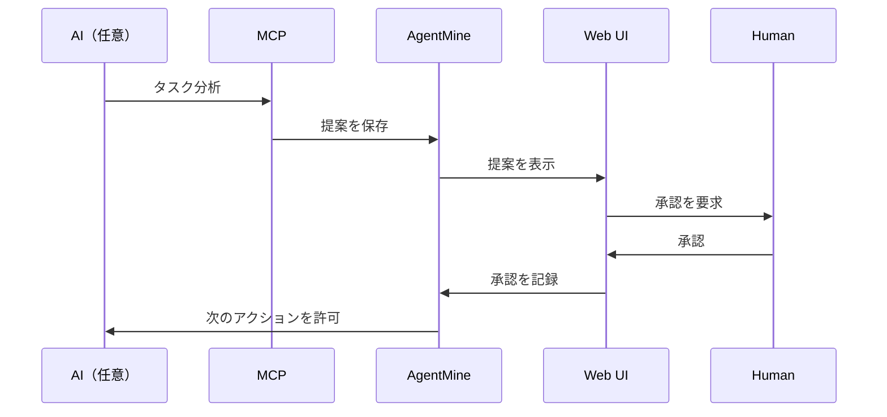

---
depends_on:
  - ../03-core-concepts/orchestrator-worker.md
tags: [decisions, adr, architecture, ai-agnostic]
ai_summary: "Orchestrator層をAI非依存に設計し、MCPとWeb UIで抽象化する決定"
---

# ADR-005: AI非依存のOrchestrator設計

> Status: Accepted
> 最終更新: 2026-01-28

## コンテキスト

AgentMineはWorker層で複数のAIクライアント（Claude Code、Codex、Aider、Gemini CLI等）に対応している。Orchestrator層も同様にAI非依存にすべきか検討が必要であった。

### 背景

- 主流のAI開発ツール（multi-agent-shogun等）は特定AIに密結合している
- AIの進化が速く、特定AIへのロックインはリスクになる
- 組織利用時にAI選択の自由度が求められる

## 決定事項

Orchestrator層をAI非依存に設計する。具体的には以下の構成を採用する。

| 層 | 実装 | AI依存度 |
|-----|------|---------|
| 判断（AI） | MCP経由でAgentMineにアクセス | 可変（どのAIでも可） |
| 仕組み（AgentMine） | 提案保存・承認管理・Worker起動 | 固定 |
| 可視化（Web UI） | 提案表示・承認ボタン・かんばん | 固定 |

## 検討した選択肢

### 選択肢1: 特定AI密結合（tmux + Claude Code等）

| 項目 | 内容 |
|------|------|
| 概要 | 特定AIクライアントの機能を前提とした設計 |
| メリット | 実装がシンプル、そのAIの機能を最大活用できる |
| デメリット | AI乗り換えが困難、ロックイン |

### 選択肢2: AI非依存（MCP + Web UI抽象化）

| 項目 | 内容 |
|------|------|
| 概要 | AgentMine側で仕組みを提供し、AIは交換可能 |
| メリット | AI乗り換え容易、比較検証可能、組織利用に適する |
| デメリット | 抽象化コスト、MCP対応必須 |

## 決定理由

選択肢2（AI非依存）を採用した理由：

- Worker層で既にAI非依存を実現しており、設計思想の一貫性が保てる
- AI進化への追従が容易になる
- 同一タスクを異なるAIで実行し比較する運用が可能になる
- 組織導入時にAI選択のポリシーに縛られない

## 結果

### ポジティブな影響

- 特定AIへのロックインを回避できる
- AIの進化・乗り換えに強くなる
- 複数AIの比較検証が容易になる
- 組織利用時の柔軟性が向上する

### ネガティブな影響

- MCP対応が必須となり、MCP非対応AIは利用困難
- 抽象化によるオーバーヘッドが発生する可能性
- 各AI固有の高度な機能を活用しづらい場合がある

## 実装方針

### 提案・承認フロー

### Web UIの役割

- 提案の一覧表示
- 承認・却下ボタン
- かんばん形式でのタスク可視化
- 人間が常に判断権限を持つ

## 関連ADR

- [ADR-001](./001-typescript-monorepo.md) - TypeScript monorepo採用
- [ADR-002](./002-sqlite-default.md) - SQLiteをデフォルトDB

## 関連ドキュメント

- [Orchestrator/Worker](../03-core-concepts/orchestrator-worker.md) - 役割定義
- [タスク分解](../03-core-concepts/task-decomposition.md) - 分解の設計案
