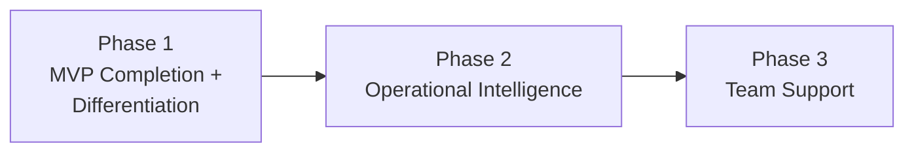

---
depends_on:
  - ./goals.md
tags: [overview, scope, phases, roadmap]
ai_summary: "Defines scope, out-of-scope, phase breakdown (A: AI-independent / B: Safety / D: Team-oriented), prerequisites, and constraints"
---

# Scope and Out-of-Scope

> Status: Active
> Last updated: 2026-02-06

This document clarifies the project scope.

---

## Scope Definition

### In Scope

| Category          | Target                               | Description                                                                      |
| ----------------- | ------------------------------------ | -------------------------------------------------------------------------------- |
| A: AI-Independent | RunnerAdapter + multi-Runner support | Unified management of Claude/Codex/Gemini, etc.                                  |
| B: Safety         | Scope control                        | write/exclude + violation detection + approval workflow                          |
| B: Safety         | Proof-Carrying Run                   | Automatic proof bundle generation upon Run completion                            |
| B: Safety         | Conflict-Aware Scheduler             | write_scope overlap detection and conflict avoidance                             |
| B: Safety         | Memory Governance                    | Trust scores, expiration dates, and approval management for memories             |
| Foundation        | Multi-project management             | Register and switch between multiple Git repositories as Projects                |
| Foundation        | Task management                      | Centralize tasks/dependencies/history (runs) in the DB                           |
| Foundation        | Worktree isolation                   | Physically isolate each task                                                     |
| Foundation        | Observable facts                     | Automatically determine state from exit codes, diffs, verification results, etc. |
| UI                | Web UI                               | Monitor, intervene, approve, and re-execute from the browser                     |

### Out of Scope

| Category | Exclusion                                  | Reason                                                                                         |
| -------- | ------------------------------------------ | ---------------------------------------------------------------------------------------------- |
| Feature  | AI final decision logic                    | Decisions are delegated to Orchestrator/Planner                                                |
| Feature  | Fully automated development by a single AI | Maintain role separation and review prerequisites                                              |
| Feature  | Optimization for a specific AI Runner      | AI independence is the principle. Runner-specific optimization is encapsulated within Adapters |
| Platform | Replacing Git                              | Coexist with Git as a prerequisite                                                             |

---

## Phase Breakdown

### Phase 1: MVP Completion + Differentiation

Complete unimplemented parts of the existing design and add differentiating features.

| Feature                          | Direction  | Description                                          | Status                                       |
| -------------------------------- | ---------- | ---------------------------------------------------- | -------------------------------------------- |
| Scope control completion         | B          | Implement violation detection and approval workflow  | Designed, not implemented                    |
| DoD check execution              | B          | Define verification checks and automate execution    | Designed, not implemented                    |
| Worktree management completion   | Foundation | Cleanup, reuse, dirty detection                      | Designed, not implemented                    |
| Proof-Carrying Run               | B          | Automatic proof bundle generation                    | **New**                                      |
| Conflict-Aware Scheduler         | B          | write_scope overlap detection and conflict avoidance | **New**                                      |
| Memory Governance                | B          | Trust scores, expiration dates, and approvals        | **New** (extension of existing memory-layer) |
| Additional RunnerAdapters        | A          | Codex completion + Gemini CLI, etc.                  | Codex stub complete                          |
| Task state derivation completion | Foundation | DoD integration, merge determination, complete rules | Partially implemented                        |

### Phase 2: Operational Intelligence

Improve the operational efficiency of AI execution.

| Feature                    | Direction  | Description                                                             |
| -------------------------- | ---------- | ----------------------------------------------------------------------- |
| Cost/SLA Router            | A          | Optimize Runner selection based on budget, deadlines, and failure rates |
| Compliance Templates       | B+D        | Provide policy presets for SOC2/ISO compliance                          |
| Audit log export           | B          | Report output for audit trails                                          |
| Runner performance metrics | A          | Collect per-Runner success rates, costs, and durations                  |
| Templatization             | Foundation | Scope/DoD templates by task type                                        |

### Phase 3: Team Support

Support multi-user and organizational use.

| Feature                          | Direction | Description                                           |
| -------------------------------- | --------- | ----------------------------------------------------- |
| Authentication and authorization | D         | JWT/OAuth + role management (Owner/Operator/Reviewer) |
| Remote access                    | D         | Remove localhost restriction, TLS support             |
| Team dashboard                   | D         | Per-member execution status and artifact lists        |
| Organization policy management   | B+D       | Organization-level scope/DoD/memory policies          |

### Deferred Features

The following have been considered and deferred for now.

| Feature            | Deferral Reason                                                                                | Re-evaluation Condition                         |
| ------------------ | ---------------------------------------------------------------------------------------------- | ----------------------------------------------- |
| Just-in-Time Scope | Conflicts with non-interactive Runner (ADR-0005). Can be approximated with existing retry flow | When the Runner communication model is extended |
| Forensic Replay    | Low priority. Partially addressable through the reproducibility principle                      | When clear user demand emerges                  |
| Spec Contract Mode | Requires code semantic analysis. Outside the scope of the current architecture                 | When an AST analysis foundation is introduced   |

---

## Prerequisites

| Prerequisite                | Description                                          |
| --------------------------- | ---------------------------------------------------- |
| Git usage                   | Assumes existing Git workflow                        |
| Worktree usage              | Creates isolated work areas per task                 |
| Local single-user operation | Phases 1-2 operate entirely in the local environment |
| Multiple Runner usage       | At least one AI CLI must be installed                |

---

## Constraints

| Constraint           | Type      | Description                                                              |
| -------------------- | --------- | ------------------------------------------------------------------------ |
| No decision-making   | Design    | AgentMine does not make decisions; it provides decision-making materials |
| AI independence      | Technical | Architecture must not depend on a specific AI                            |
| Physical constraints | Safety    | Scope control is enforced physically                                     |

---

## Related Documents

- [summary.md](./summary.md) - Project overview
- [goals.md](./goals.md) - Goals and problems to solve
- [principles.md](../02-architecture/principles.md) - Design principles
- [ADR-0013](../04-decisions/0013-repositioning.md) - Repositioning decision record
