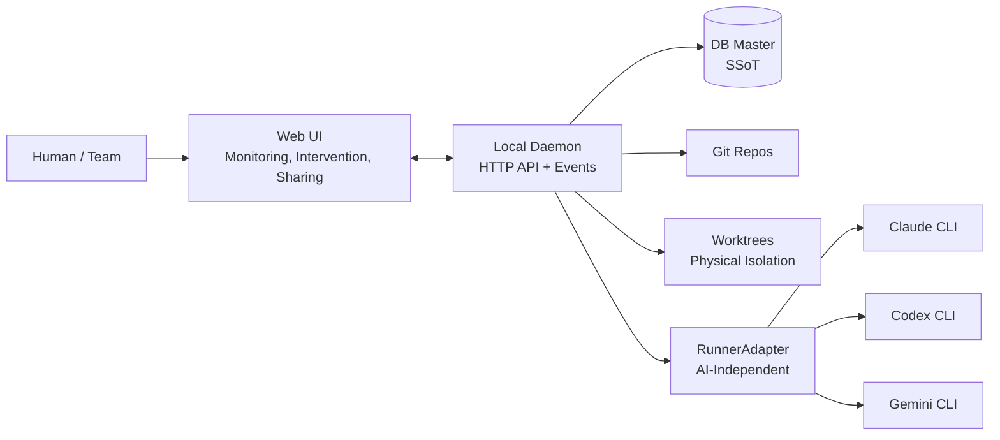

# Project Overview

> Status: Active
> Last updated: 2026-02-06

This document provides a one-page overview for grasping the entire project at a glance.

---

## In a Nutshell

AgentMine is an **AI-independent** development task orchestration platform. It provides **safety and observability** by managing multiple AI Runners (Claude, Codex, Gemini, etc.) in a unified manner through scope control, definition of done, and audit trails.

---

## Positioning

AgentMine functions as a "project manager that manages AI programmers."

| Aspect | AI Development Tools (Claude Code, etc.) | AgentMine |
|--------|------------------------------------------|-----------|
| AI Support | Specific AI only | AI-independent (RunnerAdapter) |
| Safety Control | Tool-level permissions | File-level scope + violation detection + approval |
| Execution Isolation | Same directory | Physical isolation via worktrees |
| Completion Determination | AI self-reporting | Observable Facts + DoD |
| Usage Model | Individual terminal | Visualization and sharing via Web UI |

---

## Background

| Item | Description |
|------|-------------|
| Market shift | AI development tools have begun embedding orchestration capabilities (e.g., Claude Code Agent Teams) |
| AgentMine's strengths | AI-independent design, physical scope control, and fact-based state management are not found in other tools |
| Solution approach | Separate execution (worktree + scope) from records (DB). Unify state through observable facts |

---

## Key Features

| Feature | Description |
|---------|-------------|
| AI-independent orchestration | Unified management of multiple AI Runners (Claude, Codex, Gemini, etc.) via RunnerAdapter |
| Scope control | Apply write/exclude per task, enforced through pre-constraints + post-detection |
| Conflict-Aware Scheduler | Detect write_scope overlaps before parallel launches to avoid conflicts |
| Proof-Carrying Run | Automatically generate proof bundles (prompt hash, scope, changed files, DoD results) upon Run completion |
| Memory Governance | Maintain long-term quality through trust scores, expiration dates, and approvals for memories |
| Observable facts | Automatically determine state from exit codes, diffs, verification results, etc. |
| Worktree isolation | Create a branch + worktree per task, physically preventing parallel execution conflicts |
| Monitoring and intervention (Web UI) | Monitor execution logs in the browser and intervene via stop/retry/continue |

---

## Target Users

| User Type | Description | Primary Use Case |
|-----------|-------------|-----------------|
| Individual developer | Wants to safely manage multiple AI Runners in parallel | Select and execute the optimal Runner per task |
| Team lead | Wants to track AI development progress and quality | Review all task states and audit trails via Web UI |
| Orchestrator | The point of contact for organizing requirements and making decisions | Requirements organization, priority decisions, intervention decisions |
| Supervisor | Responsible for execution management (start/stop/parallelism) | Launch eligibility decisions, conflict detection, run start/stop |

---

## System Overview

---

## Related Documents

- [Goals and Problems to Solve](./goals.md) - Problem list and success criteria definitions
- [Scope and Out-of-Scope](./scope.md) - Target scope and phase breakdown
- [Design Principles](../02-architecture/principles.md) - Separation of decision-making and execution platform
- [System Boundary and External Integrations](../02-architecture/context.md) - C4 Context diagram and external system definitions
- [Role Model (5 Layers)](../02-architecture/role-model.md) - Roles and separation of concerns
- [ADR-0013](../04-decisions/0013-repositioning.md) - Repositioning decision record
