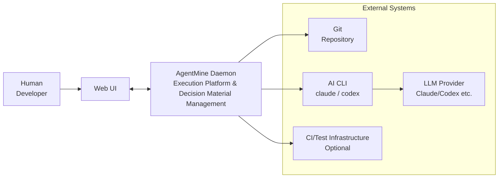

---
depends_on:
  - ../01-overview/summary.md
  - ../02-architecture/principles.md
tags: [architecture, c4, context, boundary]
ai_summary: "Defines system boundaries and external system integrations using a C4 Context diagram"
---

# System Boundaries & External Integrations

> Status: Draft
> Last updated: 2026-02-01

This document defines the system boundaries and integrations with external systems (equivalent to a C4 Context diagram).

---

## System Context Diagram

---

## Actor Definitions

| Actor | Type | Description | Primary Actions |
|-------|------|-------------|-----------------|
| Human | Person | Presents objectives and makes final decisions | Request, approve, intervene |
| Orchestrator | Role | Interface for organizing human requirements and making decisions | Accept requests, delegate, decide |
| Planner | Role | Task decomposition and dependency design | Decompose, design dependencies |
| Supervisor | Role | Run start/stop and concurrency management | Determine launch eligibility, start/stop runs |
| Worker | Role | Handles implementation in an isolated worktree | Write code, run tests |
| Reviewer | Role | Handles DoD verification | Verify, record results |

---

## External System Integrations

### Git

| Item | Details |
|------|---------|
| Overview | Used for source control, history, and merge decisions |
| Integration Method | CLI operations, worktree management |
| Integration Data | Branches, commits, diffs |
| Integration Frequency | On-demand during execution |
| Dependency Level | Required |

### AI CLI

| Item | Details |
|------|---------|
| Overview | Local CLI that executes Workers |
| Examples | `claude`, `codex` |
| Integration Method | Process spawning, stdin/stdout log collection |
| Dependency Level | Required (MVP) |

### LLM Provider

| Item | Details |
|------|---------|
| Overview | AI execution platform for Worker/Orchestrator and others |
| Integration Method | AI CLI/SDK (external to AgentMine) |
| Integration Data | Prompts, context |
| Integration Frequency | On-demand during execution |
| Dependency Level | Required |

### CI/Test Infrastructure

| Item | Details |
|------|---------|
| Overview | May serve as part of DoD verification |
| Integration Method | CLI/HTTP/API (varies by operation) |
| Integration Data | Test results, build results |
| Integration Frequency | As needed |
| Dependency Level | Optional |

---

## System Boundaries

### Internal (AgentMine's Responsibilities)

| Responsibility | Description |
|----------------|-------------|
| Execution Platform | Worktree isolation, process management, scope control |
| State Management | Project/Task/Run management with DB as master |
| Decision Materials | Providing observable facts and logs |
| Shared Infrastructure | Unified access through Web UI and API |

### External (Outside AgentMine's Responsibilities)

| Item | Owner | Description |
|------|-------|-------------|
| Final Decisions | Human/Orchestrator | Determining specification correctness and priorities |
| Task Decomposition Rules | Planner | Decisions on decomposition granularity and dependency design |
| Execution Order/Concurrency Decisions | Supervisor | Decisions on launch eligibility, stopping, and concurrency levels |
| LLM Quality | LLM Provider | Model performance and training are external factors |

---

## Related Documents

- [summary.md](../01-overview/summary.md) - Project overview
- [principles.md](./principles.md) - Design principles
- [structure.md](./structure.md) - Major component structure
- [role-model.md](./role-model.md) - Roles and separation of responsibilities
