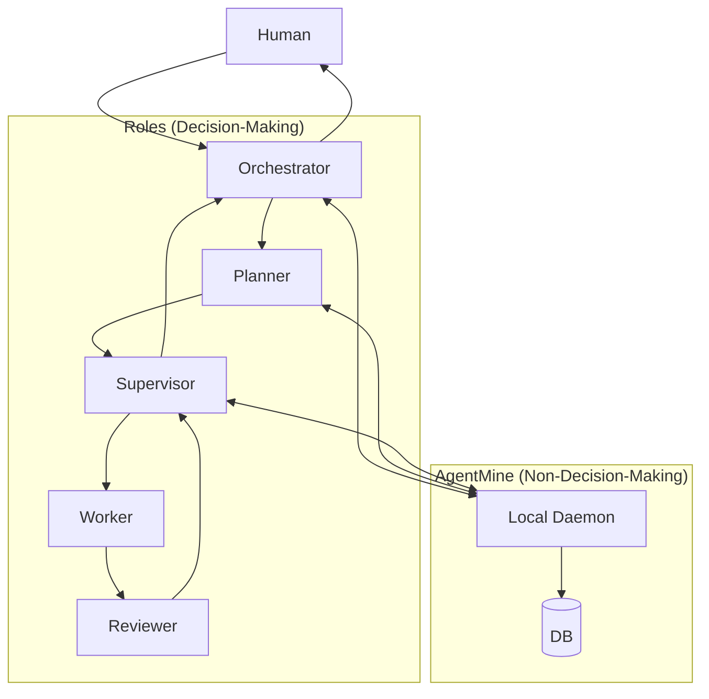

---
depends_on:
  - ./principles.md
  - ./structure.md
  - ../03-details/flows.md
  - ../03-details/scope-control.md
  - ../03-details/runner-adapter.md
  - ../03-details/event-stream.md
tags: [architecture, roles, multi-agent, orchestration]
ai_summary: "Defines the role model for Human/Orchestrator/Planner/Supervisor/Worker/Reviewer and their relationship with AgentMine (non-decision-making)"
---

# Role Model (5 Layers)

> Status: Draft
> Last updated: 2026-02-01

This document defines the role model for parallel development on AgentMine.
"Layers" here refer to role classifications for separation of responsibilities, not implementation modules.

---

## Purpose

- Separate "decision-making" from "execution" to localize failures in AI parallel development.
- Unify role names using common terminology, avoiding proprietary terms (e.g., Shogun).
- Clarify AgentMine's responsibility (non-decision-making).

---

## Overview Diagram

Note:
- Orchestrator/Planner/Supervisor are roles that "may also be fulfilled by a human."

---

## Role Definitions

| Role | Definition | Primary Responsibilities | What It Does Not Do |
|------|-----------|--------------------------|---------------------|
| Human | Final authority | Present objectives, decide policies, approve | Implementation, detailed decomposition design |
| Orchestrator | Human interface | Accept requests, explain status, decide on intervention | Implementation, verification |
| Planner | Planning | Task decomposition, dependency design, granularity adjustment | Worker launch, progress monitoring |
| Supervisor | Execution management | Launch eligibility, run start/stop, concurrency control | Task decomposition, implementation |
| Worker | Implementation | Implement and produce deliverables within a worktree | Decision-making, coordinating with other Workers |
| Reviewer | Verification | Execute DoD, quality checks, report results | Fixes, decomposition |
| AgentMine | Execution platform | DB consolidation, log/fact provision, constraint enforcement | Deciding what to do next |

---

## Launch Model (Supervisor-Centric)

The Supervisor manages "launchable tasks" and "concurrency levels."
Planner/Worker/Reviewer are launched on demand as needed.

| Role | Launch Trigger | Termination Condition |
|------|---------------|----------------------|
| Orchestrator | Human starts a conversation/operation | Human ends |
| Supervisor | Execution is to begin | No more targets to monitor |
| Planner | Decomposition/re-planning is needed | Decomposition results are finalized |
| Worker | Dependencies resolved, run starts | Instructions completed or abnormal termination |
| Reviewer | Worker completed | Verification completed |

Note:
- In the MVP, Supervisor-equivalent operations (run start/stop, etc.) may be performed by the Human through the Web UI.

---

## Sharing and Communication (MVP)

Sharing between roles centers on DB facts, and notifications are delivered via event streaming.
Process start/stop is centralized through the Daemon.

| Purpose | Method | Notes |
|---------|--------|-------|
| State sharing | DB | SSoT for state |
| Operations | HTTP API | Called from Web UI and external clients |
| Notifications | SSE (Event Stream) | UI subscribes to `/api/events` |
| Execution | OS Process (Runner) | Runner differences are absorbed by RunnerAdapter |

---

## Responsibility Boundaries on Failure

Most failures are caused by "instructions, planning, or environment" issues.
Workers are assumed to have no latitude for interpretation; on failure, the issue is escalated back to the instruction side.

| Failure Cause | Primary Owner | Next Action |
|---------------|---------------|-------------|
| Ambiguous task description | Orchestrator/Planner | Revise the task description and re-execute with a new run |
| Granularity too large | Planner | Further decompose the task |
| Incorrect dependencies | Planner | Fix the dependencies |
| Execution environment issue | Supervisor | Adjust the runner/DoD/environment and re-execute |
| Verification (DoD) failure | Planner | Review the task definition based on the failure reason |

---

## Worker Isolation and Inputs

Workers do not directly access AgentMine's DB/API.
Inputs are limited to "prompts" and "readable materials within the worktree."

| Input | Content |
|-------|---------|
| Task | id/title/description, dependencies |
| Scope | Combined result of write_scope and exclude (scope snapshot) |
| Rule materials | Memory Bank snapshots and similar (optional) |
| Verification | DoD definition and execution method (optional) |

Note:
- Physical constraints and violation detection for scope follow [Scope Control](../03-details/scope-control.md).

---

## Related Documents

- [Design Principles](./principles.md) - AgentMine does not make decisions
- [Major Component Structure](./structure.md) - Daemon/UI/Runner separation
- [Major Flows](../03-details/flows.md) - Decomposition and run start/intervention
- [Event Delivery](../03-details/event-stream.md) - Notifications via SSE
- [RunnerAdapter](../03-details/runner-adapter.md) - Absorbing runner differences
- [Scope Control](../03-details/scope-control.md) - Worker isolation
