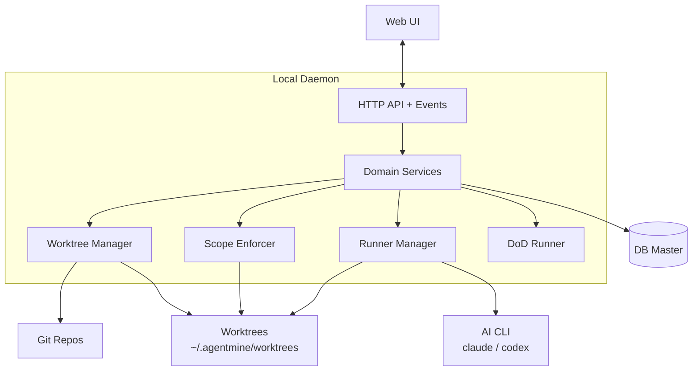

---
depends_on:
  - ./context.md
  - ./principles.md
tags: [architecture, c4, container, components]
ai_summary: "Defines major component structure, responsibilities, and communication methods using a C4 Container diagram"
---

# Major Component Structure

> Status: Draft
> Last updated: 2026-02-01

This document defines the major system components and their relationships (equivalent to a C4 Container diagram).

---

## Component Structure Diagram



---

## Component List

| Component        | Type      | Responsibility                                             | Technology         |
| ---------------- | --------- | ---------------------------------------------------------- | ------------------ |
| Web UI           | Interface | Monitoring and intervention for humans                     | Browser            |
| Local Daemon     | Core      | API/event delivery, execution platform coordination        | Node.js/TypeScript |
| Domain Services  | Core      | Project/Task/Run management                                | TypeScript         |
| Worktree Manager | Core      | Worktree creation/deletion, Git fact retrieval             | Git/Filesystem     |
| Scope Enforcer   | Core      | Applying exclude/read/write rules and detecting violations | Git/Filesystem     |
| Runner Manager   | Core      | AI process start/stop, log collection                      | OS Process         |
| DoD Runner       | Core      | Verification execution and result recording                | CLI/CI integration |
| DB Master        | Data      | SSoT for state                                             | SQLite (MVP)       |

---

## Component Details

### Domain Services

| Item           | Details                                                     |
| -------------- | ----------------------------------------------------------- |
| Responsibility | Consolidates and operates all state in the DB               |
| Input          | Operations from Web UI/API                                  |
| Output         | DB updates, events, logs                                    |
| Dependencies   | DB Master, Runner Manager, Worktree Manager, Scope Enforcer |

### Runner Manager

| Item           | Details                                 |
| -------------- | --------------------------------------- |
| Responsibility | AI process start/monitoring/termination |
| Input          | Worker launch requests                  |
| Output         | Execution state, exit codes             |
| Dependencies   | OS Process, worktree                    |

### Worktree Manager / Scope Enforcer

| Item           | Details                                   |
| -------------- | ----------------------------------------- |
| Responsibility | Physical isolation and write constraints  |
| Input          | Task and scope definitions                |
| Output         | Worktree setup and constraint enforcement |
| Dependencies   | Git, Filesystem                           |

---

## Inter-Component Communication

| Source       | Destination    | Protocol      | Content                                        |
| ------------ | -------------- | ------------- | ---------------------------------------------- |
| Web UI       | Local Daemon   | HTTP + Events | Task management, execution control, monitoring |
| Local Daemon | DB Master      | SQL           | State persistence and retrieval                |
| Local Daemon | Git/Filesystem | CLI/FS        | Worktree operations, diff retrieval            |
| Local Daemon | AI CLI         | OS Process    | AI execution                                   |

---

## Directory Structure

The implementation directory structure is left to the implementation. The following is an example.

```
project/
├── apps/
│   ├── daemon/      # Local Daemon (API + Runner)
│   └── web/         # Web UI
├── packages/        # Shared logic (optional)
├── docs/            # Design documents
└── scripts/
```

---

## Related Documents

- [System Boundaries & External Integrations](./context.md) - C4 Context diagram and external system definitions
- [Role Model (5 Layers)](./role-model.md) - Human/Orchestrator/Planner/Supervisor/Worker/Reviewer
- [Tech Stack](./tech-stack.md) - Technology choices and rationale
- [Data Model](../03-details/data-model.md) - Entity definitions and ER diagram
- [Local Daemon (Start/Stop)](../03-details/daemon.md) - Daemon lifecycle
- [Event Delivery](../03-details/event-stream.md) - Event delivery to Web UI
- [RunnerAdapter](../03-details/runner-adapter.md) - Absorbing runner differences
- [Log Storage](../03-details/log-storage.md) - Log storage methods
- [Major Flows](../03-details/flows.md) - Business flow sequence diagrams
