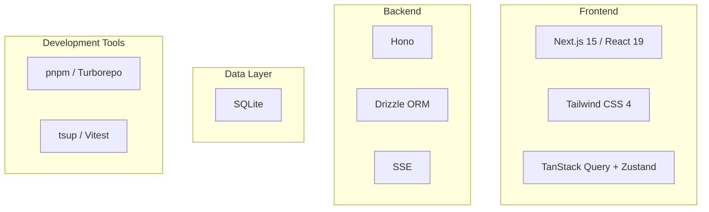

---
depends_on:
  - ./structure.md
tags: [architecture, technology, stack]
ai_summary: "Defines the technology stack, selection rationale, alternatives, and monorepo structure"
---

# Tech Stack

> Status: Draft
> Last updated: 2026-02-02

This document defines the technology stack used in the project.

---

## Tech Stack Overview

---

## Monorepo Structure

| Package | Responsibility |
|---------|---------------|
| `packages/daemon` | Local Daemon (Hono API + RunnerManager) |
| `packages/web` | Web UI (Next.js) |
| `packages/shared` | Shared type definitions (API schema, etc.) |
| `packages/db` | Drizzle schema + migrations |

---

## Tech Stack Details

### Language & Runtime

| Technology | Version | Purpose |
|-----------|---------|---------|
| TypeScript | 5.x | Common across all packages |
| Node.js | >=20 | Daemon execution |

### Frontend

| Technology | Version | Purpose |
|-----------|---------|---------|
| Next.js | 15.x | Web UI |
| React | 19.x | UI framework |
| Tailwind CSS | 4.x | Styling |
| TanStack Query | 5.x | Server state management |
| Zustand | 5.x | UI state management |

### Backend

| Technology | Version | Purpose |
|-----------|---------|---------|
| Hono | 4.x | HTTP server |
| Drizzle ORM | 0.3x | DB operations |
| better-sqlite3 | - | SQLite driver |

### Development Tools

| Technology | Version | Purpose |
|-----------|---------|---------|
| pnpm | 9.x | Package management |
| Turborepo | 2.x | Monorepo builds |
| tsup | 8.x | Bundling |
| Vitest | 2.x | Testing |

---

## Technology Selection Rationale

### Hono

| Item | Details |
|------|---------|
| Selection Rationale | Lightweight (14KB), TypeScript-native, simple |
| Alternatives Considered | Fastify, Express |
| Rejection Reasons | Fastify is overpowered for our needs; Express has weak performance and typing |

### TanStack Query + Zustand

| Item | Details |
|------|---------|
| Selection Rationale | Standard combination as of 2025. Clear separation of concerns |
| TanStack Query | API data fetching, caching, and refetching |
| Zustand | UI local state (selections, filters, etc.) |
| Alternatives Considered | Redux Toolkit, Jotai |
| Rejection Reasons | Redux has excessive boilerplate; Jotai has limited use cases |

### Next.js 15

| Item | Details |
|------|---------|
| Selection Rationale | Stable release, React 19 support, stable Turbopack |
| Alternatives Considered | Vite + React |
| Rejection Reasons | Prioritized the convenience of integrated routing and SSR |

### Drizzle ORM

| Item | Details |
|------|---------|
| Selection Rationale | Type-safe, supports both SQLite/PostgreSQL, lightweight |
| Alternatives Considered | Prisma, Kysely |
| Rejection Reasons | Prisma is heavy; Kysely has weak migration support |

---

## Related Documents

- [Major Component Structure](./structure.md) - Architecture structure
- [Local Daemon](../03-details/daemon.md) - Daemon specification
- [UI Specification](../03-details/ui-mvp.md) - Web UI specification
