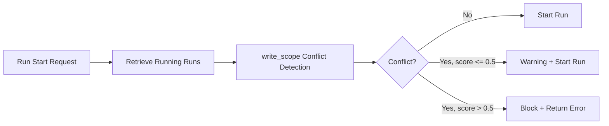

---
depends_on:
  - ./scope-control.md
  - ./business-rules.md
  - ../04-decisions/0006-task-write-scope-required.md
  - ../04-decisions/0013-repositioning.md
tags: [details, scheduler, conflict, safety, parallel]
ai_summary: "Defines a scheduler that detects write_scope overlaps before parallel execution and determines execution order to avoid conflicts"
---

# Conflict-Aware Scheduler

> Status: Draft
> Last updated: 2026-02-06

Defines the mechanism that detects write_scope overlaps before parallel execution and determines execution order to avoid conflicts.

---

## Purpose

- Eliminate write_scope conflicts during parallel execution
- Reduce the manual judgment burden on the Supervisor
- Maximize the benefits of worktree isolation

---

## Assumptions

| Item                          | Details                                                                                                           |
| ----------------------------- | ----------------------------------------------------------------------------------------------------------------- |
| write_scope required          | Tasks must always have write_scope (glob array) configured (ADR-0006)                                             |
| Same-task parallel prohibited | Concurrent execution of multiple runs for the same task is prohibited (see [Business Rules](./business-rules.md)) |
| Cross-task parallel allowed   | Different tasks can execute concurrently (different worktrees)                                                    |

---

## Definition of Conflict

Two tasks are considered to conflict when their write_scopes "could potentially expand to the same file."

### Conflict Detection Logic

Compare the write_scopes of two tasks A and B.

| Judgment    | Condition                      | Example                           |
| ----------- | ------------------------------ | --------------------------------- |
| No conflict | Intersection of globs is empty | A: `src/api/**`, B: `src/ui/**`   |
| Conflict    | Globs intersect                | A: `src/**/*.ts`, B: `src/api/**` |
| Conflict    | One contains the other         | A: `src/**`, B: `src/api/auth.ts` |

Note: Glob intersection detection is performed conservatively. When detection is difficult, it is treated as "conflict exists."

---

## Conflict Score

Quantifies the degree of conflict for use in scheduling decisions.

| Score     | Meaning          | Calculation Method                             |
| --------- | ---------------- | ---------------------------------------------- |
| 0.0       | No conflict      | Glob intersection is empty                     |
| 0.0 - 1.0 | Partial conflict | Estimated by specificity of intersecting globs |
| 1.0       | Full conflict    | One completely contains the other              |

### Calculation Rules

1. Retrieve the write_scopes of both tasks as glob arrays
2. Determine intersection for each glob pair
3. Use intersecting pair count / total pair count as the base score
4. If a containment relationship exists, raise the score to 1.0

---

## Scheduling Decisions

### Decision Table

| Conflict Score | Decision                                                 | Reason                        |
| -------------- | -------------------------------------------------------- | ----------------------------- |
| 0.0            | Allow parallel execution                                 | No conflict risk              |
| 0.0 - 0.5      | Allow parallel execution with warning                    | Low risk but attention needed |
| 0.5 - 1.0      | Block parallel execution. Recommend sequential execution | High conflict risk            |

Note: Thresholds can be adjusted via Project settings (`scheduler.conflictThreshold`).

### Decision Log

Scheduling decisions are recorded as `scheduler_decision_log`.

| Field          | Type       | Description                |
| -------------- | ---------- | -------------------------- |
| id             | integer    | Decision ID                |
| task_a_id      | integer FK | Compared task A            |
| task_b_id      | integer FK | Compared task B            |
| conflict_score | number     | Conflict score             |
| decision       | string     | allowed / warned / blocked |
| reason         | string     | Decision reason            |
| created_at     | datetime   | Decision timestamp         |

---

## Application Timing

### Detection Inputs

| Input                     | Source                             |
| ------------------------- | ---------------------------------- |
| New run's write_scope     | Task's write_scope                 |
| Running runs' write_scope | Running run -> task -> write_scope |

Note: The task's write_scope is compared, not the scope_snapshot. This is because scope_snapshot is finalized after the run starts.

---

## API Changes

### POST /api/tasks/:taskId/runs

Adds conflict detection to the existing run start endpoint.

| Response     | Condition                          |
| ------------ | ---------------------------------- |
| 201 Created  | No conflict, or score <= threshold |
| 409 Conflict | Conflict score exceeds threshold   |

Information included in the 409 response:

| Field             | Description                                                      |
| ----------------- | ---------------------------------------------------------------- |
| conflicting_tasks | List of conflicting tasks                                        |
| conflict_score    | Conflict score with each task                                    |
| suggestion        | Recommended action (sequential execution, scope narrowing, etc.) |

### GET /api/tasks/:taskId/conflicts

Retrieves conflict information between the specified task and running tasks. Used for pre-check before starting a run.

---

## UI Integration

### Conflict Warning at Run Start

Executes conflict detection when the run start button is pressed, and changes the display based on the result.

| Conflict Score | UI Display                                                                             |
| -------------- | -------------------------------------------------------------------------------------- |
| 0.0            | Standard start confirmation                                                            |
| 0.0 - 0.5      | Yellow warning banner + conflicting task names + "Continue" button                     |
| 0.5 - 1.0      | Red error banner + conflicting task names + "Force Execute" button (with confirmation) |

### Monitor Screen

Displays conflict icons on the task tree. Enables visual identification of tasks that conflict with running tasks.

---

## Related Documents

- [Scope Control](./scope-control.md) - Definition of write_scope and violation detection
- [Business Rules](./business-rules.md) - Existing parallel execution constraints
- [ADR-0006](../04-decisions/0006-task-write-scope-required.md) - Decision to require write_scope
- [ADR-0013](../04-decisions/0013-repositioning.md) - Repositioning decision record
