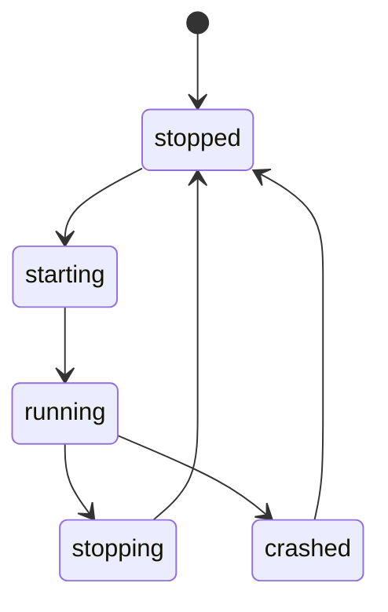

---
depends_on:
  - ../02-architecture/structure.md
  - ../04-decisions/0003-local-daemon-and-web-ui.md
  - ../04-decisions/0004-agentmine-home-dir.md
  - ../04-decisions/0010-daemon-single-instance-and-localhost.md
tags: [details, daemon, lifecycle, local]
ai_summary: "Defines Local Daemon startup/shutdown, single instance, and placement under AgentMine Home"
---

# Local Daemon (Startup & Shutdown)

> Status: Draft
> Last updated: 2026-02-01

This document defines the startup and shutdown of the Local Daemon.
Operation assumes single-user local operation.

---

## Purpose

- Consolidate operations from the Web UI into a single control point
- Complete run execution and monitoring locally
- Ensure the DB is the SSoT

---

## Startup States



---

## Single Instance

The Daemon is a single instance per user environment.
Multiple instances are not launched.

| Item              | Policy                                                                       |
| ----------------- | ---------------------------------------------------------------------------- |
| Duplicate startup | If an existing Daemon exists, return its URL                                 |
| Detection         | Place a lock file in AgentMine Home                                          |
| Release           | Released on normal shutdown. Recovered on restart after abnormal termination |

---

## Port and URL

The Daemon binds to `127.0.0.1`.
The default port is `6419`.

| Item        | Policy                                    |
| ----------- | ----------------------------------------- |
| Default     | `http://127.0.0.1:6419`                   |
| On conflict | Switch to the next candidate port         |
| Reference   | The actual URL is saved in the state file |

---

## UI Delivery (MVP)

In the MVP operational mode, the Daemon serves the Web UI.
The Web UI and API/SSE are served from the same origin.

| Item            | Policy                                |
| --------------- | ------------------------------------- |
| Delivery method | Static delivery of UI build artifacts |
| Route           | Returns the UI at `/`                 |
| API             | Serves `/api/*`                       |
| Events          | Serves `/api/events` (SSE)            |

Note:

- The UI references API/SSE using relative paths (`/api/...`). The Daemon's port configuration is not brought into the UI side.

### Development Mode (Hybrid)

During development, the Web UI may be started on a separate port's dev server.
In this case, the Web UI proxies `/api/*` and `/api/events` to the Daemon.

| Aspect   | Policy                                                       |
| -------- | ------------------------------------------------------------ |
| Purpose  | Ensure UI development speed with HMR, etc.                   |
| CORS     | Proxy so it appears as the same origin from the browser      |
| Contract | UI API call paths are the same in production and development |

---

## AgentMine Home Layout

AgentMine Home is `~/.agentmine` (see Glossary).
The Daemon creates necessary files under AgentMine Home.

```
~/.agentmine/
  db/
  daemon/
  logs/
  worktrees/
```

| Directory    | Purpose                     |
| ------------ | --------------------------- |
| `db/`        | Stores DB files             |
| `daemon/`    | Stores lock and state files |
| `logs/`      | Stores run/check logs       |
| `worktrees/` | Stores worktrees            |

---

## Shutdown Behavior

Daemon shutdown includes stopping runs.
Shutdown behavior differs between normal shutdown and abnormal termination.

| Event                        | Run Process     | Run State                      |
| ---------------------------- | --------------- | ------------------------------ |
| Normal shutdown (stop)       | Stopped         | Set to cancelled               |
| Abnormal termination (crash) | Attempt to stop | Reconciliation on next startup |

---

## Reconciliation on Restart

On startup, if runs with `running` status exist in the DB, reconciliation is performed.
In the MVP, `running` runs are changed to `cancelled`.

Note:

- Runner child processes are managed by the Daemon.
- Runs are not allowed to continue while the Daemon is stopped.

---

## Related Documents

- [Key Component Structure](../02-architecture/structure.md) - Responsibilities of the Local Daemon
- [ADR-0003](../04-decisions/0003-local-daemon-and-web-ui.md) - Web UI + Local Daemon
- [ADR-0004](../04-decisions/0004-agentmine-home-dir.md) - `~/.agentmine`
- [ADR-0010](../04-decisions/0010-daemon-single-instance-and-localhost.md) - localhost single instance
- [Log Storage](./log-storage.md) - Log storage location
