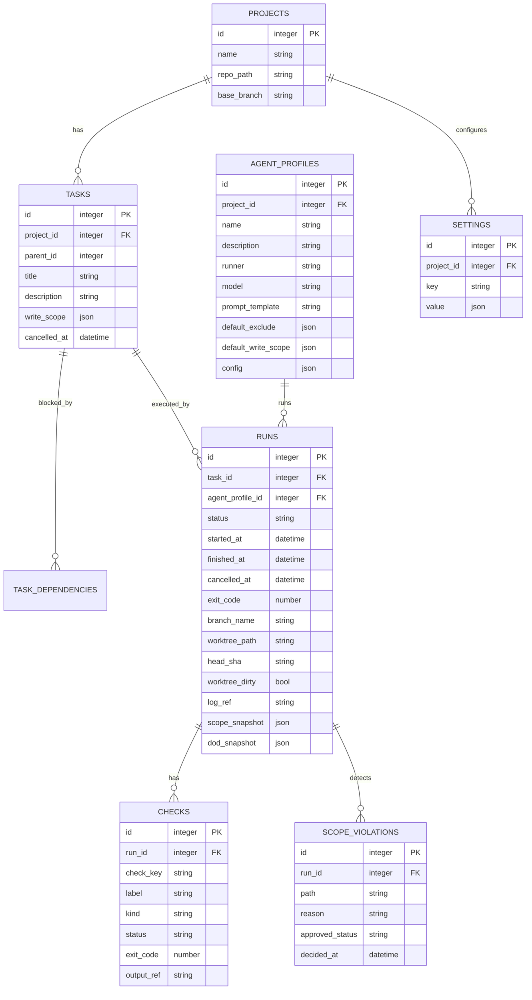

---
depends_on:
  - ../02-architecture/structure.md
  - ../02-architecture/principles.md
  - ./observable-facts.md
tags: [details, data, er-diagram, schema]
ai_summary: "Defines the MVP entity definitions and ER diagram (projects/tasks/runs/checks/scope_violations, etc.)"
---

# Data Model

> Status: Draft
> Last updated: 2026-02-01

This document defines the data model for the MVP.
Physical schema (types, indexes, etc.) is left to the implementation.

---

## ER Diagram

---

## Entity List

| Entity            | Description                                              | Primary Key |
| ----------------- | -------------------------------------------------------- | ----------- |
| projects          | Management per Git repository                            | id          |
| tasks             | Tasks (including parent-child/scope)                     | id          |
| task_dependencies | Dependencies                                             | id          |
| agent_profiles    | Execution profiles (runner/model, etc.)                  | id          |
| runs              | Execution history (multiple runs per task)               | id          |
| checks            | Verification results such as DoD (under run)             | id          |
| scope_violations  | Scope violations (under run)                             | id          |
| settings          | Project settings                                         | id          |
| project_memories  | Project memories (see [Memory Layer](./memory-layer.md)) | id          |

---

## Entity Details (MVP)

### projects

| Column      | Required | Description                                      |
| ----------- | :------: | ------------------------------------------------ |
| id          |   Yes    | Project identifier                               |
| name        |   Yes    | Display name                                     |
| repo_path   |   Yes    | Local Git repository path                        |
| base_branch |   Yes    | Base branch for completion judgment (e.g., main) |

### tasks

| Column       | Required | Description                                                                        |
| ------------ | :------: | ---------------------------------------------------------------------------------- |
| id           |   Yes    | Task identifier                                                                    |
| project_id   |   Yes    | Owning Project                                                                     |
| parent_id    |    -     | Parent task                                                                        |
| title        |   Yes    | Task name                                                                          |
| description  |    -     | Details                                                                            |
| write_scope  |   Yes    | Editable scope (glob array). In the MVP, tasks without this set cannot be executed |
| cancelled_at |    -     | Explicit cancellation (exceptionally a manual decision)                            |

Note:

- `task.status` is a derived state for display purposes. It is not stored but derived from facts on demand.
- Derived state and reasons follow the [Observable Facts](./observable-facts.md) (state derivation rules).

### task_dependencies

| Column             | Required | Description            |
| ------------------ | :------: | ---------------------- |
| task_id            |   Yes    | Child task             |
| depends_on_task_id |   Yes    | Dependency target task |

### agent_profiles

| Column              | Required | Description                                          |
| ------------------- | :------: | ---------------------------------------------------- |
| id                  |   Yes    | Profile identifier                                   |
| project_id          |   Yes    | Owning Project                                       |
| name                |   Yes    | Display name                                         |
| description         |    -     | Description                                          |
| runner              |   Yes    | `claude-cli` / `codex-cli`, etc.                     |
| model               |    -     | Model name to pass to the runner (optional)          |
| prompt_template     |    -     | Fixed role instructions (optional)                   |
| default_exclude     |   Yes    | Default exclusions (glob array)                      |
| default_write_scope |    -     | Suggested write_scope value (glob array, optional)   |
| config              |    -     | Additional runner-specific settings (JSON, optional) |

### runs

A run represents "one execution for a task." continue/retry add a new run.

| Column           | Required | Description                                                               |
| ---------------- | :------: | ------------------------------------------------------------------------- |
| id               |   Yes    | Run identifier                                                            |
| task_id          |   Yes    | Target task                                                               |
| agent_profile_id |   Yes    | Execution profile                                                         |
| status           |   Yes    | running / completed / failed / cancelled                                  |
| started_at       |   Yes    | Start time                                                                |
| finished_at      |    -     | End time                                                                  |
| cancelled_at     |    -     | Explicit cancellation                                                     |
| exit_code        |    -     | Exit code                                                                 |
| branch_name      |   Yes    | Task working branch                                                       |
| worktree_path    |   Yes    | Execution worktree                                                        |
| head_sha         |    -     | HEAD commit at run completion (for auditing and done judgment assistance) |
| worktree_dirty   |    -     | Whether uncommitted changes exist at run completion                       |
| log_ref          |    -     | Run log reference (see Log Storage)                                       |
| scope_snapshot   |   Yes    | Effective scope at execution time (for reproducibility)                   |
| dod_snapshot     |   Yes    | DoD definition snapshot at execution time (for reproducibility)           |

### checks

Records "verifications" such as DoD as checks under a run.

| Column     | Required | Description                              |
| ---------- | :------: | ---------------------------------------- |
| run_id     |   Yes    | Target run                               |
| check_key  |   Yes    | Check identifier (unique within Project) |
| label      |   Yes    | UI display name                          |
| kind       |   Yes    | dod / lint / test / build, etc.          |
| status     |   Yes    | pending / passed / failed                |
| exit_code  |    -     | Exit code                                |
| output_ref |    -     | Log reference                            |

### scope_violations

Records scope violations (changes outside the write scope, etc.) as detection results.

| Column          | Required | Description                            |
| --------------- | :------: | -------------------------------------- |
| run_id          |   Yes    | Source run of detection                |
| path            |   Yes    | Target path                            |
| reason          |   Yes    | Violation reason (e.g., outside_write) |
| approved_status |   Yes    | pending / approved / rejected          |
| decided_at      |    -     | Decision timestamp                     |

### settings

| Column     | Required | Description                              |
| ---------- | :------: | ---------------------------------------- |
| project_id |   Yes    | Owning Project                           |
| key        |   Yes    | Setting key (e.g., `dod.requiredChecks`) |
| value      |   Yes    | Setting value (JSON)                     |

---

## Related Documents

- [Key Component Structure](../02-architecture/structure.md) - Components and responsibilities
- [Observable Facts](./observable-facts.md) - State derivation rules
- [Scope Control](./scope-control.md) - Physical constraints and violation detection
- [Key Flows](./flows.md) - Business flows
