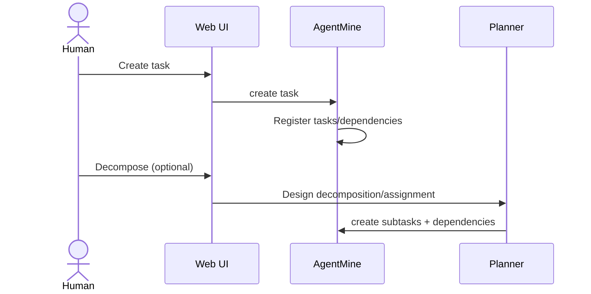
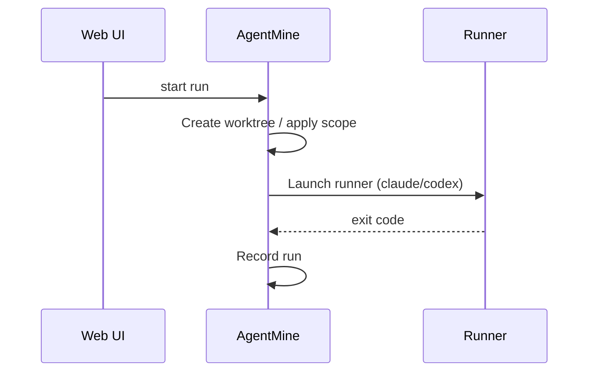

---
depends_on:
  - ../02-architecture/structure.md
  - ../02-architecture/principles.md
tags: [details, flows, sequence, process]
ai_summary: "Defines the sequence diagrams, processing steps, and error cases for key business flows"
---

# Key Flows

> Status: Draft
> Last updated: 2026-02-01

This document defines the system's key processing flows.

---

## Flow List

| Flow ID | Flow Name | Description |
|---------|-----------|-------------|
| F000 | Project Registration | Register a Git repository as a Project |
| F001 | Task Creation and Decomposition | Convert a request into tasks and decompose into subtasks if needed |
| F002 | Run Start | Create a worktree, apply scope, then launch the runner |
| F003 | Verification and Done Judgment | Record DoD verification and merge judgment as facts |
| F004 | Intervention (Stop) | Stop a running run |
| F005 | Intervention (Retry/Continue) | Add a new run to the same task |

---

## Flow Details

### F000: Project Registration

| Item | Details |
|------|---------|
| Summary | Register a Git repository as a Project |
| Trigger | Human executes project registration |
| Actors | Human, Web UI, AgentMine |
| Postcondition | Project is registered in the DB |

### F001: Task Creation and Decomposition

| Item | Details |
|------|---------|
| Summary | Convert a request into tasks and create a decomposition plan |
| Trigger | Human presents requirements |
| Actors | Human, Orchestrator, Planner, AgentMine |
| Precondition | Project is registered |
| Postcondition | Parent-child tasks and dependencies are registered in the DB |

#### Sequence Diagram



### F002: Run Start

| Item | Details |
|------|---------|
| Summary | Start a run for a task whose dependencies are satisfied |
| Trigger | Run start from Web UI |
| Actors | Human, AgentMine, Runner |
| Precondition | task.write_scope is configured |
| Postcondition | Run is recorded |

#### Sequence Diagram



### F003: Verification and Done Judgment

| Item | Details |
|------|---------|
| Summary | Reviewer executes DoD verification and records results as judgment material |
| Trigger | Worker completion |
| Actors | Reviewer, AgentMine |
| Precondition | Run record exists |
| Postcondition | Verification results are recorded in the DB |

#### Flowchart

```mermaid
flowchart TD
    A[Run completed] --> R[Launch Reviewer]
    R --> B[Execute DoD verification]
    B --> C[Record results (checks)]
    C --> D[Retrieve merge status]
```

### F004: Intervention (Stop)

| Item | Details |
|------|---------|
| Summary | Human stops execution or instructs corrections |
| Trigger | Intervention operation from Web UI |
| Actors | Human, Orchestrator, AgentMine |

#### Processing Steps

| # | Process | Owner | Description |
|---|---------|-------|-------------|
| 1 | Select running task | Human | Review the state |
| 2 | Interrupt/stop | AgentMine | Stop the process and update state |
| 3 | Judgment | Orchestrator | Determine next instructions |

### F005: Intervention (Retry/Continue)

| Item | Details |
|------|---------|
| Summary | Add a new run to the same task |
| Trigger | Retry/continue from Web UI |
| Actors | Human, AgentMine |
| Precondition | Worktree for the target task exists |
| Postcondition | New run is recorded |

Note:
- Continue does not mean "adding input to the same run" but rather creating a new run.
- Input for the new run includes a summary of facts from the previous run (diff/failure reasons/unresolved issues).

---

## Related Documents

- [Data Model](./data-model.md) - Data model
- [Design Principles](../02-architecture/principles.md) - Design principles
- [Component Structure](../02-architecture/structure.md) - Component structure
- [Task Decomposition](./task-decomposition.md) - Task decomposition rules
- [Definition of Done](./definition-of-done.md) - Concrete DoD specifications
