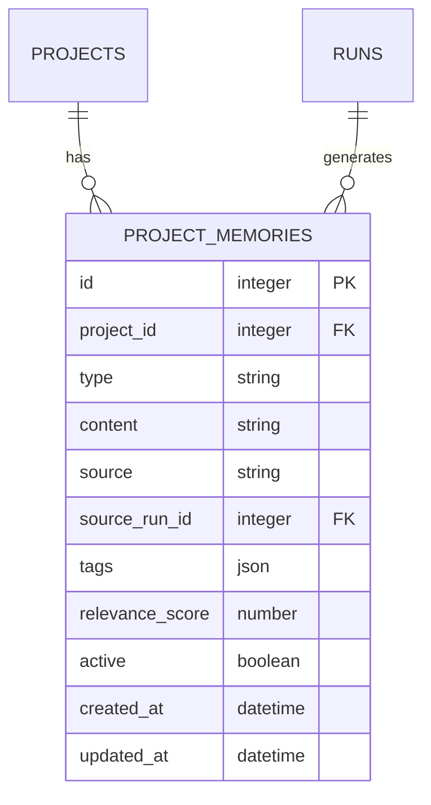

---
depends_on:
  - ../02-architecture/principles.md
  - ./data-model.md
  - ./prompt-composition.md
  - ./observable-facts.md
tags: [details, memory, context, learning]
ai_summary: "Design of the Memory Layer. Defines the project_memories data model, API, and integration with prompt-composition"
---

# Memory Layer

> Status: Draft
> Last updated: 2026-02-05

This document defines the mechanism for managing per-project memories and injecting past learnings into Workers.

---

## Purpose

- Persist project-specific knowledge (patterns, warnings, learnings)
- Inject relevant memories into prompts at Run start to avoid repeating the same mistakes
- In the future, integrate with Agent Lightning and similar reinforcement learning to automatically generate memories

---

## Alignment with Design Principles

| Principle             | Memory Layer Alignment                                           |
| --------------------- | ---------------------------------------------------------------- |
| DB as Master          | Memories are persisted in the DB, maintaining SSoT               |
| Observable Facts      | Memories are treated as "supplementary information," not "facts" |
| Do Not Judge          | Memory application decisions are delegated to Supervisor/Planner |
| Reproducibility First | The same memory set produces the same prompt                     |

---

## Data Model

### project_memories

| Column          | Required | Type       | Description                        |
| --------------- | :------: | ---------- | ---------------------------------- |
| id              |   Yes    | integer    | Memory identifier                  |
| project_id      |   Yes    | integer FK | Owning Project                     |
| type            |   Yes    | string     | Memory type                        |
| content         |   Yes    | string     | Memory content (natural language)  |
| source          |    -     | string     | Memory origin (human/run/learning) |
| source_run_id   |    -     | integer FK | Related Run (if any)               |
| tags            |    -     | json       | Search tags (glob/keywords)        |
| relevance_score |    -     | number     | Relevance score (0.0-1.0)          |
| active          |   Yes    | boolean    | Active flag                        |
| created_at      |   Yes    | datetime   | Creation timestamp                 |
| updated_at      |   Yes    | datetime   | Update timestamp                   |

### type Values

| type     | Description                                  | Example                                               |
| -------- | -------------------------------------------- | ----------------------------------------------------- |
| pattern  | Project conventions and patterns             | "Uses pnpm + Turborepo"                               |
| warning  | Areas requiring caution                      | "Full test suite required when modifying src/core/"   |
| learning | Lessons learned from past successes/failures | "Also check .eslintrc.js when changing ESLint config" |
| context  | Project-specific context                     | "Maintaining legacy API during v2 migration"          |

### source Values

| source   | Description                                                |
| -------- | ---------------------------------------------------------- |
| human    | Manually registered by Human/Orchestrator                  |
| run      | Automatically extracted at Run completion (future)         |
| learning | Results from Agent Lightning and similar learning (future) |

---

## ER Diagram (Addition)



---

## API Specification

### Endpoint List

| Method | Path                                 | Description        |
| ------ | ------------------------------------ | ------------------ |
| GET    | /api/projects/:id/memories           | List memories      |
| POST   | /api/projects/:id/memories           | Create memory      |
| GET    | /api/projects/:id/memories/:memoryId | Get memory details |
| PATCH  | /api/projects/:id/memories/:memoryId | Update memory      |
| DELETE | /api/projects/:id/memories/:memoryId | Delete memory      |

### GET /api/projects/:id/memories

Query parameters:

| Parameter | Type    | Default | Description                      |
| --------- | ------- | ------- | -------------------------------- |
| type      | string  | -       | Filter by type                   |
| active    | boolean | true    | Active memories only             |
| tags      | string  | -       | Filter by tags (comma-separated) |
| limit     | number  | 50      | Maximum number of results        |

Response example:

```json
{
  "memories": [
    {
      "id": 1,
      "projectId": 1,
      "type": "pattern",
      "content": "This project uses pnpm + Turborepo",
      "source": "human",
      "tags": ["build", "package-manager"],
      "relevanceScore": 1.0,
      "active": true,
      "createdAt": "2026-02-05T10:00:00Z"
    }
  ]
}
```

### POST /api/projects/:id/memories

Request body:

```json
{
  "type": "warning",
  "content": "Full test execution is required for changes under src/core/",
  "tags": ["src/core/**", "testing"],
  "relevanceScore": 0.9
}
```

---

## Integration with prompt-composition

### Additional Section: Memories

A `Memories` section is added between `Read First` and `Constraints` in the prompt.

```
## Role
{Agent Profile prompt_template}

## Task
{task id/title/description}

## Workspace
{worktree description}

## Read First
{list of paths to reference}

## Memories
- [pattern] This project uses pnpm + Turborepo
- [warning] Full test execution is required for changes under src/core/
- [learning] In previous Task#12, ESLint config change failed due to missing .eslintrc.js check

## Constraints
{write/exclude, prohibited actions}

## Retry/Continue Digest
{only when applicable}

## Output Format
{expected output}
```

### Memory Selection Logic

Memories are selected at Run start based on the following criteria:

1. Only memories with `active = true`
2. Prioritize memories whose tags match the task's `write_scope`
3. Sort by `relevance_score` in descending order
4. Limit to N items (configurable, default 10)

---

## Memory Governance

To prevent quality degradation as memories accumulate, confidence, expiration, and approval management are introduced.

### Additional Fields

| Column      | Required | Type     | Description                                                               |
| ----------- | :------: | -------- | ------------------------------------------------------------------------- |
| confidence  |    -     | number   | Confidence score (0.0-1.0). source=human is 1.0, source=run starts at 0.5 |
| expires_at  |    -     | datetime | Expiration date. null means no expiration                                 |
| approved_by |    -     | string   | Approver (whether reviewed by a human)                                    |
| approved_at |    -     | datetime | Approval timestamp                                                        |

### Confidence Rules

| source   | Initial confidence | Description                                                |
| -------- | :----------------: | ---------------------------------------------------------- |
| human    |        1.0         | Human-registered memories have the highest confidence      |
| run      |        0.5         | Memories extracted from Run results have medium confidence |
| learning |        0.3         | Auto-learned memories start with low confidence            |

### Confidence Changes

| Event                           | Change         | Reason                                 |
| ------------------------------- | -------------- | -------------------------------------- |
| Human approves                  | Raised to 1.0  | Human has verified the content         |
| Run referencing memory succeeds | +0.1 (max 1.0) | Effectiveness confirmed                |
| Run referencing memory fails    | -0.1 (min 0.0) | Effectiveness questionable             |
| confidence < 0.2                | active = false | Low-confidence memory auto-deactivated |

### Expiration Rules

| type     | Default Expiration | Reason                                     |
| -------- | ------------------ | ------------------------------------------ |
| pattern  | None               | Project conventions are stable long-term   |
| warning  | 90 days            | Warnings become stale as situations change |
| learning | 180 days           | Learnings are effective in the medium term |
| context  | 30 days            | Project context changes frequently         |

Note: Expiration can be adjusted per Project settings (`memory.defaultExpiry`).

### Memory Selection Logic (Updated)

Memory selection at Run start is updated as follows:

1. Only memories with `active = true`
2. `expires_at` is in the future or null
3. `confidence >= 0.3` (exclude low-confidence memories)
4. Prioritize memories whose tags match the task's `write_scope`
5. Sort by `confidence * relevance_score` in descending order
6. Limit to N items (configurable, default 10)

### API Changes

#### PATCH /api/projects/:id/memories/:memoryId/approve

Approves a memory by a human. Raises confidence to 1.0 and records approved_by and approved_at.

---

## Future Extensions

### Phase 2: Agent Lightning Integration

| Feature                              | Description                                         |
| ------------------------------------ | --------------------------------------------------- |
| Training data export                 | Export Runs history as training data                |
| Automatic memory generation          | Auto-create learning memories from learning results |
| Automatic relevance_score adjustment | Learn memory effectiveness from execution results   |

### Other Extension Candidates

| Feature                | Description             |
| ---------------------- | ----------------------- |
| Memory versioning      | Tracking change history |
| Cross-project memories | Sharing common patterns |

---

## Related Documents

- [Design Principles](../02-architecture/principles.md) - DB as Master / Reproducibility First
- [Data Model](./data-model.md) - Existing entity definitions
- [Prompt Composition](./prompt-composition.md) - Final prompt generation
- [Observable Facts](./observable-facts.md) - Difference between facts and supplementary information
- [ADR-0012](../04-decisions/0012-memory-layer.md) - Decision to introduce Memory Layer
- [ADR-0013](../04-decisions/0013-repositioning.md) - Repositioning decision record
