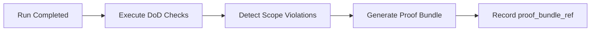

---
depends_on:
  - ./observable-facts.md
  - ./scope-control.md
  - ./definition-of-done.md
  - ./log-storage.md
  - ../04-decisions/0013-repositioning.md
tags: [details, audit, proof, safety, run]
ai_summary: "Defines the mechanism for automatically generating a Proof Bundle (evidence pack of changes) upon Run completion, reducing audit and review costs"
---

# Proof-Carrying Run

> Status: Draft
> Last updated: 2026-02-06

Defines the mechanism for automatically generating a Proof Bundle (evidence pack of changes) upon Run completion.

---

## Purpose

- Provide a self-contained explanation of "what changed, why, and how" on a per-Run basis
- Eliminate the need to navigate across multiple screens during review and auditing
- Serve as the foundation for Compliance Templates (Phase 2)

---

## Alignment with Design Principles

| Principle             | Alignment                                                                                           |
| --------------------- | --------------------------------------------------------------------------------------------------- |
| Observable Facts      | All components of the Proof Bundle are existing facts in the DB or files                            |
| DB as Master          | The Bundle holds only metadata in the DB. The substance is a reference aggregation of existing data |
| Reproducibility First | Snapshots within the Bundle (scope, DoD) are already fixed                                          |
| Do Not Judge          | The Bundle is an aggregation of facts and does not include pass/fail judgments                      |

---

## Proof Bundle Components

The following information is aggregated upon Run completion. No new data is created; it **bundles references** to existing data.

| Element          | Source                                        | Description                            |
| ---------------- | --------------------------------------------- | -------------------------------------- |
| prompt_hash      | runs.log_ref -> log file                      | SHA-256 hash of the execution prompt   |
| scope_snapshot   | runs.scope_snapshot                           | Effective scope as JSON                |
| dod_snapshot     | runs.dod_snapshot                             | DoD definition as JSON                 |
| changed_files    | git diff --name-only (worktree)               | List of changed files                  |
| diff_stat        | git diff --stat (worktree)                    | Scale of changes (line count)          |
| head_sha         | runs.head_sha                                 | Commit SHA at Run completion           |
| exit_code        | runs.exit_code                                | Process exit code                      |
| dod_results      | checks (run_id)                               | List of results for each check         |
| scope_violations | scope_violations (run_id)                     | List of violations and approval status |
| approval_history | scope_violations.approved_status + decided_at | Violation approval/rejection history   |

---

## Data Model

### run_proof_bundles

A `proof_bundle_ref` column is added to the existing runs table. Bundles are stored as JSON files.

| Column           | Required | Type   | Description                       |
| ---------------- | :------: | ------ | --------------------------------- |
| proof_bundle_ref |    -     | string | Reference path to the Bundle file |

Note: The Bundle substance is stored file-based, similar to logs (following [Log Storage](./log-storage.md)).

### Bundle JSON Structure

| Field            | Type     | Description                                    |
| ---------------- | -------- | ---------------------------------------------- |
| version          | string   | Bundle format version ("1.0")                  |
| run_id           | integer  | Target Run                                     |
| generated_at     | datetime | Generation timestamp                           |
| prompt_hash      | string   | SHA-256                                        |
| scope_snapshot   | object   | Effective scope                                |
| dod_snapshot     | object   | DoD definition                                 |
| changed_files    | string[] | List of changed files                          |
| diff_stat        | object   | Added lines / deleted lines / file count       |
| head_sha         | string   | Commit SHA                                     |
| exit_code        | integer  | Exit code                                      |
| dod_results      | object[] | List of check results                          |
| scope_violations | object[] | List of violations (including approval status) |

---

## Generation Timing

Generated after Run completion in the following order.

Note: The Bundle is generated after DoD checks and scope violation detection are complete. Generation is executed asynchronously.

---

## API

### GET /api/runs/:id/proof

Retrieves the Proof Bundle for a given Run.

Response: The Bundle JSON itself. Returns 404 if the Bundle has not been generated.

---

## UI Integration

A "Proof" tab is added to the Run detail panel.

| Display Item      | Description                             |
| ----------------- | --------------------------------------- |
| Changed file list | Display changed_files as a list         |
| Diff statistics   | +lines / -lines / file count            |
| DoD check results | Badge display for passed/failed/pending |
| Scope violations  | Violation paths + approval status       |
| Scope definition  | Contents of scope_snapshot              |
| Download          | Save Bundle JSON                        |

---

## Related Documents

- [Observable Facts](./observable-facts.md) - Definitions of Bundle components
- [Scope Control](./scope-control.md) - Violation detection and approval workflow
- [Definition of Done](./definition-of-done.md) - DoD check results
- [Log Storage](./log-storage.md) - File-based storage strategy
- [ADR-0013](../04-decisions/0013-repositioning.md) - Repositioning decision record
