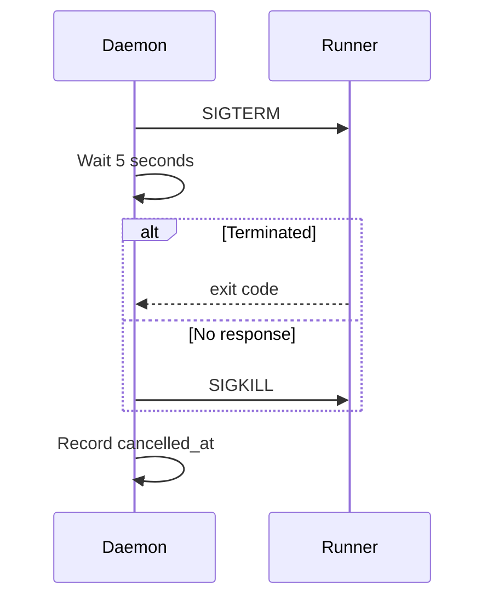

---
depends_on:
  - ../02-architecture/structure.md
  - ./flows.md
  - ./log-storage.md
  - ./prompt-composition.md
  - ../04-decisions/0005-continue-adds-new-run.md
  - ../04-decisions/0009-runner-adapter-interface.md
tags: [details, runner, adapter, execution]
ai_summary: "Defines RunnerAdapter responsibilities, interface, capabilities, and execution specifications for claude/codex CLIs"
---

# RunnerAdapter

> Status: Draft
> Last updated: 2026-02-02

Defines the RunnerAdapter that absorbs differences between runners. The MVP targets the `claude` and `codex` CLIs.

---

## Purpose

- Absorb runner differences (arguments, model specification support, etc.)
- Record run execution as consistent facts
- Keep stop/retry/continue independent of the runner

---

## Assumptions

| Item              | Policy                                  |
| ----------------- | --------------------------------------- |
| Execution mode    | Non-interactive                         |
| Additional input  | No additional input to the same process |
| Working directory | Must be a worktree                      |

Note: continue/retry creates a new run (see ADR-0005).

---

## Interface

| Operation        | Input            | Output         | Description                               |
| ---------------- | ---------------- | -------------- | ----------------------------------------- |
| start            | run, prompt, env | process_handle | Launches the runner                       |
| stop             | process_handle   | -              | Stops the runner                          |
| get_capabilities | -                | capabilities   | Returns model specification support, etc. |

---

## capabilities

capabilities is information returned in a machine-readable format about "what this runner can do."

| Use Case                 | Purpose                                                |
| ------------------------ | ------------------------------------------------------ |
| UI conditional rendering | Prevent unsupported input fields from being selectable |
| Pre-execution validation | Reject unsupported requests before run start           |

### Fields (MVP)

| Field                          | Type     | Meaning                                        |
| ------------------------------ | -------- | ---------------------------------------------- |
| supports_model                 | boolean  | Whether model specification is supported       |
| supports_non_interactive       | boolean  | Whether non-interactive execution is supported |
| supports_prompt_file_inclusion | boolean  | Whether file embedding is supported            |
| available_models               | string[] | List of available models                       |

---

## start Input

| Item          | Required | Description                                |
| ------------- | :------: | ------------------------------------------ |
| run_id        |   Yes    | Target run                                 |
| worktree_path |   Yes    | Execution directory                        |
| prompt        |   Yes    | Execution instructions                     |
| env           |    -     | Environment variables                      |
| model         |    -     | Model name (only when supported by runner) |

Note: The Daemon records the prompt as meta in the run log immediately before start.

---

## Output and Observable Facts

| Fact        | Example       | Use                      |
| ----------- | ------------- | ------------------------ |
| Output      | stdout/stderr | Log display, auditing    |
| Termination | exit code     | Run status determination |

Output is written to log storage and simultaneously streamed via events.

---

## Runner Implementation Specifications

### claude-cli

| Item                     | Value               |
| ------------------------ | ------------------- |
| Command                  | `claude`            |
| supports_model           | true                |
| supports_non_interactive | true                |
| available_models         | sonnet, opus, haiku |

#### Non-Interactive Execution

Non-interactive execution is achieved by combining `--print` and `--dangerously-skip-permissions`.
`--output-format stream-json` provides JSON-formatted stream output.

#### Key Flags

| Flag                           | Required | Description                 |
| ------------------------------ | :------: | --------------------------- |
| --print                        |   Yes    | Non-interactive mode        |
| --dangerously-skip-permissions |   Yes    | Auto-approve all operations |
| --output-format stream-json    |   Yes    | JSON output                 |
| --model                        |    -     | Model specification         |
| --system-prompt                |    -     | System prompt               |

### codex-cli

| Item                     | Value   |
| ------------------------ | ------- |
| Command                  | `codex` |
| supports_model           | false   |
| supports_non_interactive | true    |

#### Non-Interactive Execution

Non-interactive execution is achieved by combining `--approval-policy never` and `--sandbox danger-full-access`.

#### Key Flags

| Flag                         | Required | Description                 |
| ---------------------------- | :------: | --------------------------- |
| --approval-policy never      |   Yes    | Auto-approve all operations |
| --sandbox danger-full-access |   Yes    | Full access permission      |
| --developer-instructions     |    -     | Developer instructions      |
| --cwd                        |    -     | Working directory           |

---

## Stop Processing

---

## Error Handling

### Startup Failure

| Cause                    | Response                        |
| ------------------------ | ------------------------------- |
| Command not found        | run.status = failed             |
| Argument error           | run.status = failed, log stderr |
| API authentication error | run.status = failed, log stderr |

### Runtime Error

| Cause     | Response                                  |
| --------- | ----------------------------------------- |
| API error | run.status = failed                       |
| Timeout   | SIGTERM then SIGKILL, run.status = failed |

---

## Runner Addition Guidelines

1. Implement the RunnerAdapter interface
2. Define capabilities accurately
3. Confirm that non-interactive execution is possible
4. Confirm that stop processing (SIGTERM/SIGKILL) works correctly

---

## Related Documents

- [Main Flows](./flows.md) - Run start and stop/retry/continue
- [Main Component Structure](../02-architecture/structure.md) - Runner Manager
- [Log Storage](./log-storage.md) - Prompt and output tracking
- [Prompt Composition](./prompt-composition.md) - Runner-independent prompt generation
- [ADR-0005](../04-decisions/0005-continue-adds-new-run.md) - continue/retry creates a new run
- [ADR-0009](../04-decisions/0009-runner-adapter-interface.md) - RunnerAdapter interface
