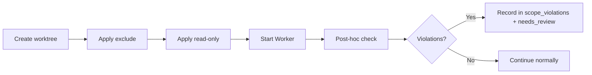

---
depends_on:
  - ../02-architecture/principles.md
  - ./observable-facts.md
tags: [details, scope, safety, worktree]
ai_summary: "Defines scope control that restricts Worker access range through physical constraints and detects violations for review"
---

# Scope Control

> Status: Draft
> Last updated: 2026-02-01

This document defines the "Scope Control" that restricts the file range accessible by Workers.

---

## Purpose

- Reduce unintended changes (especially to sensitive information and configuration)
- Create a state where "damage is limited" even when leaning toward auto-approval
- Do not sweep violations under the rug; detect and make them reviewable

---

## Scope Fields (Logical Model)

| Field | Meaning | Default | Primary Physical Implementation |
|-------|---------|---------|-------------------------------|
| exclude | Inaccessible (as if non-existent) | empty | sparse-checkout, etc. |
| read | Viewable | **/* (all) | Exists in worktree |
| write | Editable | **Required (cannot execute if unset)** | Write permission granted |
| implicit_ro | read - write - exclude | - | Made read-only |

Priority: **exclude > write > read(implicit_ro)**

---

## Physical Enforcement Policy (Minimum)

| Requirement | Policy |
|-------------|--------|
| exclude | Removed from worktree (invisible) |
| Non-write | Made read-only (physically prevents accidental modifications) |
| Windows compatibility | chmod equivalents tolerate OS differences; compensated by detection |

Note: Physical constraints are assumed to be less than 100% effective, so post-hoc checks are always used in combination.

---

## Scope Determination (MVP)

Scope is determined by combining "template" and "task-specific" settings.
The task's `write` must be explicitly specified.

| Input Source | Applied To | Purpose |
|-------------|-----------|---------|
| Project settings (`scope.defaultExclude`) | exclude | Exclude project-wide sensitive information |
| Agent Profile (default_exclude) | exclude | Add exclusions per runner/use case |
| Task (write_scope) | write | Explicitly define the editable range for this task |

Notes:
- The combined result (effective scope) is saved as `scope_snapshot` on the run.
- Subsequent violation checks are based on `scope_snapshot` (for reproducibility).

---

## Scope Application Flow

---

## Post-Hoc Check (Violation Detection)

Detection is performed per "run" and results are persisted as `scope_violations`.

| Check | Input | Determination |
|-------|-------|---------------|
| Changed files | `git diff --name-only` equivalent | All must match write and not match exclude |
| Change content | `git diff` equivalent | Dangerous patterns can be detected with additional rules (optional) |
| Permission changes | File mode diff | Record signs of read-only removal (optional) |

Note: Actual commands are environment-dependent, so this document defines "what facts to observe."

---

## Violation Handling (Review-Priority Mode)

The current policy is "violations do not cause immediate failure; they result in review pending (needs_review)."

| Item | Behavior |
|------|----------|
| task.status | Automatically transitions to needs_review |
| Auto-merge | Blocked (requires manual or higher-level AI judgment) |
| Approval/Rejection | **Human only** records as a decision, maintaining traceability |

Decisions:
- Approval (approved) is treated as "the violation has been accepted." It does not block done determination (merge + DoD).
- In the MVP, violation severity levels (warning/error) are not introduced.

---

## Relationship with Agent Definitions

Agent Profiles have a default exclude.
Tasks have a write scope.
In the MVP, these are combined to determine the effective scope for the run.

| Example | task.write_scope (example) | agent_profile.default_exclude (example) |
|---------|---------------------------|----------------------------------------|
| Backend change task | `packages/core/**` | `**/*.env`, `**/*secret*` |
| Docs change task | `docs/**` | `**/*.env` |

---

## Related Documents

- [Design Principles](../02-architecture/principles.md) - Safety is ensured through constraints
- [Observable Facts](./observable-facts.md) - Violation recording and reflection on task status
- [Data Model](./data-model.md) - Holding scope_violations
- [Agent Profiles](./agent-profiles.md) - Definition of default_exclude
- [Project Settings](./settings.md) - `scope.defaultExclude`
