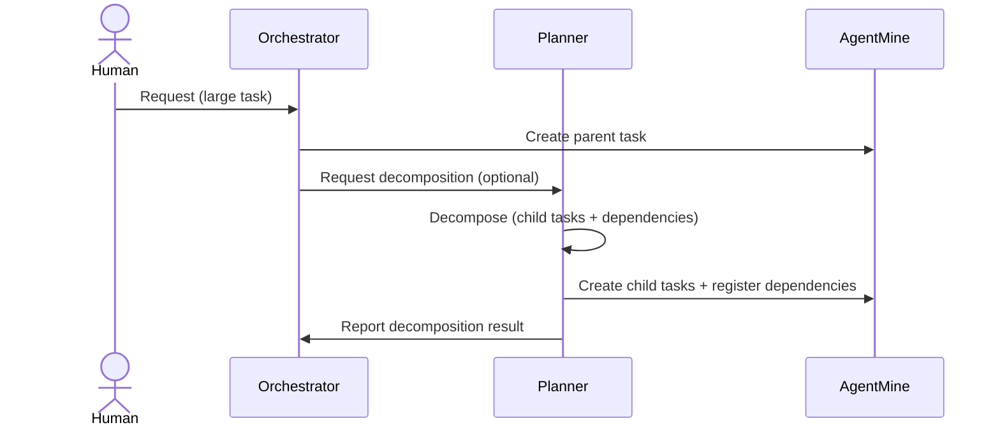

---
depends_on:
  - ../02-architecture/role-model.md
  - ./data-model.md
  - ./flows.md
  - ./business-rules.md
tags: [details, planning, decomposition, tasks, dependencies]
ai_summary: "Defines the purpose, criteria, decomposition patterns, and DB representation (parent-child/dependencies) of task decomposition by the Planner"
---

# Task Decomposition

> Status: Draft
> Last updated: 2026-02-01

This document defines the rules for decomposing large requests into tasks of a granularity suitable for parallel execution.
Task decomposition is the responsibility of the Planner in the role model.

---

## Purpose

- Split into parallelizable units to clarify progress and responsibility scope.
- Clarify the escalation target (instruction/planning side) on failure.
- Move toward "1 task = 1 run / 1 deliverable" to make state tracking via observable facts easier.

---

## Decomposition Criteria (Simple Rules)

The Planner uses the following self-assessment questions rather than complex score calculations to determine decomposition.

| Question                                          | Answer | Decision  |
| ------------------------------------------------- | ------ | --------- |
| Can it be explained as a single commit (or diff)? | No     | Decompose |
| Does it contain multiple independent changes?     | Yes    | Decompose |
| Can one person review it in a short time?         | No     | Decompose |

Note:

- "Short time" is not a fixed number of hours but is judged by review ease.

---

## Additional Criteria (MVP Execution Model)

In the MVP, **1 Task = 1 worktree** (see worktree management).
Therefore, task decomposition additionally uses "can it proceed in a separate worktree/branch?" as a criterion.

| Perspective     | Decision                                               | Guideline                                                |
| --------------- | ------------------------------------------------------ | -------------------------------------------------------- |
| write_scope     | Decompose if too broad                                 | e.g., containing both `apps/web/**` and `apps/daemon/**` |
| Mergeability    | Decompose if individually mergeable into base          | Each subtask can pass DoD independently and be explained |
| Strong coupling | Do not decompose if build/tests fail without the other | Splitting would always result in an incomplete state     |

Note:

- When decomposition is not possible, progress is made incrementally by "adding multiple runs to the same task."

---

## Decomposition Patterns

| Pattern           | Decomposition Method               | Example                                            |
| ----------------- | ---------------------------------- | -------------------------------------------------- |
| Cross-layer       | Split into DB -> API -> UI         | Authentication -> Schema, API, Screen              |
| Feature composite | Split into Feature A / Feature B   | User management -> Registration, Editing, Deletion |
| CRUD              | Split by Create/Read/Update/Delete | Article API -> Each operation                      |

---

## Parent-Child vs. Dependencies

Task decomposition uses both "parent-child" and "dependencies" to express relationships.
The two serve different purposes.

| Mechanism                        | Purpose                                          | Example                                                      |
| -------------------------------- | ------------------------------------------------ | ------------------------------------------------------------ |
| Parent-child (parent_id)         | Express the origin and grouping of decomposition | Parent: "UI Implementation" Children: "Monitor" / "Settings" |
| Dependencies (task_dependencies) | Express execution order constraints              | "Add API" -> "Display in UI"                                 |

Note:

- Parent-child does not imply "order." When order is needed, use dependencies.

---

## Decomposition Output (DB Representation)

Decomposition output is expressed as "child tasks" and "dependency relationships."

| Output                    | Target            | Description                             |
| ------------------------- | ----------------- | --------------------------------------- |
| Parent-child relationship | tasks.parent_id   | Track the decomposition origin          |
| Dependency relationship   | task_dependencies | Express execution order constraints     |
| Execution scope           | tasks.write_scope | Defined as required for each child task |

Notes:

- Additional metadata (complexity, task type, etc.) is not required in the MVP.
- If additional metadata becomes necessary, it will be handled through DB extensions (settings or dedicated tables).

---

## Cases Where Not Decomposing Is Better

Decomposition is not always beneficial. In the following cases, it is safer to proceed as a single task.

| Case                                | Reason                                                    | Alternative                                 |
| ----------------------------------- | --------------------------------------------------------- | ------------------------------------------- |
| Changes are tightly coupled         | Splitting always results in incomplete/inconsistent state | Add runs to the same task                   |
| Frequent conflicts in the same file | Benefits of worktree separation are minimal               | Keep as one task                            |
| Cannot separate write_scope         | Cannot draw safe constraints                              | Update the plan until scope can be narrowed |

---

## Decomposition Flow (Conceptual)

Note:

- In the MVP, Humans may perform the Planner's work (registering child tasks and dependencies) via the UI.

---

## Re-planning on Failure

Failures are not returned to the Worker; the Planner updates the plan.
Re-planning is fundamentally "modifying the task definition and re-executing with a new run."

| Failure Cause          | Planner's Response                                     |
| ---------------------- | ------------------------------------------------------ |
| Ambiguous instructions | Make description more specific, re-decompose if needed |
| Granularity too large  | Add child tasks and redesign dependencies              |
| Incorrect dependencies | Fix task_dependencies                                  |
| Verification failure   | Reflect failure reason in the task and re-execute      |

---

## Related Documents

- [Role Model (5 Layers)](../02-architecture/role-model.md) - Planner/Supervisor responsibilities
- [Data Model](./data-model.md) - Parent-child/dependency representation
- [Business Rules](./business-rules.md) - Invariants and concurrency constraints
- [Main Flows](./flows.md) - Task creation and run start
