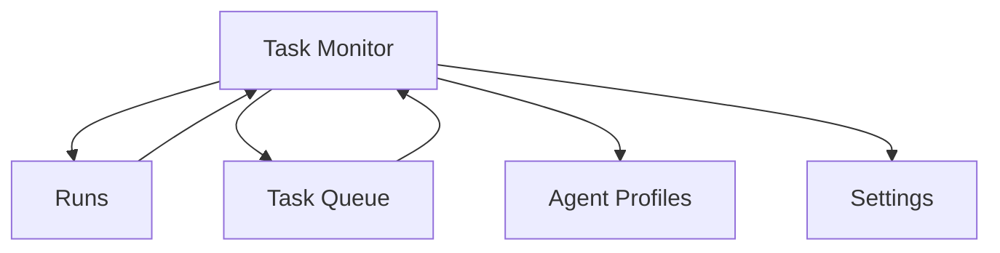

---
depends_on:
  - ../02-architecture/structure.md
  - ./flows.md
tags: [details, ui, screens, interactions]
ai_summary: "Defines the monitoring and intervention UI centered on Task Monitor (tree + timeline)"
---

# UI Design

> Status: Draft
> Last updated: 2026-02-01

This document defines the direction of UI design.
The ultimate goal is a Web UI that visualizes AI execution and enables intervention when needed.

---

## Positioning of This Document

The following division of responsibility applies to UI documentation.

| Document | Positioning |
|----------|-------------|
| `ui.md` | Direction and overall vision (including future vision) |
| `ui-mvp.md` | Concrete specification to implement for the MVP (source of truth for implementation) |

Note:
- MVP implementation uses `ui-mvp.md` as the source of truth.

---

## Purpose

- Enable humans to monitor AI execution status
- Clearly indicate situations where intervention is needed
- Ensure consistent visibility of the DB-as-master state
- Avoid subjective displays, given the premise that "task status is derived from observable facts"

---

## Screen List

| Screen ID | Screen Name | Description | Status |
|-----------|-------------|-------------|--------|
| S000 | Project Switcher | Project switching (global) | MVP defined (`ui-mvp.md`) |
| S001 | Task Monitor | Execution status monitoring (main) | MVP defined (`ui-mvp.md`) |
| S002 | Task Queue | Waiting/dependencies/assignment | Not in MVP scope (future) |
| S003 | Runs | Execution history, logs, verification results | MVP defined (`ui-mvp.md`) |
| S004 | Agent Profiles | runner/model/prompt/default constraints | MVP defined (`ui-mvp.md`) |
| S005 | Settings | Project settings | MVP defined (`ui-mvp.md`) |

---

## Screen Transitions

---

## UI Principles

| Principle | Description |
|-----------|-------------|
| Monitoring first | Prioritize understanding execution status |
| Intervention capable | Clearly present stop/re-execute/instruction changes |
| Fact-based | Display facts rather than AI self-reports |
| Tree + Timeline | Enable simultaneous understanding of parent-child relationships and time axis |

---

## Task Monitor (S001)

The central screen. In the MVP, an **Overview** + **Run list table** + **Waterfall** are arranged in a Chrome DevTools Network-style layout (see UI Specification).
The default display is "Group by task" (runs are bundled by task in a parent-child hierarchy).

| Element | Content |
|---------|---------|
| Overview | Understand the time distribution of executions at a glance (Network Overview-style). Follows the current selection/filtered list |
| Table | Displays a list of runs, enabling triage by status/reason |
| Timeline | Visualizes execution time from run start/end |
| Status | Expresses task.status (derived from observable facts) with colors |
| Detail panel | Facts of the selected task/run (diff/DoD/violations/log references). Collapsed when nothing is selected |
| Actions | stop/retry/continue/approve/reject, etc. (minimal for MVP) |

Note: The fact source for display is `runs/checks/scope_violations`, etc.; no free-form "complete" button is provided.
Note: `needs_review` displays "reasons" separately. Reasons are not stored but derived from facts (e.g., `scope_violation_pending`, `scope_violation_rejected`, `dod_pending`, etc.).

---

## Related Documents

- [ui-mvp.md](./ui-mvp.md) - MVP implementation specification (screens/operations/empty states)
- [flows.md](./flows.md) - Main flows
- [structure.md](../02-architecture/structure.md) - Component structure
- [principles.md](../02-architecture/principles.md) - Design principles
- [observable-facts.md](./observable-facts.md) - Task/run status derivation rules
- [data-model.md](./data-model.md) - Entities referenced by the UI
- [agent-profiles.md](./agent-profiles.md) - Execution profile definitions
